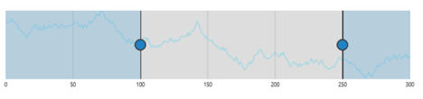
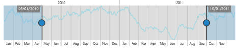
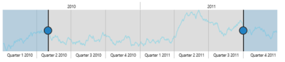

# Range Types

RangeNavigator control is designed to visualize large number of data and navigate to particular data from the large collection at ease. The data for the RangeNavigator is either numeric values or DateTime values and the ValueType property in RangeNavigator indicates the type of the data that should be passed for the control. By default the `ValueType` of RangeNavigator is DateTime

* Numeric                   
* DateTime

## Numeric Type

RangeNavigator is also used with numeric data and the ValueType for this data is “numeric” 


<ej:RangeNavigator ID="RangeNavigator1" runat="server" ValueType="numeric">

<%--Code --%>

<%--Code --%>

</ej:RangeNavigator>



The following screenshot displays the RangeNavigator with numeric data.

RangeNavigator with numeric data.
{:.caption}

## DateTime

By default the ValueType of the RangeNavigator is “datetime” and represents the DateTime values. 


<ej:RangeNavigator ID="RangeNavigator1" runat="server" ValueType="datetime">

<%--Code --%>

<%--Code --%>

</ej:RangeNavigator>


 

RangeNavigator with DateTime values
{:.caption}

### DateTime Intervals

The DateTime range type contains an `IntervalType` property that sets the DateTime interval to one of the following:

* Years
* Quarters
* Months
* Weeks
* Days 
* Hours
* By default IntervalType for higher level labels are Years and for lower level labels its Quarters.


<ej:RangeNavigator ID="RangeNavigator1" runat="server">

         <LabelSettings>

                <HigherLevel IntervalType="Years"></HigherLevel>

                <LowerLevel IntervalType="Quarters"></LowerLevel>

         </LabelSettings>

<%--Code --%>

</ej:RangeNavigator>


Date Time property
{:.caption}