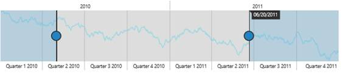

# Tooltip

RangeNavigator provides Tooltip support for sliders. Sliders are used to select data at particular range in the RangeNavigator control. Tooltips for sliders display the selected start and end DateTime values.

## Customization

RangeNavigator provides support for you to customize the text display in the tooltip and background using `TooltipSettings` property. You can change font family, font color, font style, font weight. By default “Segoe UI” font family is set to tooltip text.

* Tooltip visibility can be enabled or disabled using `Visible` property.
* You can change background color of tooltip using `BackgroundColor` property.
* You can customize the `Color`, `Family`, `FontStyle`, `Opacity`, `Size` and `Weight` of tooltip text in `Font` property.



<ej:RangeNavigator ID="RangeNavigator1" runat="server" Locale="fr-FR">

<TooltipSettings Visible="true" BackgroundColor="black" TooltipDisplayMode="onDemand">        

</TooltipSettings>

<%--Code --%>

<%--Code --%>

</ej:RangeNavigator>



Tool Tip
{:.caption}

## Label Format

By default, the tooltip texts are automatically determined based on the data points.  To make it readable and understandable you can format the tooltip text. For DateTime data, all globalized format are supported. By default the LabelFormat is "MM/dd/yyyy".

Some of the `LabelFormat` for DateTime data are as follows:

* 'MMM, yyyy'
* 'dd, MMM'
* 'dd/MM/yyyy'
* 'dd, hh:mm'
* 'hh:mm:ss'
* 'hh:mm:ss:tt'


<ej:RangeNavigator ID="Range1" runat="server">

<TooltipSettings LabelFormat="MMM, yyyy"></TooltipSettings>

. . . . . . .

. . . . . . .

</ej:RangeNavigator>


labelFormat
{:.caption}

## Tooltip display mode

By default the tooltip for RangeNavigator gets displayed. You can change this behavior using the `TooltipDisplayMode` property in the tooltip and it takes the following values.

<table>
<tr>
<th>
Value</th><th>
Description</th></tr>
<tr>
<td>
always</td><td>
Tooltip get displayed for RangeNavigator always.</td></tr>
<tr>
<td>
onDemand</td><td>
Tooltip get displayed only when we move the slider.</td></tr>
</table>


<ej:RangeNavigator ID="RangeNavigator1" runat="server" Locale="fr-FR">

<TooltipSettings Visible="true" TooltipDisplayMode="onDemand">   

</TooltipSettings>

<%--Code --%>

<%--Code --%>

</ej:RangeNavigator>


 

Tool Tip display mode
{:.caption}

