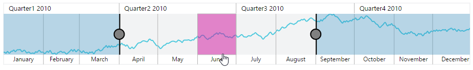
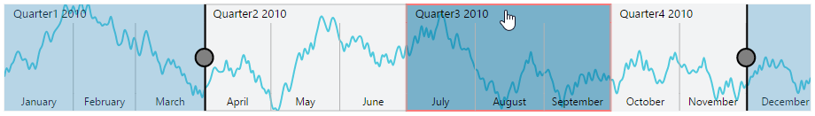
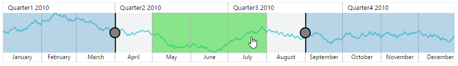
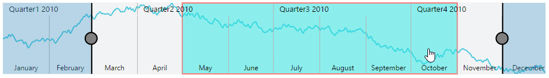
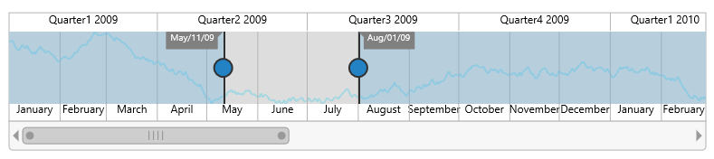

# User Interactions

## Highlight

EjRangeNavigator provides highlighting supports to the intervals on mouse hover. To enable the highlighting option, set the `Enable` property to true in the `HighlightSettings` of `NavigatorStyleSettings`.



  <ej:RangeNavigator ID="RangeNavigator1" runat="server">
        <NavigatorStyleSettings>
            <%--enable the highlight settings--%>
            <HighlightSettings Enable="true"></HighlightSettings>
        </NavigatorStyleSettings>
    </ej:RangeNavigator>



 

[Click](http://asp.syncfusion.com/demos/web/rangenavigator/highlight.aspx) here to view the highlight and selections online demo sample.

### Customize the highlight style

To customize the highlighted intervals, use `Color`, `Border` and `Opacity` options in the `HighlightSettings`.To customize border of highlighted interval, use `Color` and `Width` options in `Border`.



<ej:RangeNavigator ID="RangeNavigator1" runat="server">
        <NavigatorStyleSettings>
            <%--enable the highlight settings--%>
            <HighlightSettings Enable="true" Color="#006fa0">
                <%--customizing style--%>
                <Border Color="red" Width="2" />
            </HighlightSettings>
        </NavigatorStyleSettings>
    </ej:RangeNavigator>



## Selection

EjRangeNavigator provides selection supports to the intervals by, clicking and dragging the highlighted intervals. To enable the selection option, set the `Enable` property to true in the `SelectionSettings`.



    <ej:RangeNavigator ID="RangeNavigator1" runat="server">
        <NavigatorStyleSettings>
            <%--enable the selection settings--%>
            <SelectionSettings Enable="true" Color="#27e8e5">
              
            </SelectionSettings>
        </NavigatorStyleSettings>
    </ej:RangeNavigator>



 

[Click](http://asp.syncfusion.com/demos/web/rangenavigator/highlight.aspx) here to view the highlight and selections online demo sample.

### Customize the selection style

To customize the selected intervals, use `Color`, `Border` and `Opacity` options in the `SelectionSettings`. To customize border of selected interval, use`Color` and `Width` options in `Border`.



   <ej:RangeNavigator ID="RangeNavigator1" runat="server">
        <NavigatorStyleSettings>
            <%--enable the selection settings--%>
            <SelectionSettings Enable="true" Color="#27e8e5">
                <%--customizing style--%>
                <Border Color="red" Width="2" />
            </SelectionSettings>
        </NavigatorStyleSettings>
    </ej:RangeNavigator>



## Scrollbar

* To render the Scrollbar in RangeNavigator, you need to enable `EnableScrollbar` option.
 
* `ScrollRangeSettings` of  rangenavigator `Start` and `End` value is used to set the minimum and maximum datasource value to be added in the rangenavigator.
 
* Based on the ScrollRangeSettings *Start, End* value and dataSource *Start, End* value scrollbar will be adjust.

* When you change the scrollbar position, `ScrollEnd` event returns the current position of start and end range value.



     <ej:RangeNavigator ID="RangeNavigator1" runat="server" EnableScrollbar="true" onClientSideScrollEnd="onScrollbarChange">
        <%--Maximum data to be displayed in the rangenavigator control--%>
       <ScrollRangeSettings Start="2010/1/1" End="2011/11/31" />
        <Series>
            <ej:Series>
                <%--Add DataSource to RangeNavigator--%>
                <%--........--%>
            </ej:Series>
        </Series>
    </ej:RangeNavigator>
     
   


[Click](http://asp.syncfusion.com/demos/web/rangenavigator/rangescrollbar.aspx) here to view scrollbar online demo sample.