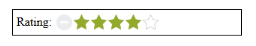
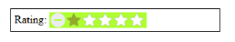

# Appearance and Styling

## Show ToolTip

Rating control provides support for Tooltip values. This is achieved by enabling the ShowTooltip property to true. When you 
move the mouse over the Rating control, it displays the Tooltip value as rating value. By default, this property value is set 
to true.

Add the following code example to the corresponding ASPX to render the Rating with Tooltip.



            <table>

                <tr>

                    <td valign="top">Rating:

                    </td>

                    <td>

                        <ej:Rating ID="Rating1" ShowTooltip="false" runat="server"></ej:Rating>

                    </td>

                </tr>

            </table>



The following screenshot displays the output of the above code example.

## Adjusting Rating Size

### Adjust Shape Width and Shape Height

You can customize the width and height of the Rating by ShapeWidth and ShapeHeight properties. These properties completely depend on rating image’s size. The ShapeWidth and ShapeHeight are adjusted within the rating image size.

Add the following code example to the corresponding ASPX to render the Rating with the customized ShapeWidth and ShapeHeight.



    <table>

        <tr>

            <td valign="top">Rating:

            </td>

            <td>

               <ej:Rating ID="Rating1" Value="4" ShapeWidth="29" ShapeHeight="29" runat="server"></ej:Rating>

           </td>

        </tr>

    </table>



Add the following styles for Rating.

  
.e-rating {

       margin-top: -7px;

    }

   .e-rating.e-horizontal .e-shape-list, .e-rating.e-vertical .e-shape-list,

   .e-rating.e-horizontal .e-shape, .e-rating.e-vertical .e-shape, .e-rating.e-horizontal .e-ul,.e-rating.e-vertical .e-ul,.e-rating.e-horizontal .e-reset, .e-rating.e-vertical .e-reset {

        height:28px;width:28px;

        background:url(images/crystal-stars.png) no-repeat;

    }

   .e-rating.e-horizontal .e-reset, .e-rating.e-vertical .e-reset {

        background-position: 0 42px;

        margin-left: 2px;

    }

   .e-rating.e-horizontal .e-shape-list {

        background-position: 0 -56px;

    }

   .e-rating.e-horizontal .e-reset:hover {

        background-position: 0 42px;

    }

   .e-rating .e-shape.inactive {

        background-position: 0 -56px;

    }

    .e-rating .e-shape.active {

        background-position: 0 -112px;

    }

    .e-rating .e-shape.selected {

        background-position: 0 -84px;

    }

    .e-tooltip {

        background-color:white;border:2px solid #b0c4de;color:black

    }  


The following screenshot displays the output of the above code example.

## Theme

Rating control’s style and appearance are controlled based on CSS classes. In order to apply styles to the Rating control, refer to 2 files namely, ej.widgets.core.min.css and ej.theme.min.css. When the file ej.widgets.all.min.css is referred, then it is not necessary to include the files, ej.widgets.core.min.css and ej.theme.min.css in your project, as ej.widgets.all.min.css is the combination of these both.

By default, there are 13 themes support available for Rating control namely:

* bootstrap-theme
* default-theme
* flat-azure-dark
* fat-lime
* flat-lime-dark
* flat-saffron
* flat-saffron-dark
* gradient-azure
* gradient-azure-dark
* gradient-lime
* gradient-lime-dark
* gradient-saffron
* gradient-saffron-dark

## Custom styles

The style of the Rating control is customized by CssClass property.

Add the following code example to the corresponding ASPX page to render the Rating with the customized style.



            <table>

                <tr>

                    <td valign="top">Rating:

                    </td>

                    <td>

                        <ej:Rating ID="Rating1" CssClass="custom"runat="server"> </ej:Rating>

                    </td>

                </tr>

            </table>



Define the style for the Rating control.


.custom {

    background-color: greenyellow;

 }


The following screenshot displays the output of the above code example.

