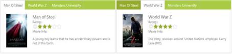
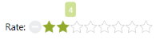

# Getting Started with ASP.NET Rating

This section explains briefly how to create a Rating control in the ASP.NET MVC.

## Create your first Rating control in ASP.NET

ASP.NET Rating helps you to select the number of stars that represent Rating. Here, you can learn how to create Rating control in a real-time movie download application and also learn how to rate the application.

The following screenshot demonstrates the functionality of a Rating control with a Rating range of 0 to 5.

In the above screenshot, you can rate the movie by selecting a corresponding movie.

## Create a Rating

You can create an ASP.NET Web Forms Project and add necessary Dll’s and scripts with the help of the given [ ASP.NET -Getting Started Documentation.](http://help.syncfusion.com/aspnetmvc/captcha/getting-started#create-your-first-captcha-in-aspnet-mvc)

Add the following code example to the corresponding ASPX page to render Rating control.

Refer to the following link to know the details on the Tab control.

<http://help.syncfusion.com/js/tab/getting-started#create-tab-control>

Add the following code example to the corresponding ASPX page to render Rating control.



    <ej:Tab ID="Tab1" runat="server" Width="550px">

        <items>

            <ej:tabitem id="TabItem1" text="Man Of Steel">

                <contentsection>

                    <table>

                        <tr>

                            <td class="movies-image" valign="top">

                                

                            </td>

                            <td valign="top">

                                

                                    Man of Steel 

                                    Rating :

                                     

                                    <ej:Rating ID="Rating8" Value="3" MinValue="0" MaxValue="5" runat="server">

                                    </ej:Rating>

                                    Movie Info:

                                    

                                        A young boy learns that he has extraordinary powers and is not of this Earth.

                                    

                                

                            </td>

                        </tr>

                    </table>

                </contentsection>

            </ej:tabitem>

            <ej:tabitem id="TabItem2" text="World War Z">

                <contentsection>

                    <table>

                        <tr>

                            <td class="movies-image" valign="top">

                                

                            </td>

                            <td valign="top">

                                

                                    World War Z 

                                    Rating :

                                     

                                    <ej:Rating ID="Rating9" Value="4" MinValue="0" MaxValue="5" runat="server" CssClass="rating">

                                    </ej:Rating>

                                    Movie Info:

                                    

                                        The story revolves around United Nations employee Gerry Lane (Pitt).

                                    

                                

                            </td>

                        </tr>

                    </table>

                </contentsection>

            </ej:tabitem>

            <ej:tabitem id="TabItem3" text="Monsters University">

                <contentsection>

                    <table>

                        <tr>

                            <td class="movies-image" valign="top">

                                

                            </td>

                            <td valign="top">

                                

                                    Monsters University 

                                    Rating :

                                     

                                    <ej:Rating ID="Rating10" Value="4" MinValue="0" MaxValue="5" runat="server">

                                    </ej:Rating>

                                    Movie Info:

                                    

                                        Mike Wazowski and James P. Sullivan are an inseparable pair, but that wasn't always

                                        the case.

                                    

                                

                            </td>

                        </tr>

                    </table>

                </contentsection>

            </ej:tabitem>

        </items>

    </ej:Tab>



Add the following styles to the corresponding view page to show the Rating in a horizontal order.



.e-movies-image

        {

            width: 125px;

        }       

        .movie-header

        {

            font-size: 20px;

            font-weight: 600;

        }

        .frame

        {

            width: 600px;

            height: 250px;

        }



Execute the above code to render the following output.

N> Add necessary images to the mentioned directory. &lt;project directory&gt;/Images/rating/yourimage.png

### Set Min and Max Value  

In a real-time movie Rating scenario, you can extend the range by using the properties MinValue and MaxValue. Only rates ranging between the MinValue and MaxValue appear in the Rating.

Add the following code example to the corresponding ASPX page to set MinValue and MaxValue to the Rating.



    <table>

        <tr>

            <td valign="top">

                Rate:

            </td>

            <td>

                <ej:Rating ID="Rating1" Value="4" MinValue="2" MaxValue="10" runat="server">

                </ej:Rating>

            </td>

        </tr>

    </table>



Execute the above code to render the following output.

### Set Precision

In a real-time movie Rating scenario, you can rate the Rating between two whole numbers, such as 2.5 or 3.7 by using the Precision property. You can also add additional functionalities such as Orientation and APIs to the Rating.

Add the following code example to the corresponding view page to set Precision to Rating. 



    <table>

        <tr>

            <td valign="top">

                Full Precision :

            </td>

            <td>

                <ej:Rating ID="Rating1" Value="4" Precision="Full" runat="server" CssClass="rating">

                </ej:Rating>

            </td>

        </tr>

        <tr>

            <td valign="top">

                Half Precision :

            </td>

            <td>

                <ej:Rating ID="Rating2" Value="1.5" Precision="Half" runat="server" CssClass="rating">

                </ej:Rating>

            </td>

        </tr>

        <tr>

            <td valign="top">

                Exact Precision :

            </td>

            <td>

                <ej:Rating ID="Rating3" Value="3.7" Precision="Exact" runat="server" CssClass="rating">

                </ej:Rating>

            </td>

        </tr>

    </table>



Execute the above code to render the following output.

