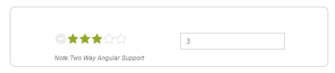
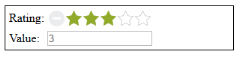

# Integration

## AngularJS Binding

For AngularJS Binding, you can include angular.min.js, ej.unobtrusive.min.js, and ej.widget.angular.min.js files.

Rating control is availed with two types of AngularJS supports namely,

* One-way binding
* Two-way binding

One-way binding refers to the process of applying scope values to all the available properties of the Rating control. But the changes made in the Rating control are not reflected or triggered in the scope collection. This kind of binding is applied to all the properties of the Rating control.

Two-way binding supports both the processes; it applies the scope values to the Rating properties and also the changes made in the Rating control are reflected back and triggered within the AngularJS scope change function. The Rating property called Value supports two-way binding.

Apply the plugin and property assigning the Rating element through the directive that starts with the letter “e-“.

Add the following code example to the corresponding ASPX page to render the Rating with the Angular support.



    

        

            

                

                    <input id="apiRating" type="text" class="rating" ej-rating e-value="ratingValue" e-precision="exact" />

                    <h6>

                        Note:Two Way Angular Support

                    </h6>

                

                

                    <input type="text" id="apinum" class="input ejinputtext" name="rating" ej-numerictextbox e-decimalplaces=1 e-enablestrictmode=true e-minvalue=1 e-maxvalue=5 e-width="200px" e-showspinbutton=false e-value="ratingValue" />

                

            

        

    



Include the following Script to achieve the AngularJS binding.


angular.module('syncApp', ['ejangular'])

   .controller('RatingCtrl', function ($scope) {

       $scope.ratingValue = 3;

   });


The following screenshot displays the output of the above code example.

## KnockoutJS Binding

KnockoutJS support allows you to bind the HTML elements with any of the available data models.

For KnockoutJS Binding, you can include the files knockout-min.js and ej.widget.ko.min.

KnockoutJS Binding is of two types:

* One-way binding
* Two-way binding

One-way binding refers to the process of applying observable values to all the available properties of the Rating control. But the changes made in the Rating control are not reflected and triggered in the observable collection. This kind of binding is applied to all the properties of the Rating control.

Two-way binding supports both the processes; it applies the observable values to the Rating properties and the changes made in the Rating control are also reflected back and triggered within the observable collections. The Rating property that supports two-way binding is value.

Apply the plugin and the property assigning the Rating element through the directive that starts with the letter “e-“.

Add the following code example to the corresponding ASPX page to render the Rating with the Knockout support.



    <table>

        <tr>

            <td valign="top">Rating:</td>

            <td>

                <input id="Text1" type="text" class="rating" data-bind="ejRating: { value: ratingValue, width: '161px', precision: 'exact' }" />

            </td>

        </tr>

        <tr>

            <td valign="top">Value:</td>

            <td>

                <input type="text" name="rating" class="input ejinputtext" value="" data-bind="    value: ratingValue" />

            </td>

        </tr>

    </table>



Add the following scripts to render the Rating with Knockout support.


var ratingObj;

    $(function () {

        // declaration           

        ratingObj = $("#apiRating").data("ejRating");

        $("#btnGetValue").ejButton({ "click": "onGetValueClick", "width": "87px" });

    });

    window.viewModel = {

        ratingValue: ko.observable(3),

    };

    $(function () {

        ko.applyBindings(viewModel);

        ratingObj = $("#apiRating").data("ejRating");

    });

    function onResetClick() {

        ratingObj.reset();

    }


The following screenshot displays the output of the above code example.

