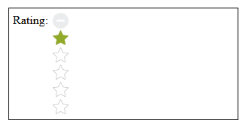

# Orientation

Rating provides support for the vertical orientation. By default, Rating renders with horizontal orientation. You can the change the orientation by the orientation property.

Add the following code example to the corresponding ASPX page to render the Rating with the customized orientation.



            <table>

                <tr>

                    <td valign="top">Rating:

                    </td>

                    <td>

                        <ej:Rating ID="Rating1" Orientation="Vertical"runat="server"> </ej:Rating>

                    </td>

                </tr>

            </table>



The following screenshot displays the output of the above code example.

