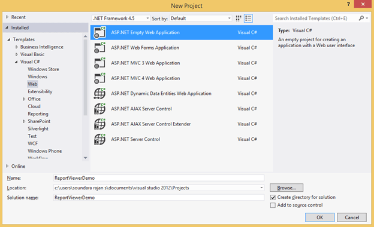
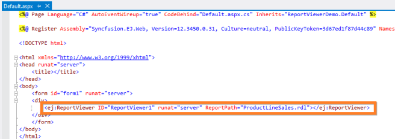
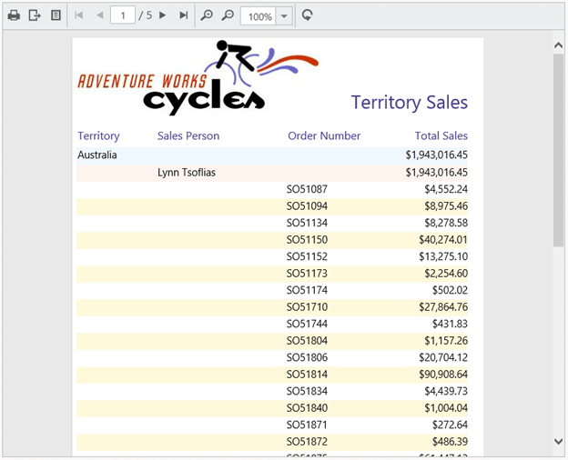
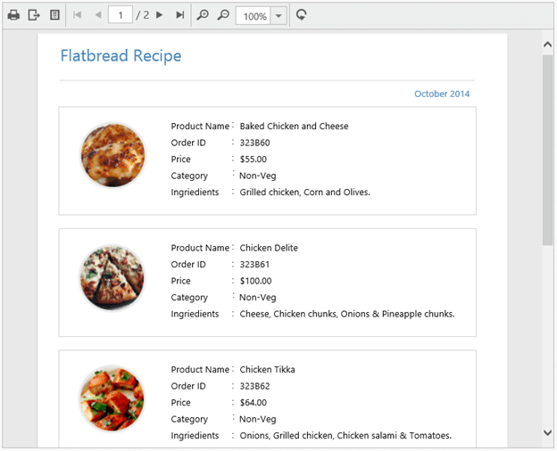

# Getting Started

This section explains briefly about how to create a ReportViewer in your web application with ASP.NET.

## Create your first ReportViewer in ASP.NET

This section explains how to configure a ReportViewer component in web application. As ReportViewer uses WebApi to process the report file, you can also learn how to create WebApi Service to process the report for ReportViewer. In the following example, the ReportViewer component displays the Sales Dashboard Report. 

Open Visual Studio and create a new project by clicking New Project. Select the Web category, select the ASP.NET Empty Web Application template, and then click OK. The following screenshot displays the Project Creation Wizard.

 

Project Creation Wizard
{:.caption}

### Create ASPX Page

To create a new Web Forms in the application

1. Right-Click on the project and select Add

    
   
   New Item Wizard
   {:.caption}
   
2. Click New Item and select Web Form from the listed templates

    
   
   Adding Web Forms
   {:.caption}
   
3. Name the page as Default.aspx and click OK.

### Add References, Scripts, Styles and Control in ASPX Page

#### Add References

1. In the Solution Explorer, right-click the References folder and then click Add Reference

    
   
   Adding Reference
   {:.caption}
   
2. Add the following assemblies

   * System.Web.Routing  
   * System.Web.Http
   * System.Web.WebHost
   * System.Net.Http
   * System.Net.Http.WebRequest
   * System.Net.Http.Formatting
   * Syncfusion.EJ
   * Syncfusion.EJ.Web
   * Syncfusion.Linq.Base
   * Syncfusion.EJ.ReportViewer
   * Syncfusion.Pdf.Base
   * Syncfusion.XlsIO.Base
   * Syncfusion.DocIO.Base
   * Syncfusion.Shared.Wpf
   * Syncfusion.Chart.Wpf
   * Syncfusion.Gauge.Wpf
   * Syncfusion.SfMaps.Wpf 
   
   N> Refer the above assemblies from the installed location, C:\Program Files (x86)\Syncfusion\Essential Studio\ASP.NET\{{ site.releaseversion }}\Assemblies
   N>
   N> Refer System.Web.Http, System.Web.WebHost, System.Net.Http.WebRequest and System.Net.Http.Formatting assemblies from ASP.NET WebApi NuGet package.

3. Click OK

#### Add Scripts and Styles

Add the script files and CSS files in the &lt;title&gt; tag of the default.html page.

N> Use the following code example while adding scripts and styles.



<head>
<link href="https://cdn.syncfusion.com/{{ site.releaseversion }}/js/web/flat-azure/ej.web.all.min.css"  rel="stylesheet" />

</head>



### Add Control in ASPX Page

1. Drag the ReportViewer control from the Syncfusion Web Toolbox onto the Design Page

    
   
   ReportViewer Control in Toolbox
   {:.caption} 
   
   
   
   ReportViewer Control in Source Tab Section
   {:.caption} 
   
2. Set the desired ReportPath and ReportServiceUrl to ReportViewer.
   
   ~~~ html   
   <form id="form1" runat="server">
       

           <ej:ReportViewer runat="server" ID="viewer"  ReportPath="~/App_Data/Sales Dashboard.rdl" ReportServiceUrl="/api/ReportApi">
           </ej:ReportViewer>
       

   </form>   
   ~~~
   
   N> Add your report files to your application’s App_Data folder.You can obtain sample rdl/rdlc files from Syncfusion installed location (%userprofile%\AppData\Local\Syncfusion\EssentialStudio\{{ site.releaseversion }}\Common\Data\ejReportTemplate). {{ site.releaseversion }} is the Essential Studio Release Version.
	
### Add WebAPI controller for ReportViewer

The ASP.NET ReportViewer uses WebApi services to process the report file and process the request from control.

 

Adding WebApi Controller
{:.caption} 

### Inherit the ReportViewer IReportController

The ApiController inherits the IReportController and you can add the following code example to its methods definition in order to process the report file. The interface IReportController contains the required actions and helper methods declaration to process the report. The ReportHelper class contains helper methods that helps to process Post/Get request from control and return the response to control.



using Syncfusion.EJ.ReportViewer;
using System;
using System.Collections.Generic;
using System.Linq;
using System.Net;
using System.Net.Http;
using System.Web.Http;

namespace ReportViewerDemo.Api
{
    public class ReportApiController : ApiController, IReportController
    {
        //Post action for processing the rdl/rdlc report
        public object PostReportAction(Dictionary<string, object> jsonResult)
        {
            return ReportHelper.ProcessReport(jsonResult, this);
        }
        //Get action for getting resources from the report
        [System.Web.Http.ActionName("GetResource")]
        [AcceptVerbs("GET")]
        public object GetResource(string key, string resourcetype, bool isPrint)
        {
            return ReportHelper.GetResource(key, resourcetype, isPrint);
        }
        //Method will be called when initialize the report options before start processing the report
        public void OnInitReportOptions(ReportViewerOptions reportOption)
        {
            //You can update report options here
        }
        //Method will be called when reported is loaded
        public void OnReportLoaded(ReportViewerOptions reportOption)
        {
            //You can update report options here
        }   
    }
}



### WebAPI Routing

1. Right-click the project and select Add and select Global.asax file from the listed templates.

    
   
   Adding Global.asax
   {:.caption} 
   
2. You can route the WebAPI in Application_Start event into Global.asax file as follows.
   
   ~~~ csharp 
   using System;
   using System.Collections.Generic;
   using System.Linq;
   using System.Web;
   using System.Web.Security;
   using System.Web.SessionState;
   using System.Web.Http;
   
   namespace ReportViewerDemo
   {
       public class Global: System.Web.HttpApplication
       {
           protected void Application_Start(object sender, EventArgs e)
           {
               System.Web.Http.GlobalConfiguration.Configuration.Routes.MapHttpRoute(
               name: "DefaultApi",
               routeTemplate: "api/{controller}/{action}/{id}",
               defaults: new { id = RouteParameter.Optional });
           }
       }
   }
   ~~~

### Run the Application

Run the sample application and you can see the ReportViewer on the page as displayed in the following screenshot.

  

ReportViewer with Sales Dashboard Report
{:.caption}

## Load SSRS Server Reports

ReportViewer supports to load RDL/RDLC files from SSRS Server. The following steps help you to load reports from SSRS Server.

1. Set the ReportPath from SSRS and SSRS ReportServerUrl in the ReportViewer properties.

   ~~~ html   
   <form id="form1" runat="server">
       

           <ej:ReportViewer ID="viewer" runat="server" ReportServiceUrl="/api/ReportApi" ReportServerUrl="http://mvc.syncfusion.com/ReportServer" ReportPath="/SSRSSamples2/Territory Sales">
           </ej:ReportViewer>
       

   </form>
   ~~~
   
2. Add the credential information in ReportApiController’sOnInitReportOptions method that is available in IReportController

   ~~~ csharp
   public void OnInitReportOptions(ReportViewerOptions reportOption) 
   {
       //Add SSRS Server and database credentials here 
	   reportOption.ReportModel.ReportServerCredential = new System.Net.NetworkCredential("ssrs", "RDLReport1");
	   reportOption.ReportModel.DataSourceCredentials.Add(new DataSourceCredentials("AdventureWorks", "ssrs1", "RDLReport1"));
   }  
   ~~~
3. Run the application and you can see the ReportViewer on the page as displayed in the following screenshot.

    
 
   Report from SSRS
   {:.caption}

## Load RDLC Reports

The ReportViewer has data binding support to visualize the RDLC reports. The following steps help you to bind data to ReportViewer.

1. Assign the RDLC report path to ReportViewer’sReportPath property

   ~~~ html   
   
 
       <ej:ReportViewer ID="viewer" runat="server" ReportServiceUrl="/api/ReportApi" ReportPath="~/App_Data/Product List.rdlc" ProcessingMode="Local">
       </ej:ReportViewer>
   
    
   ~~~
   
2. Add business object data source to ReportViewer’sDataSources from aspx.cs.

   ~~~ csharp
   namespace ReportViewerDemo 
   {
       public partial class ProductListDemo: System.Web.UI.Page 
	   {
           protected void Page_Load(object sender, EventArgs e) 
		   {
               ProductList prodlist = new ProductList();
               List <ReportDataSource> rptDatasources = new List <ReportDataSource> ();
               ReportDataSource rptDatasource = new ReportDataSource();
               rptDatasource.Name = "list";
               rptDatasource.Value = prodlist.GetData();
               rptDatasources.Add(rptDatasource);
               this.viewer.DataSources = rptDatasources;
           }
       }

       public class ProductList 
	   {
           public string ProductName { get; set; }
		   public string OrderId { get;set; }
		   public double Price { get; set; }
		   public string Category { get; set; }
		   public string Ingredients { get; set; }
		   public string ProductImage { get; set; }

           public IList GetData() 
		   {
               List <ProductList> datas = new List <ProductList> ();
               ProductList data = null;
               data = new ProductList() { ProductName = "Baked Chicken and Cheese", OrderId = "323B60", Price = 55, Category = "Non-Veg", Ingredients = "grilled chicken, corn and olives.", ProductImage = "" };
               datas.Add(data);
               data = new ProductList() { ProductName = "Chicken Delite", OrderId = "323B61", Price = 100, Category = "Non-Veg", Ingredients = "cheese, chicken chunks, onions & pineapple chunks.", ProductImage = "" };
               datas.Add(data);
               data = new ProductList() { ProductName = "Chicken Tikka", OrderId = "323B62", Price = 64, Category = "Non-Veg", Ingredients = "onions, grilled chicken, chicken salami & tomatoes.", ProductImage = "" };
               datas.Add(data);
               return datas;
           }
       }
   }
   ~~~

3. Run the application and you can see the ReportViewer on the page as displayed in the following screenshot.

    
 
   Product List RDLC Report
   {:.caption}