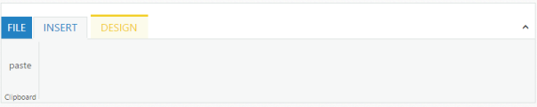

## AddContextualTabs

This method is used to add contextual tabs dynamically.This method has two arguments _addContextualTabs(Contextualtabs,index)_

* _Contextualtabs_: Collection of the contextual tabs that contextual tab needs to add.
* _Index_: Index in which the tab is to be added.It is optional argument. When this argument is not given, by default the tab is added at the last position.



[ASP.NET]

[ASPX]

<ej:Ribbon ID="Defaultribbon" runat="server" Width="800">

            <ApplicationTab ItemID="menu" Type="ApplicationMenu">

            </ApplicationTab>

            <RibbonTabs>

                <ej:RibbonTab Id="RibbonTab1" Text="INSERT">

                    <TabGroupCollection>

                        <ej:TabGroup Text="Clipboard">

                            <ContentCollection>

                                <ej:TabContent>

                                    <ContentGroupCollection>

                              <ej:ContentGroup Id="ContentGroup1" Type="Custom" ContentID="paste">

                                        </ej:ContentGroup>

                                    </ContentGroupCollection>

                                </ej:TabContent>

                            </ContentCollection>

                        </ej:TabGroup>

                    </TabGroupCollection>

                </ej:RibbonTab>

            </RibbonTabs>

        </ej:Ribbon>

<ul id="menu">

<li><a>FILE</a></li>

</ul>

Paste

    
ContextualTab



The following screenshot displays the output of the above code example.

{  | markdownify }
{:.image }

