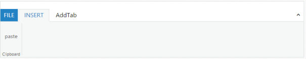

# AddTab

This method is used to add tab dynamically in the Ribbon control. This method requires three arguments addTab(TabName,TabGroupCollection,index)

* TabName : Name of the tab.
* TabGroupCollection : Collection of the tab groups that tab needs to add.
* Index : Index in which the tab is to be added.It is an optional argument. When this argument is not given, by default the tab is added at the last position.



<ej:Ribbon ID="Defaultribbon" runat="server" Width="800">

            <ApplicationTab MenuItemID="menu" Type="Menu">

            </ApplicationTab>

            <RibbonTabs>

                <ej:RibbonTab Id="RibbonTab1" Text="INSERT">

                    <TabGroupCollection>

                        <ej:TabGroup Text="Clipboard">

                            <ContentCollection>

                                <ej:TabContent>

                                    <ContentGroupCollection>

                               <ej:ContentGroup Id="ContentGroup1" Type="Custom" ContentID="paste">

                                        </ej:ContentGroup>

                                    </ContentGroupCollection>

                                </ej:TabContent>

                            </ContentCollection>

                        </ej:TabGroup>

                    </TabGroupCollection>

                </ej:RibbonTab>

            </RibbonTabs>

        </ej:Ribbon>

<ul id="menu">

<li><a>FILE</a></li>

</ul>

Paste

AddTab



The following screenshot displays the output of the above code example.

