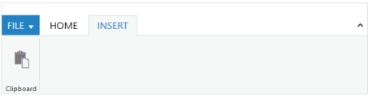

# Appearance and Styling

## CssClass 

When you want to display the **Ribbon** widget in a different style based on the appearance of your application, you can use this **cssClass** property to apply custom theme for the **Ribbon**. Specify a class name as the value for **cssClass** property. The specified class is added to the root element of the **Ribbon** widget. Now, you can easily override the styles of the **Ribbon** widget by accessing the styles from the root level (using the cssClass specified).

In an ASPX page, define the Ribbon control and configure the Ribbon with custom theme by using the CssClass property.



<ej:Ribbon ID="Ribbon" runat="server" Width="100%" CssClass="custom">
            <ApplicationTab MenuItemID="ribbonmenu" Type="Menu">
                <MenuSettings OpenOnClick="false"></MenuSettings>
            </ApplicationTab>
            <RibbonTabs>
                <ej:RibbonTab Id="home1" Text="HOME">
                    <TabGroupCollection>
                        <ej:TabGroup Text="New" AlignType="Columns">
                            <ContentCollection>
                                <ej:TabContent>
                                    <ContentGroupCollection>
                                        <ej:ContentGroup Id="new1" Text="New" Type="Button">
                                            <ButtonSettings Type="Button" ContentType="ImageOnly" PrefixIcon="e-icon e-ribbon e-new" />
                                        </ej:ContentGroup>
                                    </ContentGroupCollection>
                                </ej:TabContent>
                            </ContentCollection>
                        </ej:TabGroup>
                    </TabGroupCollection>
                </ej:RibbonTab>
            </RibbonTabs>
        </ej:Ribbon>
        <ul id="ribbonmenu">
            <li><a>FILE</a>
                <ul>
                    <li><a>New</a></li>
                </ul>
            </li>
        </ul>



### Define CSS class for customizing the Ribbon.



    .custom.e-js .e-header {
            background: #179bd7;
        }

    .custom.e-js .e-content {
        background: #ddd;
    }

    .custom .e-rbn-button.e-btn.e-select {
        background: #f5f5f5;
        color: #333;
    }



Execute the above code example to render the following output.

 

## Themes

Ribbon control’s style and appearance are controlled based on CSS classes and it has support of 12 default themes. You can check List of themes available for JavaScript’s control which is mentioned in [`this`](http://help.syncfusion.com/js/theming-in-essential-javascript-components) page.

To apply styles refer to two files namely

*	ej.widgets.core.min.css 
*	ej.theme.min.css

When the file `ej.widgets.all.min.css/ej.web.all.min.css` is referred, it is not necessary to include the files `ej.widgets.core.min.css` and `ej.theme.min.css` in your project as `ej.widgets.all.min.css` is the combination of these two files.

## Customize Styles

Override default styles of Ribbon control by using its class name to customize it.

List of custom classes that are need to override styles. The following are specific class names you can use to modify styles and appearance in Ribbon.

*	`e-js` -  used to represent element `ej-widget` control, that is present at the container element of Ribbon control.
*	`e-header` - This class is applied to the header element of the Ribbon.
*	`e-active-content` -This class is applied to the active content of the Ribbon.
*	`e-expandcollapse` - This class is applied to the expand/collapse button in the Ribbon.

### Application Tab

*   `e-apptab` - This class is applied to the application tab in the Ribbon.

### Tabs & Groups

*	`e-tab` -This class is applied to the Tabs in the Ribbon.
*	`e-groupdiv` -This class is applied to the groups in the Ribbon.
*	`e-active` -This class is applied to the active or selected tab in the Ribbon.

### Contextual Tabs

*	`e-contextliset`, `e-contextual`, `e-contextualtabset` -This class is applied to the contextual tab and contextual tab set in the Ribbon.

### Custom Tooltip

*	`e-tooltipdiv`, `e-tooltiptitle`,`e-tooltipdesc`, `e-tooltipimg` – Applies to custom tooltip and its icons settings.

### Gallery

*	`e-gallexpandcontent`,`e-gallerycontent` - Applies  to gallery items and custom items for collapse and expanded state.

*	`e-gallerymovediv`,`e-gallerybtn`,`e-moveupdiv`,`e-movedowndiv`,`e-expgallerydiv` - Applies  to gallery item button and navigation buttons of gallery.

*	`e-extracontent`,`e-galleryextrabtn`,`e-gallerymenu`  - Applies  to gallery custom items menu and button customization.

### Resizing

*	`e-resizebtn`, `e-resizediv` – Applies to resizing and its group button.

### Back Stage

*	`e-ribbonbackstagepage`,`e-ribbonbackstagetop`,`e-backstagetopicon` – Applies to back stage top header.

*	`e-ribbonbackstagebody` ,`e-backstageheader`,`e-backstagecontent`,`e-backstageli`,`e-backstageseparator`, `e-backstageactive` – Applies Backstage page side header and its contents.

### Quick Access Toolbar

*   `e-rbnwithqat`- This class applied to the Quick access toolbar in the Ribbon.

*   `e-rbnabove` - This class applied to the top Quick access toolbar.

*   `e-qatooldiv`- This class applied to individual controls in the Quick access toolbar.

*   `e-rbnbelow`- This class applied to the bottom Quick access toolbar.
