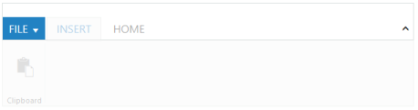
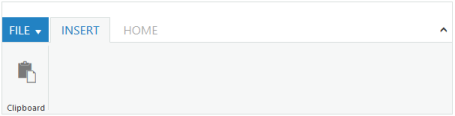
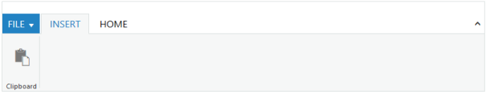
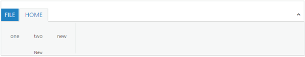

# Appearance and Styling

## SelectedItemIndex

Specifies the index of the Ribbon tab to select the given index tab item in the Ribbon control



<ej:Ribbon ID="Defaultribbon" runat="server" Width="800px">

<ApplicationTab ItemID="menu" Type="ApplicationMenu">

<MenuSettings OpenOnClick="false"></MenuSettings>

</ApplicationTab>

<RibbonTabs>

<ej:RibbonTab Id="home" Text="HOME">

<TabGroupCollection>

<ej:TabGroup Text="New" Type="custom" AlignType="Columns" ContentID="content">

</ej:TabGroup>

</TabGroupCollection>

</ej:RibbonTab>

<ej:RibbonTab Id="insert" Text="INSERT">

<TabGroupCollection>

<ej:TabGroup Text="paste">

<ContentCollection>

<ej:TabContent>

<ContentDefaults Height="70" />

<ContentGroupCollection>

<ej:ContentGroup Id="paste" Text="Paste" ToolTip="Paste" Type="Button" IsBig="true">

<ButtonSettings ContentType="ImageOnly" PrefixIcon="e-ribbon e-ribbonpaste" />

</ej:ContentGroup>

</ContentGroupCollection>

</ej:TabContent>

</ContentCollection>

</ej:TabGroup>

</TabGroupCollection>

</ej:RibbonTab>

</RibbonTabs>

</ej:Ribbon>

<ul id="menu">

<li><a>FILE</a>

<ul>

<li><a>New</a></li>

<li><a>Open</a></li>

</ul>

</li>

</ul>

Home control



The following output is displayed as a result of the above code example.

## DisabledItemIndex

Specifies the index or indexes to disable the corresponding tabs in the Ribbon control.



<ej:Ribbon ID="Defaultribbon" runat="server" Width="800px">

<ApplicationTab ItemID="menu" Type="ApplicationMenu">

<MenuSettings OpenOnClick="false"></MenuSettings>

</ApplicationTab>

<RibbonTabs>

<ej:RibbonTab Id="insert" Text="INSERT">

<TabGroupCollection>

<ej:TabGroup Text="paste">

<ContentCollection>

<ej:TabContent>

<ContentDefaults Height="70" />

<ContentGroupCollection>

<ej:ContentGroup Id="paste" Text="Paste" ToolTip="Paste" Type="Button" IsBig="true">

<ButtonSettings ContentType="ImageOnly" PrefixIcon="e-ribbon e-ribbonpaste" />

</ej:ContentGroup>

</ContentGroupCollection>

</ej:TabContent>

</ContentCollection>

</ej:TabGroup>

</TabGroupCollection>

</ej:RibbonTab>

<ej:RibbonTab Id="home" Text="HOME">

<TabGroupCollection>

<ej:TabGroup Text="New" Type="custom" AlignType="Columns" ContentID="content">

</ej:TabGroup>

</TabGroupCollection>

</ej:RibbonTab>

</RibbonTabs>

</ej:Ribbon>

<ul id="menu">

<li><a>FILE</a>

<ul>

<li><a>New</a></li>

<li><a>Open</a></li>

</ul>

</li>

</ul>

Home control



The following output is displayed as a result of the above code example.

## EnableItemIndex

Specifies the index or indexes to enable the corresponding tabs in the Ribbon control.



<ej:Ribbon ID="Defaultribbon" runat="server" Width="800px">

<ApplicationTab ItemID="menu" Type="ApplicationMenu">

<MenuSettings OpenOnClick="false"></MenuSettings>

</ApplicationTab>

<RibbonTabs>

<ej:RibbonTab Id="insert" Text="INSERT">

<TabGroupCollection>

<ej:TabGroup Text="paste">

<ContentCollection>

<ej:TabContent>

<ContentDefaults Height="70" />

<ContentGroupCollection>

<ej:ContentGroup Id="paste" Text="Paste" ToolTip="Paste" Type="Button" IsBig="true">

<ButtonSettings ContentType="ImageOnly" PrefixIcon="e-ribbon e-ribbonpaste" />

</ej:ContentGroup>

</ContentGroupCollection>

</ej:TabContent>

</ContentCollection>

</ej:TabGroup>

</TabGroupCollection>

</ej:RibbonTab>

<ej:RibbonTab Id="home" Text="HOME">

<TabGroupCollection>

<ej:TabGroup Text="New" Type="custom" AlignType="Columns" ContentID="content">

</ej:TabGroup>

</TabGroupCollection>

</ej:RibbonTab>

</RibbonTabs>

</ej:Ribbon>

<ul id="menu">

<li><a>FILE</a>

<ul>

<li><a>New</a></li>

<li><a>Open</a></li>

</ul>

</li>

</ul>

Home control



The following output is displayed as a result of the above code example.

## HideTab

This method is used to hide the given text tab in the Ribbon control.



<ej:Ribbon ID="Defaultribbon" runat="server" Width="800px">

<ApplicationTab ItemID="menu" Type="ApplicationMenu">

<MenuSettings OpenOnClick="false"></MenuSettings>

</ApplicationTab>

<RibbonTabs>

<ej:RibbonTab Id="insert" Text="INSERT">

<TabGroupCollection>

<ej:TabGroup Text="paste">

<ContentCollection>

<ej:TabContent>

<ContentDefaults Height="70" />

<ContentGroupCollection>

<ej:ContentGroup Id="paste" Text="Paste" ToolTip="Paste" Type="Button" IsBig="true">

<ButtonSettings ContentType="ImageOnly" PrefixIcon="e-ribbon e-ribbonpaste" />

</ej:ContentGroup>

</ContentGroupCollection>

</ej:TabContent>

</ContentCollection>

</ej:TabGroup>

</TabGroupCollection>

</ej:RibbonTab>

<ej:RibbonTab Id="home" Text="HOME">

<TabGroupCollection>

<ej:TabGroup Text="New" Type="custom" AlignType="Columns" ContentID="content">

</ej:TabGroup>

</TabGroupCollection>

</ej:RibbonTab>

</RibbonTabs>

</ej:Ribbon>

<ul id="menu">

<li><a>FILE</a>

<ul>

<li><a>New</a></li>

<li><a>Open</a></li>

</ul>

</li>

</ul>

Home control



The following output is displayed as a result of the above code example.

## ShowTab

This method is used to show the given text tab in the Ribbon control.



<ej:Ribbon ID="Defaultribbon" runat="server" Width="800px">

<ApplicationTab ItemID="menu" Type="ApplicationMenu">

<MenuSettings OpenOnClick="false"></MenuSettings>

</ApplicationTab>

<RibbonTabs>

<ej:RibbonTab Id="insert" Text="INSERT">

<TabGroupCollection>

<ej:TabGroup Text="paste">

<ContentCollection>

<ej:TabContent>

<ContentDefaults Height="70" />

<ContentGroupCollection>

<ej:ContentGroup Id="paste" Text="Paste" ToolTip="Paste" Type="Button" IsBig="true">

<ButtonSettings ContentType="ImageOnly" PrefixIcon="e-ribbon e-ribbonpaste" />

</ej:ContentGroup>

</ContentGroupCollection>

</ej:TabContent>

</ContentCollection>

</ej:TabGroup>

</TabGroupCollection>

</ej:RibbonTab>

<ej:RibbonTab Id="home" Text="HOME">

<TabGroupCollection>

<ej:TabGroup Text="New" Type="custom" AlignType="Columns" ContentID="content">

</ej:TabGroup>

</TabGroupCollection>

</ej:RibbonTab>

</RibbonTabs>

</ej:Ribbon>

<ul id="menu">

<li><a>FILE</a>

<ul>

<li><a>New</a></li>

<li><a>Open</a></li>

</ul>

</li>

</ul>

Home control



The following output is displayed as a result of the above code example.

## RemoveTab

This method is used to remove the given index tab item from the Ribbon control.



<ej:Ribbon ID="Defaultribbon" runat="server" Width="800px">

<ApplicationTab ItemID="menu" Type="ApplicationMenu">

<MenuSettings OpenOnClick="false"></MenuSettings>

</ApplicationTab>

<RibbonTabs>

<ej:RibbonTab Id="insert" Text="INSERT">

<TabGroupCollection>

<ej:TabGroup Text="paste">

<ContentCollection>

<ej:TabContent>

<ContentDefaults Height="70" />

<ContentGroupCollection>

<ej:ContentGroup Id="paste" Text="Paste" ToolTip="Paste" Type="Button" IsBig="true">

<ButtonSettings ContentType="ImageOnly" PrefixIcon="e-ribbon e-ribbonpaste" />

</ej:ContentGroup>

</ContentGroupCollection>

</ej:TabContent>

</ContentCollection>

</ej:TabGroup>

</TabGroupCollection>

</ej:RibbonTab>

<ej:RibbonTab Id="home" Text="HOME">

<TabGroupCollection>

<ej:TabGroup Text="New" Type="custom" AlignType="Columns" ContentID="content">

</ej:TabGroup>

</TabGroupCollection>

</ej:RibbonTab>

</RibbonTabs>

</ej:Ribbon>

<ul id="menu">

<li><a>FILE</a>

<ul>

<li><a>New</a></li>

<li><a>Open</a></li>

</ul>

</li>

</ul>

Home control



The following output is displayed as a result of the above code example.

## Width

Specifies the Width to the Ribbon control.



<ej:Ribbon ID="Defaultribbon" runat="server" Width="800">

        <ApplicationTab ItemID="menu" Type="ApplicationMenu">

            <MenuSettings OpenOnClick="false"></MenuSettings>

        </ApplicationTab>

        <RibbonTabs>

            <ej:RibbonTab Id="insert" Text="INSERT">

                <TabGroupCollection>

                    <ej:TabGroup Text="paste">

                        <ContentCollection>

                            <ej:TabContent>

                                <ContentDefaults Height="70" Width="50" />

                                <ContentGroupCollection>

                                    <ej:ContentGroup Id="paste" Text="Paste" ToolTip="Paste" Type="Button" IsBig="true">

                                        <ButtonSettings ContentType="ImageOnly" PrefixIcon="e-ribbon e-ribbonpaste" />

                                    </ej:ContentGroup>

                                </ContentGroupCollection>

                            </ej:TabContent>

                        </ContentCollection>

                    </ej:TabGroup>

                </TabGroupCollection>

            </ej:RibbonTab>

            <ej:RibbonTab Id="home" Text="HOME">

                <TabGroupCollection>

                    <ej:TabGroup Text="New" Type="custom" AlignType="Columns" ContentID="content">

                    </ej:TabGroup>

                </TabGroupCollection>

            </ej:RibbonTab>

        </RibbonTabs>

    </ej:Ribbon>

    <ul id="menu">

        <li><a>FILE</a>

            <ul>

                <li><a>New</a></li>

                <li><a>Open</a></li>

            </ul>

        </li>

    </ul>

    
Home control



The following output is displayed as a result of the above code example.

## Add Tab Group

This method is used to add Ribbon Group dynamically in the Ribbon control. This method needs three arguments addTabGroup(Tab index, Groupcollection, Group index)

Tab index : Index of tab, where the group is to be added.

TabGroup collection : Collection of the groups that group needs to add.

Group Index : Index of ribbon group, where the group is to be added. It is optional argument, when this argument is not given, group is added at last position by default.



<ej:Ribbon ID="Ribbon" ClientIDMode="Static" runat="server" Width="100%">

        <ApplicationTab ItemID="menu" Type="ApplicationMenu"/>

        </ApplicationTab>

        <RibbonTabs>

            <ej:RibbonTab Id="home" Text="HOME">

                <TabGroupCollection>

                    <ej:TabGroup Text="New" AlignType="rows">

                        <ContentCollection>

                            <ej:TabContent>

                                <ContentGroupCollection>

                                    <ej:ContentGroup Id="one" Text="one" ToolTip="one" Type="Button">

                                    </ej:ContentGroup>

                                    <ej:ContentGroup Id="two" Text="two" ToolTip="two" Type="Button">

                                    </ej:ContentGroup>

                                </ContentGroupCollection>

                                <ContentDefaults Width="60" Height="70" Type="Button" />

                            </ej:TabContent>

                        </ContentCollection>

                    </ej:TabGroup>

                </TabGroupCollection>

            </ej:RibbonTab>

        </RibbonTabs>

    </ej:Ribbon>

<ul id="menu">

<li><a>FILE</a></li>

</ul>



The following output is displayed as a result of the above code example.

## Add Tab Group Content

This method is used to add group content dynamically in the ribbon. This method contains five arguments addTabGroupContent(Tab index, Group index, Subgroup index, Content, Content index)

Tab index : Ribbon Tab index.

Group index : Ribbon group index.

Subgroup Index : Sub group index. Content to be added belongs to this sub group index.

Content : Collection of the group content that is added as Ribbon group content. 

Content Index : Ribbon content index, this is optional argument. When this argument is not given, the Group content is added at last position by default.



<ej:Ribbon ID="Ribbon" ClientIDMode="Static" runat="server" Width="100%">

        <ApplicationTab ItemID="ribbonmenu" Type="ApplicationMenu"/>

        <RibbonTabs>

            <ej:RibbonTab Id="home" Text="HOME">

                <TabGroupCollection>

                    <ej:TabGroup Text="New" AlignType="rows">

                        <ContentCollection>

                            <ej:TabContent>

                                <ContentGroupCollection>

                                    <ej:ContentGroup Id="one" Text="one" ToolTip="one" Type="Button">

                                    </ej:ContentGroup>

                                    <ej:ContentGroup Id="two" Text="two" ToolTip="two" Type="Button">

                                    </ej:ContentGroup>

                                </ContentGroupCollection>

                                <ContentDefaults Width="60" Height="70" Type="Button" />

                            </ej:TabContent>

                        </ContentCollection>

                    </ej:TabGroup>

                </TabGroupCollection>

            </ej:RibbonTab>

        </RibbonTabs>

    </ej:Ribbon>

<ul id="menu">

<li><a>FILE</a></li>

</ul>



The following output is displayed as a result of the above code example.

