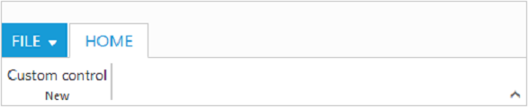
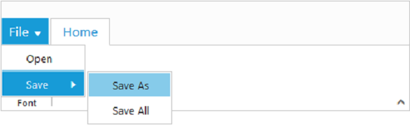
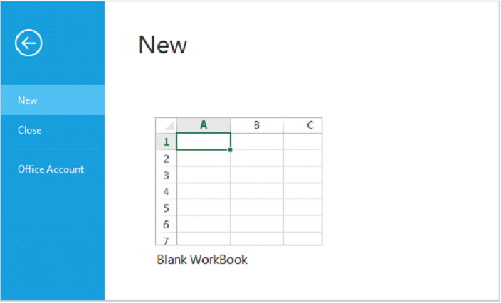

# Application Tab
The Application Tab is used to represent a `Menu` that do some operations, such as File menu to create, open, and print documents. Application Tab classified by `Type` property with the following:

*	Menu
*	Backstage

## Application Menu

The Application Menu is similar to traditional file menu options and Syncfusion `ejMenu` control is used internally to render this. To show Application Menu in Ribbon, set the `Type` as `menu` and [`MenuSettings`](http://help.syncfusion.com/aspnet/menu/getting-started) to customize properties of `ejMenu`.

### Create Using Template

Set the UL element `Id` to `MenuItemID` property to create Application Menu and it will acts as template to render menu.



	<ej:Ribbon ID="Ribbon" runat="server" Width="100%">
		<ApplicationTab MenuItemID="ribbonmenu" Type="Menu">
			<MenuSettings OpenOnClick="false"></MenuSettings>
		</ApplicationTab>
		<RibbonTabs>
			<ej:RibbonTab Id="home1" Text="HOME">
				<TabGroupCollection>
					<ej:TabGroup Text="New" AlignType="Columns">
						<ContentCollection>
							<ej:TabContent>
								<ContentGroupCollection>
									<ej:ContentGroup Id="new1" Text="New" Type="Custom" ContentID="Contents">
	
									</ej:ContentGroup>
								</ContentGroupCollection>
							</ej:TabContent>
						</ContentCollection>
					</ej:TabGroup>
				</TabGroupCollection>
			</ej:RibbonTab>
		</RibbonTabs>
	</ej:Ribbon>
	<!--UL template to render menu-->
	<ul id="ribbonmenu">
		<li><a>FILE</a>
			<ul>
				<li><a>New</a></li>
				<li><a>Open</a></li>
	
			</ul>
		</li>
	</ul>
	
Custom control



### Binding Data Source
 
Application Menu can be rendered using JSON Data Source. Please refer [`this`](http://help.syncfusion.com/aspnet/menu/data-binding) page to set data source to `ejMenu`.
 


	<ej:Ribbon ID="Ribbon" runat="server" Width="100%" AllowResizing="true" Create="createControl">
		<ApplicationTab MenuItemID="ribbonmenu1" Type="Menu">
			<MenuSettings OpenOnClick="false" />
		</ApplicationTab>
		<RibbonTabs>
			<ej:RibbonTab Id="home" Text="HOME">
				<TabGroupCollection>
					<ej:TabGroup Text="Font">
						<ContentCollection>
							<ej:TabContent>
								<ContentGroupCollection>
									<ej:ContentGroup id="bold" Text="Bold" IsBig="true">
										<ButtonSettings ContentType="ImageOnly" PrefixIcon="e-icon e-ribbon e-bold" />
									</ej:ContentGroup>
								</ContentGroupCollection>
							</ej:TabContent>
						</ContentCollection>
					</ej:TabGroup>
				</TabGroupCollection>
			</ej:RibbonTab>
		</RibbonTabs>
	</ej:Ribbon>
	
	<ul id="ribbonmenu1">
	</ul>
	
	



## Backstage Page

The Backstage page is where documents and related data of those can be managed, such as Create, Save and other information.

The Backstage page has a feature to add custom Control in left side of the page which contains menu items and the right side contains corresponding user controls. 

You can set Application Tab `Type` as `backstage` and set `Id` , `Text` to backstage items. Backstage `Pages` can be added with required `ItemType` and `ContentID` as template id to render template into Backstage. 

Separator between Backstage items can be enabled by setting `EnableSeparator` as true. Width of back stage side header can be customized using `HeaderWidth`, If not set based on content given width will be considered.

To render the Ribbon with the Backstage page, refer to the following code snippet. 


	
	<ej:Ribbon ID="Ribbon" runat="server" Width="800px">
		<ApplicationTab Type="Backstage">
			<BackstageSettings HeaderWidth="125" Text="FILE" Height="360" Width="600">
				<PageCollection>
					<ej:BackstagePage Id="new1" Text="New" ContentID="newCon" />
					<ej:BackstagePage Id="close" Text="Close" EnableSeparator="true" ItemType="Button" />
					<ej:BackstagePage Id="account" Text="Office Account" ContentID="accountCon" />
				</PageCollection>
			</BackstageSettings>
		</ApplicationTab>
		<RibbonTabs>
			<ej:RibbonTab Id="home1" Text="HOME">
				<TabGroupCollection>
					<ej:TabGroup Text="Save" AlignType="Columns">
						<ContentCollection>
							<ej:TabContent>
								<ContentGroupCollection>
									<ej:ContentGroup Text="New" Type="Custom" ContentID="ribbonContent">
									</ej:ContentGroup>
								</ContentGroupCollection>
							</ej:TabContent>
						</ContentCollection>
					</ej:TabGroup>
				</TabGroupCollection>
			</ej:RibbonTab>
		</RibbonTabs>
	</ej:Ribbon>
	

		<table>
			<tr>
				<td>
					<button id="btn1" class="e-bsnewbtnstyle">Blank WorkBook</button></td>
			</tr>
		</table>
	

	

		

			User Information
			

				

				

					
user

					
any@syncfusion.com

				

			

		

		<a href="#">Sign out</a>
	

	
Home control

	
	



N> _Height & width of backstage can be set using `Height` and `Width`, if these are not set, Ribbon’s Height & Width will be considered._

You can add/remove/update backStage item to the ribbon control by using [`addBackStageItem`](https://help.syncfusion.com/api/js/ejribbon#methods:addbackstageitem), [`removeBackStageItem`](https://help.syncfusion.com/api/js/ejribbon#methods:removebackstageitem) and [`updateBackStageItem`](https://help.syncfusion.com/api/js/ejribbon#methods:updatebackstageitem) methods. Also you can show/hide the backstage page in ribbon control by using [`showBackstage`](https://help.syncfusion.com/api/js/ejribbon#methods:showbackstage) and [`hideBackstage`](https://help.syncfusion.com/api/js/ejribbon#methods:hidebackstage methods.
