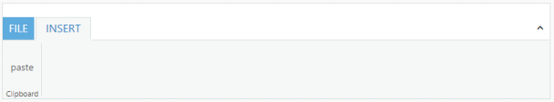

# Collapse and Expand

## Collapse

_Collapse_ method is used to minimize the ribbon control tab contents.You can minimize the Ribbon tab content by using the client side method _collapse()._



<ej:Ribbon ID="Defaultribbon" runat="server" Width="800">

            <ApplicationTab ItemID="menu" Type="ApplicationMenu">

            </ApplicationTab>

            <RibbonTabs>

                <ej:RibbonTab Id="RibbonTab1" Text="INSERT">

                    <TabGroupCollection>

                        <ej:TabGroup Text="Clipboard">

                            <ContentCollection>

                                <ej:TabContent>

                                    <ContentGroupCollection>

                                        <ej:ContentGroup Id="ContentGroup1" Type="Custom" ContentID="paste">

                                        </ej:ContentGroup>

                                    </ContentGroupCollection>

                                </ej:TabContent>

                            </ContentCollection>

                        </ej:TabGroup>

                    </TabGroupCollection>

                </ej:RibbonTab>

            </RibbonTabs>

        </ej:Ribbon>

<ul id="menu">

<li><a>FILE</a></li>

</ul>

Paste



The following screenshot displays the output of the above code example.

## Expand

_Expand_ method is used to expand the minimized ribbon control tab contents.You can expand the_Ribbon_ tab content by using the client side method _expand()_ .



<ej:Ribbon ID="Defaultribbon" runat="server" Width="800">

            <ApplicationTab ItemID="menu" Type="ApplicationMenu">

             </ApplicationTab>

            <RibbonTabs>

                <ej:RibbonTab Id="RibbonTab1" Text="INSERT">

                    <TabGroupCollection>

                        <ej:TabGroup Text="Clipboard">

                            <ContentCollection>

                                <ej:TabContent>

                                    <ContentGroupCollection>

                                        <ej:ContentGroup Id="ContentGroup1" Type="Custom" ContentID="paste">

                                        </ej:ContentGroup>

                                    </ContentGroupCollection>

                                </ej:TabContent>

                            </ContentCollection>

                        </ej:TabGroup>

                    </TabGroupCollection>

                </ej:RibbonTab>

            </RibbonTabs>

        </ej:Ribbon>

<ul id="menu">

<li><a>FILE</a></li>

</ul>

Paste



The following screenshot displays the output of the above code example.

