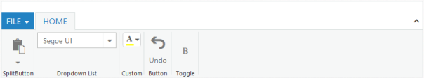
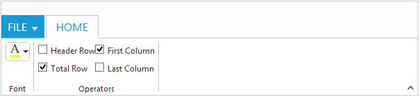

# Controls Support

Button, SplitButton, DropDownList, ToggleButton, Gallery and Custom controls can be added to each ContentGroup . You can set `Type` property in ContentGroup to define the controls. Default `Type` is `Button`.  

## Built in Controls

The following table describes about the built in controls `Type` and their corresponding control settings.

<table class="params">
<thead>
<tr>
<th>Type</th>
<th>Control Settings</th>
<th class="last">Example</th>
</tr>
</thead>                     
<tbody>
<tr>
<td class="type">Button</td>
<td class="control settings">Button - ButtonSettings</td><td class="example last">
    ButtonSettings Width="70" ContentType="ImageOnly" PrefixIcon="e-icon e-ribbon e-new"
 </td>
</tr>
<tr>
<td class="type">SplitButton</td>
<td class="control settings">SplitButton - SplitButtonSettings</td>
<td class="example last">
    SplitButtonSettings Width="70" ContentType="ImageOnly" TargetID="pasteSplit" ButtonMode="Dropdown" ArrowPosition="Bottom"
 </td>
</tr>
<tr>
<td class="type">ToggleButton</td>
<td class="control settings">ToggleButton - ToggleButtonSettings</td>
<td class="example last">
    ToggleButtonSettings ActiveText="Italic" DefaultText="Italic" ContentType="ImageOnly"
 </td>
</tr>
<tr>
<td class="type">DropDownList</td>
<td class="control settings">DropDownList - DropDownSettings</td>
<td class="example last">
	DropdownSettings DataSource="size" Text="1pt" Width="65"
 </td>
</tr>
</tbody>
</table>

N> You can specify type either to `ContentGroup` or to `ContentDefault`.





	<ej:Ribbon ID="defaultRibbon" runat="server" Width="100%">
		<ApplicationTab MenuItemID="ribbonmenu" Type="Menu">
			<MenuSettings OpenOnClick="false"></MenuSettings>
		</ApplicationTab>
		<RibbonTabs>
			<ej:RibbonTab Id="home" Text="HOME">
				<TabGroupCollection>
					<ej:TabGroup Text="New" AlignType="Columns">
						<ContentCollection>
							<ej:TabContent>
								<ContentGroupCollection>
									<ej:ContentGroup Id="new" Text="New" ToolTip="New" Type="Button">
										<ButtonSettings Type="Button" ContentType="ImageOnly" ImagePosition="ImageTop" PrefixIcon="e-icon e-ribbon e-new" Click="executeAction" />
									</ej:ContentGroup>
								</ContentGroupCollection>
								<ContentDefaults Width="60" Height="70" Type="Button" />
							</ej:TabContent>
						</ContentCollection>
					</ej:TabGroup>
					<ej:TabGroup Text="Clipboard" AlignType="Columns">
						<ContentCollection>
							<ej:TabContent>
								<ContentDefaults Width="50" Height="75" Type="SplitButton" />
								<ContentGroupCollection>
									<ej:ContentGroup Id="paste" ToolTip="Paste">
										<SplitButtonSettings ButtonMode="Dropdown" ArrowPosition="Bottom" TargetID="pasteul" ContentType="TextAndImage" PrefixIcon="e-icon e-ribbon e-ribbonpaste" />
									</ej:ContentGroup>
								</ContentGroupCollection>
							</ej:TabContent>
						</ContentCollection>
					</ej:TabGroup>
					<ej:TabGroup Text="Font" AlignType="Rows">
						<ContentCollection>
							<ej:TabContent>
								<ContentDefaults Height="28" Type="DropDownList" />
								<ContentGroupCollection>
									<ej:ContentGroup Id="fontFamily" ToolTip="Font" Type="DropDownList">
										<DropdownSettings Text="Segoe UI" Width="150"></DropdownSettings>
									</ej:ContentGroup>
									<ej:ContentGroup Id="fontsize" ToolTip="FontSize" Type="DropDownList">
										<DropdownSettings Text="1pt" Width="65"></DropdownSettings>
									</ej:ContentGroup>
								</ContentGroupCollection>
							</ej:TabContent>
							<ej:TabContent>
								<ContentGroupCollection>
									<ej:ContentGroup Id="bold" Text="Bold" ToolTip="Bold" Type="ToggleButton">
										<toggleButtonSettings ContentType="ImageOnly" ActiveText="Bold" ActivePrefixIcon="e-icon e-ribbon bold" DefaultPrefixIcon="e-icon e-ribbon bold" />
									</ej:ContentGroup>
									<ej:ContentGroup Id="italic" Text="Italic" ToolTip="Italic" Type="ToggleButton">
										<toggleButtonSettings ContentType="ImageOnly" ActiveText="Italic" ActivePrefixIcon="e-icon e-ribbon e-ribbonitalic" DefaultPrefixIcon="e-icon e-ribbon e-ribbonitalic" />
									</ej:ContentGroup>
								</ContentGroupCollection>
								<ContentDefaults Type="Button" IsBig="false" />
							</ej:TabContent>
						</ContentCollection>
					</ej:TabGroup>
				</TabGroupCollection>
			</ej:RibbonTab>
		</RibbonTabs>
	</ej:Ribbon>
	<ul id="ribbonmenu">
		<li><a>FILE</a>
			<ul>
				<li><a>Open</a></li>
			</ul>
		</li>
	</ul>
	<ul id="pasteul">
		<li><a>Paste</a></li>
	</ul> 
	





    protected void Page_Load(object sender, EventArgs e)
        {
            var fontList = new List<string> { "Segoe UI", "Arial", "Times New Roman", "Tahoma", "Helvetica" };
            var fontsize = new List<string>() { "1pt", "2pt", "3pt", "4pt", "5pt" };
            this.fontFamily.DropdownSettings.DataSource = fontList;
            this.fontsize.DropdownSettings.DataSource = fontsize;        
        }





## Custom

You can set `Type` as `Custom` to render custom controls and Custom element id has to be specified as `ContentID`.You can change the element defined in the custom template to appropriate Syncfusion control in the event of Ribbon `Create`.


	
		<ej:Ribbon ID="defaultRibbon" runat="server" Width="600" Create="createControl">
		<ApplicationTab MenuItemID="ribbonmenu" Type="Menu">
			<MenuSettings OpenOnClick="false"></MenuSettings>
		</ApplicationTab>
		<RibbonTabs>
			<ej:RibbonTab Id="home" Text="HOME">
				<TabGroupCollection>
					<ej:TabGroup Text="Font">
						<ContentCollection>
							<ej:TabContent>
								<ContentDefaults Type="Custom" Height="30" />
								<ContentGroupCollection>
									<ej:ContentGroup Id="fontcolor" ToolTip="Font Color" ContentID="fontcolor1">
									</ej:ContentGroup>
								</ContentGroupCollection>
							</ej:TabContent>
						</ContentCollection>
					</ej:TabGroup>
					<ej:TabGroup Text="Operators">
						<ContentCollection>
							<ej:TabContent>
								<ContentGroupCollection>
									<ej:ContentGroup Id="design" ContentID="design1" Type="Custom">
									</ej:ContentGroup>
								</ContentGroupCollection>
							</ej:TabContent>
						</ContentCollection>
					</ej:TabGroup>
				</TabGroupCollection>
			</ej:RibbonTab>
		</RibbonTabs>
	</ej:Ribbon>
	
	<ul id="ribbonmenu">
		<li><a>FILE</a>
			<ul>
				<li><a>Open</a></li>
			</ul>
		</li>
	</ul>
	<input id="fontcolor1" />
	<table id="design1" class="e-designtablestyle">
		<tr>
			<td><input type="checkbox" id="check1" /><label for="check1">Header Row</label></td>
			<td><input type="checkbox" id="Check2" checked="checked" /><label for="Check2">First Column</label></td>
		</tr>
		<tr>
			<td><input type="checkbox" id="check4" checked="checked" /><label for="check4">Total Row</label></td>
			<td><input type="checkbox" id="Check5" /><label for="Check5">Last Column</label></td>
		</tr>
	</table>
	   



 