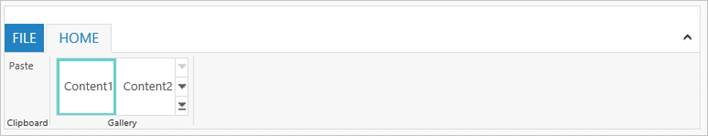
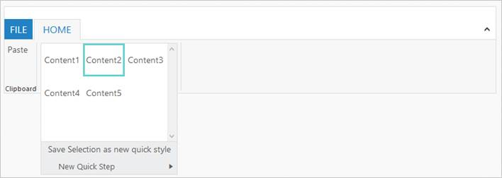
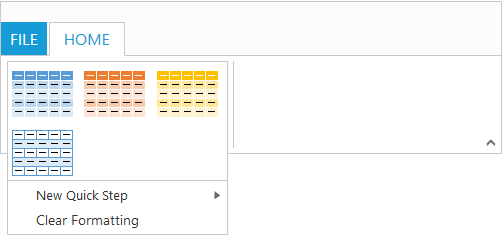

# Gallery

Galleries are used to display items that can be arranged in a grid-type layout. Items in the gallery can be customized as [`Button`](http://help.syncfusion.com/aspnet/button/getting-started)/[`Menu`](http://help.syncfusion.com/aspnet/menu/getting-started) to display images, text, or both images and text. You can set `Type` of group as `Gallery`.

## Gallery Items

GalleryItem are collection of the items to be included in the main gallery. You can set `Text` and `ToolTip` to gallery item which can also be customized with `ButtonSettings `. 

Number of `Columns` to display in gallery for each row should be specified and the Number of columns in Expanded State (`ExpandedColumns`) can be customized, if not set, `Columns` count will be set as default. 

N> The `ItemHeight` and `ItemWidth` for GalleryItem can be set, if not set default values will be used.


	
	<ej:Ribbon ID="defaultRibbon1" runat="server" Width="500">
		<ApplicationTab MenuItemID="ribbonmenu" Type="Menu">
			<MenuSettings OpenOnClick="false"></MenuSettings>
		</ApplicationTab>
		<RibbonTabs>
			<ej:RibbonTab Id="home1" Text="HOME">
				<TabGroupCollection>
					<ej:TabGroup Text="Gallery">
						<ContentCollection>
							<ej:TabContent>
								<ContentGroupCollection>
									<ej:ContentGroup Text="Gallery" Type="Gallery" Id="Gallery1" Columns="2" ItemWidth="73" ItemHeight="54" ExpandedColumns="3">
										<GalleryItemCollection>
											<ej:GalleryItem Text="GalleryContent1" ToolTip="GalleryContent1">
												<ButtonSettings ContentType="ImageOnly" CssClass="e-gbtnposition" PrefixIcon="e-icon e-gallerycontent1 e-gbtnimg" />
											</ej:GalleryItem>
											<ej:GalleryItem Text="GalleryContent2" ToolTip="GalleryContent2">
												<ButtonSettings ContentType="ImageOnly" CssClass="e-gbtnposition" PrefixIcon="e-icon e-gallerycontent2 e-gbtnimg" />
											</ej:GalleryItem>
											<ej:GalleryItem Text="GalleryContent3" ToolTip="GalleryContent3">
												<ButtonSettings ContentType="ImageOnly" CssClass="e-gbtnposition" PrefixIcon="e-icon e-gallerycontent3 e-gbtnimg" />
											</ej:GalleryItem>
											<ej:GalleryItem Text="GalleryContent4" ToolTip="GalleryContent4">
												<ButtonSettings ContentType="ImageOnly" CssClass="e-gbtnposition" PrefixIcon="e-icon e-gallerycontent4 e-gbtnimg" />
											</ej:GalleryItem>
										</GalleryItemCollection>
									</ej:ContentGroup>
								</ContentGroupCollection>
							</ej:TabContent>
						</ContentCollection>
					</ej:TabGroup>
				</TabGroupCollection>
			</ej:RibbonTab>
		</RibbonTabs>
	</ej:Ribbon>
	<ul id="ribbonmenu">
		<li><a>FILE</a>
			<ul>
				<li><a>New</a></li>
				<li><a>Open</a></li>
			</ul>
		</li>
	</ul>
	



Ribbon Gallery.
{:.caption}

Gallery at Expanded State
{:.caption}

## Custom Gallery Items

CustomGalleryItem are the additional items to be displayed at gallery expanded state. You can set `CustomItemType` as `Button` or `Menu`, Default is `Button`.

You can also set `Text` and `ToolTip` to CustomGalleryItem which can also be customized with [`ButtonSettings`](http://help.syncfusion.com/aspnet/button/getting-started)/[`MenuSettings`](http://help.syncfusion.com/aspnet/menu/getting-started) based on the CustomItemType specified.



		<ej:Ribbon ID="defaultRibbon1" runat="server" Width="500">
		<ApplicationTab MenuItemID="ribbonmenu" Type="Menu">
			<MenuSettings OpenOnClick="false"></MenuSettings>
		</ApplicationTab>
		<RibbonTabs>
			<ej:RibbonTab Id="home1" Text="HOME">
				<TabGroupCollection>
					<ej:TabGroup Text="Gallery">
						<ContentCollection>
							<ej:TabContent>
								<ContentGroupCollection>
									<ej:ContentGroup Text="Gallery" Type="Gallery" Id="Gallery1" Columns="2" ItemWidth="73" ItemHeight="54" ExpandedColumns="3">
										<GalleryItemCollection>
											<ej:GalleryItem Text="GalleryContent1" ToolTip="GalleryContent1">
												<ButtonSettings ContentType="ImageOnly" CssClass="e-gbtnposition" PrefixIcon="e-icon e-gallerycontent1 e-gbtnimg" />
											</ej:GalleryItem>
											<ej:GalleryItem Text="GalleryContent2" ToolTip="GalleryContent2">
												<ButtonSettings ContentType="ImageOnly" CssClass="e-gbtnposition" PrefixIcon="e-icon e-gallerycontent2 e-gbtnimg" />
											</ej:GalleryItem>
											<ej:GalleryItem Text="GalleryContent3" ToolTip="GalleryContent3">
												<ButtonSettings ContentType="ImageOnly" CssClass="e-gbtnposition" PrefixIcon="e-icon e-gallerycontent3 e-gbtnimg" />
											</ej:GalleryItem>
											<ej:GalleryItem Text="GalleryContent4" ToolTip="GalleryContent4">
												<ButtonSettings ContentType="ImageOnly" CssClass="e-gbtnposition" PrefixIcon="e-icon e-gallerycontent4 e-gbtnimg" />
											</ej:GalleryItem>
										</GalleryItemCollection>
										<CustomGalleryItemCollection>
											<ej:CustomGalleryItem CustomItemType="Menu" MenuId="custommenu">
												<MenuSettings OpenOnClick="false" />
											</ej:CustomGalleryItem>
											<ej:CustomGalleryItem Text="Clear Formatting" ToolTip="Clear Formatting" CustomItemType="Button">
												<ButtonSettings CssClass="e-extrabtnstyle" />
											</ej:CustomGalleryItem>
										</CustomGalleryItemCollection>
									</ej:ContentGroup>
								</ContentGroupCollection>
							</ej:TabContent>
						</ContentCollection>
					</ej:TabGroup>
				</TabGroupCollection>
			</ej:RibbonTab>
		</RibbonTabs>
	</ej:Ribbon>
	<ul id="ribbonmenu">
		<li><a>FILE</a>
			<ul>
				<li><a>New</a></li>
				<li><a>Open</a></li>
			</ul>
		</li>
	</ul>
	<ul id="custommenu">
		<li>
			<a>New Quick Step</a>
			<ul>
				<li><a>Flag and Move</a></li>
			</ul>
		</li>
	</ul>
	



