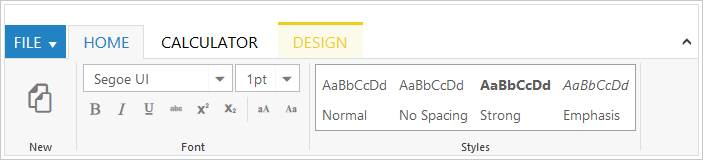
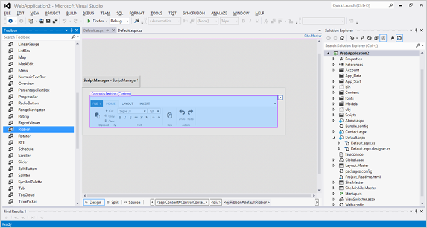
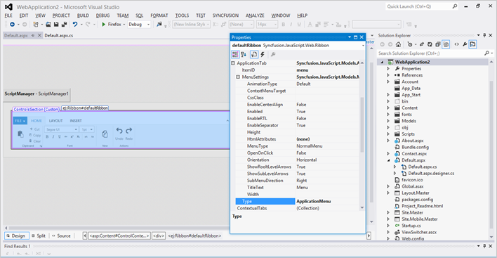
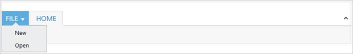
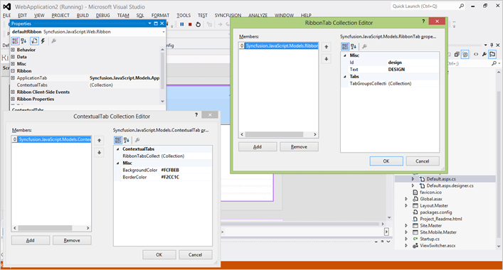
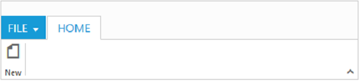
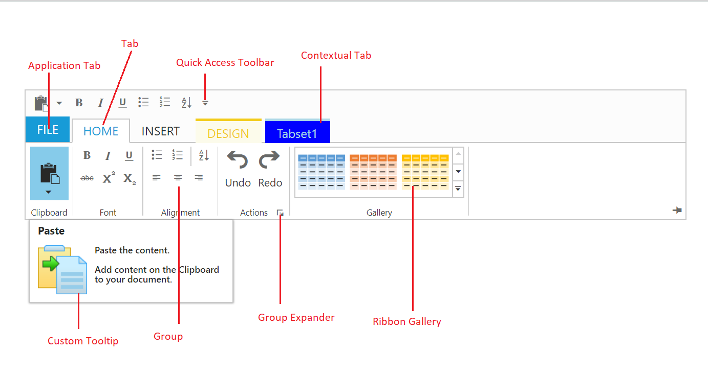

# Getting Started

This section explains briefly how to create a Ribbon.

## Control Initialization

Ribbon can be initialized with `Application Tab` and UL list is needed for binding menu to application menu which can be specified through `MenuItemID` which denotes `Id` of UL.

Define the Application Tab with `Type` as `Menu` to render simple Ribbon control.



    <ej:Ribbon ID="Ribbon" runat="server" Width="100%">
      <ApplicationTab MenuItemID="ribbonmenu" Type="Menu">
          <MenuSettings OpenOnClick="false"></MenuSettings>
      </ApplicationTab>
    </ej:Ribbon>
    <ul id="ribbonmenu">
      <li><a>FILE</a>
          <ul>
              <li><a>New</a></li>
              <li><a>Open</a></li>
              <li><a>Save</a></li>
              <li><a>Print</a></li>
          </ul>
      </li>
    </ul>



N> _Set the required `Width` to Ribbon, else default parent container or window width will be considered_

1. Create a Syncfusion ASP.NET Web Forms application.

2. Drag and drop the Ribbon control in the Index.aspx page from the toolbox.
 
 
 
  
## Adding Tabs
 
 RibbonTab is a set of related groups which are combined into single item. For creating Tab, `Id ` and `Text` properties should be specified. 
 
 The following screenshot shows designer page of ApplicationTab.
 
 
 
 
 

    <ej:Ribbon ID="Ribbon" runat="server" Width="100%">
        <ApplicationTab MenuItemID="ribbonmenu" Type="Menu">
            <MenuSettings OpenOnClick="false"></MenuSettings>
        </ApplicationTab>
        <RibbonTabs>
            <ej:RibbonTab Id="home" Text="HOME">
            </ej:RibbonTab>
        </RibbonTabs>
    </ej:Ribbon>
    <ul id="ribbonmenu">
        <li><a>FILE</a>
            <ul>
                <li><a>New</a></li>
            </ul>
        </li>
    </ul>


 

## Configuring Groups

List of controls are combined as logical `TabGroupCollection ` into RibbonTab. TabGroup alignment type as “Rows/Columns”, Default is `Rows`. 

Create TabGroup item with `Text` specified and add ContentGroupCollection to ContentGroup with Button control settings.

The following screenshot shows designer page of TabGroupCollection



    <ej:Ribbon ID="Ribbon" runat="server" Width="100%">
        <ApplicationTab MenuItemID="ribbonmenu" Type="Menu">
            <MenuSettings OpenOnClick="false"></MenuSettings>
        </ApplicationTab>
        <RibbonTabs>
            <ej:RibbonTab Id="home1" Text="HOME">
                <TabGroupCollection>
                    <ej:TabGroup Text="New" AlignType="Columns">
                        <ContentCollection>
                            <ej:TabContent>
                                <ContentGroupCollection>
                                    <ej:ContentGroup Id="new1" Text="New" Type="Button">
                                        <ButtonSettings Type="Button" ContentType="ImageOnly" PrefixIcon="e-icon e-ribbon e-new" />
                                    </ej:ContentGroup>
                                </ContentGroupCollection>
                            </ej:TabContent>
                        </ContentCollection>
                    </ej:TabGroup>
                </TabGroupCollection>
            </ej:RibbonTab>
        </RibbonTabs>
    </ej:Ribbon>
    <ul id="ribbonmenu">
        <li><a>FILE</a>
            <ul>
                <li><a>New</a></li>
            </ul>
        </li>
    </ul>   



## Adding Controls to Group

Syncfusion ASP.NET Controls can be added to group’s content with corresponding `Type` specified like Button, Split button, Toggle button, Dropdown list, Gallery, Custom, etc. Default type is `Button`.





        <ej:Ribbon ID="Ribbon" runat="server" Width="100%" AllowResizing="true" Create="createControl">
            <ApplicationTab MenuItemID="ribbonmenu" Type="Menu">
                <MenuSettings OpenOnClick="false"></MenuSettings>
            </ApplicationTab>
            <RibbonTabs>
                <ej:RibbonTab Id="home" Text="HOME">
                    <TabGroupCollection>
                        <ej:TabGroup Text="SplitButton & Dropdown" AlignType="Columns">
                            <ContentCollection>
                                <ej:TabContent>
                                    <ContentDefaults Width="50" Height="75" Type="SplitButton" />
                                    <ContentGroupCollection>
                                        <ej:ContentGroup Id="paste" ToolTip="Paste">
                                            <SplitButtonSettings ButtonMode="Dropdown" ArrowPosition="Bottom" TargetID="pasteul" ContentType="TextAndImage" PrefixIcon="e-icon e-ribbon e-ribbonpaste" Click="executeAction" />
                                        </ej:ContentGroup>
                                    </ContentGroupCollection>
                                </ej:TabContent>
                            </ContentCollection>
                            <ContentCollection>
                                <ej:TabContent>
                                    <ContentDefaults Height="28" Type="DropDownList" />
                                    <ContentGroupCollection>
                                        <ej:ContentGroup Id="fontFamily" ToolTip="Font" Type="DropDownList">
                                            <DropdownSettings Text="Segoe UI" Width="150"></DropdownSettings>        
                                        </ej:ContentGroup>
                                    </ContentGroupCollection>
                                </ej:TabContent>
                            </ContentCollection>
                        </ej:TabGroup>
                    </TabGroupCollection>
                </ej:RibbonTab>      
            </RibbonTabs>
        </ej:Ribbon>       
        <ul id="ribbonmenu">
            <li><a>FILE</a>
                <ul>
                    <li><a>New</a></li>
                </ul>
            </li>
        </ul>
        <ul id="pasteul">
            <li><a>Paste</a></li>
        </ul>





    protected void Page_Load(object sender, EventArgs e)
        {
            var fontList = new List<string> { "Segoe UI", "Arial"};
            var fontsize = new List<string>() { "1pt", "2pt"};
            this.fontFamily.DropdownSettings.DataSource = fontList;
        }





## User Interface

Ribbon component able to integrate any custom components and customized their functionality in application end. Our Ribbon component is similar to Microsoft products(Word). The Ribbon UI consists of several sections like Application Tab, Quick Access Toolbar, Tab, Contextual Tab, Gallery and etc.The following screenshot shows the diagrammatic detail of Ribbon UI:

From above screenshot, you can see Ribbon has several subcomponents for different functionalities. The upcoming sections explains the brief details of each functionalities and their customizations.

