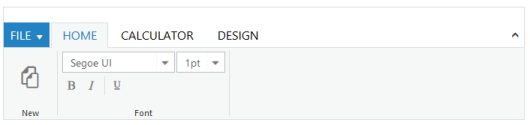
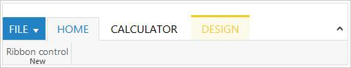

# Getting Started

This section explains briefly how to create a _Ribbon_ in your application with _ASP.NET_.

## Create your Ribbon in ASP.NET

You can create a _Ribbon_ with highly customizable look and feel. The _Ribbon_control displays the controls in multiple tabs. This section explains the ribbon tabs, adding controls to the groups, expand/collapse ribbon option, and the control separator.

{  | markdownify }
{:.image }

1. Create a _Syncfusion ASP.NET Web_ form application.
2. Drag and drop the _Ribbon_ control in the Index.aspx page from the toolbox.

{  | markdownify }
{:.image }

### Application Tabs

_Application menu_ support has been provided in the ribbon control _ApplicationTab_. Use _ApplicationTab_ tag to define the application tab with menu. In _ApplicationTab_ attributes, _Type_ property to define the ApplicationMenu and the value is _ApplicationMenu_,_ItemID_ property to specify ID of the _UL_ list for the application menu and the _MenuSettings_ property to specify all the members and events of the menu.

{  | markdownify }
{:.image }



[ASPX]

<ej:Ribbon ID="defaultRibbon" runat="server" Width="100%">

            <ApplicationTab ItemID="menu" Type="ApplicationMenu">

                <MenuSettings OpenOnClick="false"></MenuSettings>

            </ApplicationTab>

            <RibbonTabs>

                <ej:RibbonTab Id="home" Text="HOME">

                    <TabGroupCollection>

                        <ej:TabGroup Text="New" AlignType="Rows" Type="custom" ContentID="HomeDiv" />

                    </TabGroupCollection>

                </ej:RibbonTab>

            </RibbonTabs>

        </ej:Ribbon>

    

    <ul id="menu">

        <li><a>FILE</a>

            <ul>

                <li><a>New</a></li>

                <li><a>Open</a></li>

            </ul>

        </li>

    </ul>

    
Ribbon Control



The following screenshot illustrates Ribbon control with Application Tab.

{  | markdownify }
{:.image }

### Contextual Tabs

You can add _contextual tabs_ in the _Ribbon_ control. Inside _ContextualTabs_ tag use _ContextualTab_ tag to add a single or set of _contextual tabs_. In the _ContextualTab_ tag, use _BackgroundColor_ property to apply background color to the contextual tabs. Use _BorderColor_ property to apply border color to the contextualTab.

{  | markdownify }
{:.image }



[ASPX]

<asp:Content ID="ControlContent" runat="server" ContentPlaceHolderID="ControlsSection">

     <ej:Ribbon ID="defaultRibbon" runat="server" Width="100%">

        <ApplicationTab ItemID="menu" Type="ApplicationMenu">

           <MenuSettings OpenOnClick="false"></MenuSettings>

        </ApplicationTab>

     <RibbonTabs>

     <ej:RibbonTab Id="home" Text="HOME">

    <TabGroupCollection>        <ej:TabGroup Text="New" AlignType="Rows" Type="custom" ContentID="homeDiv">

</ej:TabGroup>

       </TabGroupCollection>

     </ej:RibbonTab>

     <ej:RibbonTab Id="calculator" Text="CALCULATOR">

       <TabGroupCollection>

<ej:TabGroup Text="New" AlignType="Rows" Type="custom" ContentID="calculate" />

       </TabGroupCollection>

    </RibbonTabs>

<ContextualTabs>

   <ej:ContextualTab BackgroundColor="#FCFBEB" BorderColor="#F2CC1C">

       <RibbonTabCollection >

         <ej:RibbonTab Id="design" Text="DESIGN">

            <TabGroupCollection>

               <ej:TabGroup Text="New" AlignType="Rows" Type="custom" ContentID="designing" />

              </TabGroupCollection>

          </ej:RibbonTab>

        </RibbonTabCollection >

    </ej:ContextualTab>

</ContextualTabs>

</ej:Ribbon>

    <ul id="menu">

        <li><a>FILE</a>

            <ul>

                <li><a>New</a></li>

                <li><a>Open</a></li>

                <li><a>Save</a></li>

                <li><a>Save as</a></li>

                <li><a>Print</a></li>

            </ul>

        </li>

    </ul>

    <div id="homeDiv">Ribbon Control

    <div id="calculate">Calculator

    <div id="designing">Designing

</asp:Content>



The following screenshot illustrates Ribbon control with Contextual tabs.

{  | markdownify }
{:.image }

### Tabs

_Tabs_ can be created by using _RibbonTab_ property. In _RibbonTab_, define the _TabGroupCollection_ property that allows you to create one or more _TabGroups_ in the _RibbonTab_.

{  | markdownify }
{:.image }



[ASPX]

<asp:Content ID="ControlContent" runat="server" ContentPlaceHolderID="ControlsSection">

 <ej:Ribbon ID="defaultRibbon" runat="server" Width="500px">

   <ApplicationTab ItemID="menu" Type="ApplicationMenu">

     <MenuSettings OpenOnClick="false"></MenuSettings>

   </ApplicationTab>

 <RibbonTabs>

   <ej:RibbonTab Id="home" Text="HOME">

    <TabGroupCollection>

     <ej:TabGroup Text="New" AlignType="Rows">

      <ContentCollection>

       <ej:TabContent>

        <ContentGroupCollection>          <ej:ContentGroup Id="new" Text="New" ToolTip="New" Type="Button">

<ButtonSettings Type="Reset" ContentType="ImageOnly" ImagePosition="ImageTop" PrefixIcon="e-ribbon e-new" Click="executeAction" />

</ej:ContentGroup>

        </ContentGroupCollection>

        <ContentDefaults Width="60" Height="70" Type="Button" />

       </ej:TabContent>

      </ContentCollection>

     </ej:TabGroup>

    <ej:TabGroup Text="Font" AlignType="Rows">

   <ContentCollection>

  <ej:TabContent>

       <ContentDefaults Height="28" Type="DropDownList" />

       <ContentGroupCollection>

<ej:ContentGroup Id="fontfamily" ToolTip="Font" Type="DropDownList">

<DropdownSettings Value="Segoe UI" Text="Fonts" Width="150" Select="executeAction"></DropdownSettings>

   </ej:ContentGroup>

<ej:ContentGroup Id="fontsize" ToolTip="FontSize" Type="DropDownList">

<DropdownSettings Value="1pt" Width="65" Select="executeAction"></DropdownSettings>

   </ej:ContentGroup>

   </ContentGroupCollection>

 </ej:TabContent>

  <ej:TabContent>

   <ContentGroupCollection>

<ej:ContentGroup Id="bold" Text="Bold" ToolTip="Bold">

<ButtonSettings ContentType="ImageOnly" Type="Reset" PrefixIcon="e-ribbon bold" Click="executeAction" />

  </ej:ContentGroup>

<ej:ContentGroup Id="italic" Text="Italic" ToolTip="Italic" EnableSeparator="true">

<ButtonSettings ContentType="ImageOnly" Type="Reset" PrefixIcon="e-ribbon e-ribbonitalic" Click="executeAction" />

  </ej:ContentGroup>

<ej:ContentGroup Id="underline" Text="Underline" ToolTip="Underline">

<ButtonSettings ContentType="ImageOnly" Type="Reset" PrefixIcon="e-ribbon e-ribbonunderline" Click="executeAction" />

  </ej:ContentGroup>                             

  </ContentGroupCollection>

       <ContentDefaults Type="Button" IsBig="false" />

   </ej:TabContent>

   </ContentCollection>

</ej:TabGroup>

</TabGroupCollection>

</ej:RibbonTab>

<ej:RibbonTab Id="calculator" Text="CALCULATOR">

 <TabGroupCollection>

<ej:TabGroup Text="New" AlignType="Rows" Type="custom" ContentID="calculate" />                        

 </TabGroupCollection>

</ej:RibbonTab>

<ej:RibbonTab Id="design" Text="DESIGN">

    <TabGroupCollection>

<ej:TabGroup Text="New" AlignType="Rows" Type="custom" ContentID="designing" />                   

    </TabGroupCollection>

   </ej:RibbonTab>

  </RibbonTabs>

</ej:Ribbon>

<ul id="menu">

        <li><a>FILE</a>

            <ul>

                <li><a>New</a></li>

                <li><a>Open</a></li>

                <li><a>Save</a></li>

                <li><a>Save as</a></li>

                <li><a>Print</a></li>

            </ul>

        </li>

</ul>

    <div id="calculate">Calculator

    <div id="designing">Design

</asp:Content>





[CS]

protected void Page_Load(object sender, EventArgs e)

        {

         var fontlist = new List<string> { "Segoe UI", "Arial", "Times New Roman", "Tahoma", "Helvetica" };

          var fontsize = new List<string> { "1pt", "2pt", "3pt", "4pt", "5pt" };

         this.fontfamily.DropdownSettings.DataSource = fontlist;

         this.fontsize.DropdownSettings.DataSource = fontsize;}



The following screenshot illustrates _Ribbon_ with Tab Group Collections.

{  | markdownify }
{:.image }

### Create Ribbon Control 

1. Create a _Master_ file and add the following references to the required libraries. 



[Layout.Master]

<!doctype html>

<html>

<head>

<meta name="viewport" content="width=device-width, initial-scale=1.0" charset="utf-8" />

<!-- style sheet for default theme(flat azure) -->

<link href="http://cdn.syncfusion.com/13.1.0.21/js/web/flat-azure/ej.web.all.min.css" rel="stylesheet" />

<!--scripts-->

</head>

<body>

</body>

</html>



2. Add a _Ribbon_ tag in the .aspx page as shown in the following code example.



[ASPX]

<%--..--%>

<ej:Ribbon ID="defaultRibbon" runat="server" Width="100%"> </ej:Ribbon>

<%--..--%>



3. Create the _Ribbon_ control as follows. The _Width_ property allows you to define the width to the ribbon. In applicationTab definition, the _ItemID_ property allows you to specify the ID of the ul list to create the application menu. In _RibbonTab_, define the _TabGroupCollection_ property that allows you to create one or more _TabGroups_ in the _RibbonTab_. In contextual Tabs definition, the _BackgroundColor_ property allows you to define the background color of the contextual tab and _BorderColor_ property allows you to define the border color of the contextual tab.



[ASPX]

<asp:Content ID="ControlContent" runat="server" ContentPlaceHolderID="ControlsSection">

     <ej:Ribbon ID="defaultRibbon" runat="server" Width="100%">

        <ApplicationTab ItemID="menu" Type="ApplicationMenu">

           <MenuSettings OpenOnClick="false"></MenuSettings>

        </ApplicationTab>

     <RibbonTabs>

     <ej:RibbonTab Id="home" Text="HOME">

    <TabGroupCollection>        <ej:TabGroup Text="New" AlignType="Rows" Type="custom" ContentID="homediv">

</ej:TabGroup>

       </TabGroupCollection>

     </ej:RibbonTab>

     <ej:RibbonTab Id="calculator" Text="CALCULATOR">

       <TabGroupCollection>

<ej:TabGroup Text="Calculator" AlignType="Rows" Type="custom" ContentID="calculate" />

       </TabGroupCollection>

     </ej:RibbonTab>

    </RibbonTabs>

<ContextualTabs>

   <ej:ContextualTab BackgroundColor="#FCFBEB" BorderColor="#F2CC1C">

       <RibbonTabCollection >

         <ej:RibbonTab Id="design" Text="DESIGN">

            <TabGroupCollection>

               <ej:TabGroup Text="Design" AlignType="Rows" Type="custom" ContentID="designing" />

              </TabGroupCollection>

          </ej:RibbonTab>

        </RibbonTabCollection >

    </ej:ContextualTab>

</ContextualTabs>

</ej:Ribbon>

    <ul id="menu">

        <li><a>FILE</a>

            <ul>

                <li><a>New</a></li>

                <li><a>Open</a></li>

                <li><a>Save</a></li>

                <li><a>Save as</a></li>

                <li><a>Print</a></li>

            </ul>

        </li>

    </ul>

    <div id="homediv">Ribbon Control

    <div id="calculate">Calculator

    <div id="designing">Design
</asp:Content>



4. The following screenshot illustrates the _Ribbon_ control.

{  | markdownify }
{:.image }

### Add Controls

Add controls to each _Ribbon_ tab by using the tag _ContentCollection_. You can also add custom controls by using the property _ContentID_. The property _AlignType_ is used to align the groups in row or column order._Button, Split button, DropdownLlist_ and _Toggle button_, _Gallery_, and _Custom_ controls support have provided in the _Ribbon_ control.The default _AlignType_ is _rows_.



[ASPX]

<asp:Content ID="ControlContent" runat="server" ContentPlaceHolderID="ControlsSection">

     <ej:Ribbon ID="defaultRibbon" runat="server" Width="500px">

     <ApplicationTab ItemID="menu" Type="ApplicationMenu">

     <MenuSettings OpenOnClick="false"></MenuSettings>

     </ApplicationTab>

     <RibbonTabs>

        <ej:RibbonTab Id="home" Text="HOME">

     <TabGroupCollection>

     <ej:TabGroup Text="New" AlignType="Rows">

        <ContentCollection>

     <ej:TabContent>

     <ContentGroupCollection>

 <ej:ContentGroup Id="new" Text="New" ToolTip="New" Type="Button">

  <ButtonSettings Type="Reset" ContentType="ImageOnly" ImagePosition="ImageTop" PrefixIcon="e-ribbon e-new" Click="executeAction" />

 </ej:ContentGroup>

     </ContentGroupCollection>

 <ContentDefaults Width="60" Height="70" Type="Button" />

     </ej:TabContent>

     </ContentCollection>

  </ej:TabGroup>

   <ej:TabGroup Text="Font" AlignType="Rows">

    <ContentCollection>

     <ej:TabContent>

    <ContentDefaults Height="28" Type="DropDownList" />

     <ContentGroupCollection>

 <ej:ContentGroup Id="fontfamily" ToolTip="Font" Type="DropDownList">

<DropdownSettings Value="Segoe UI" Text="Fonts" Width="150" Select="executeAction"></DropdownSettings>

   </ej:ContentGroup>

  <ej:ContentGroup Id="fontsize" ToolTip="FontSize" Type="DropDownList">

<DropdownSettings Value="1pt" Width="65" Select="executeAction">

</DropdownSettings>

  </ej:ContentGroup>

   </ContentGroupCollection>

  </ej:TabContent>

  <ej:TabContent>

  <ContentGroupCollection>

  <ej:ContentGroup Id="bold" Text="Bold" ToolTip="Bold">

<ButtonSettings ContentType="ImageOnly" Type="Reset" PrefixIcon="e-ribbon bold" Click="executeAction" />

  </ej:ContentGroup>

    <ej:ContentGroup Id="italic" Text="Italic" ToolTip="Italic">

 <ButtonSettings ContentType="ImageOnly" Type="Reset" PrefixIcon="e-ribbon e-ribbonitalic" Click="executeAction" />

   </ej:ContentGroup>

 </ContentGroupCollection>

   <ContentDefaults Type="Button" IsBig="false" />

    </ej:TabContent>

      </ContentCollection>

       </ej:TabGroup>

 <ej:TabGroup Text="CustomControls" AlignType="Rows" Type="custom" ContentID="Contents">

   <ContentCollection>

     <ej:TabContent>

        <ContentGroupCollection>

 <ej:ContentGroup Id="Customcontrol" Text="Bold" ToolTip="Custom">

 <ButtonSettings ContentType="ImageOnly" Type="Button" PrefixIcon="e-ribbon bold"  />

          </ej:ContentGroup>

         </ContentGroupCollection>

       <ContentDefaults Type="Button" IsBig="false" />

     </ej:TabContent>

   </ContentCollection>

 </ej:TabGroup>

 </TabGroupCollection>

 </ej:RibbonTab>

 <ej:RibbonTab Id="calculator" Text="CALCULATOR">

     <TabGroupCollection>

<ej:TabGroup Text="New" AlignType="Rows" Type="custom" ContentID="calculate" />                       

     </TabGroupCollection>

 </ej:RibbonTab>

   <ej:RibbonTab Id="design" Text="DESIGN">  

     <TabGroupCollection>

 <ej:TabGroup Text="New" AlignType="Rows" Type="custom" ContentID="designing" />                        

     </TabGroupCollection>

    </ej:RibbonTab>

   </RibbonTabs>

 </ej:Ribbon>

 

    <ul id="menu">

        <li><a>FILE</a>

            <ul>

                <li><a>New</a></li>

                <li><a>Open</a></li>

                <li><a>Save</a></li>

                <li><a>Save as</a></li>

                <li><a>Print</a></li>

            </ul>

        </li>

    </ul>

    <div id="Contents"><button id="custom">Custom Control</button>

</asp:Content>





[CS]

protected void Page_Load(object sender, EventArgs e)

        {

            var fontlist = new List<string> { "Segoe UI", "Arial", "Times New Roman", "Tahoma", "Helvetica" };

              var fontsize = new List<string>() { "1pt", "2pt", "3pt", "4pt", "5pt" };

            this.fontfamily.DropdownSettings.DataSource = fontlist;

            this.fontsize.DropdownSettings.DataSource = fontsize;}



The following screenshot illustrates Ribbon with controls,

{  | markdownify }
{:.image }

### Expand/Collapse

The _expand/collapse_ support has been provided to the _Ribbon_.

The following screenshot illustrates _Ribbon_ in the expanded state.

{  | markdownify }
{:.image }

The following screenshot illustrates _Ribbon_ in the collapsed state,

{  | markdownify }
{:.image }

### Separator for Controls

The control _Separator_ support is provided in the _Ribbon_ control. Set _EnableSeparator_ value to _true_ to enable the separator after a control. _Control Separator_ supports only row type group.



[ASPX]

<asp:Content ID="ControlContent" runat="server" ContentPlaceHolderID="ControlsSection">

 <ej:Ribbon ID="defaultRibbon" runat="server" Width="500px">

   <ApplicationTab ItemID="menu" Type="ApplicationMenu">

     <MenuSettings OpenOnClick="false"></MenuSettings>

   </ApplicationTab>

 <RibbonTabs>

   <ej:RibbonTab Id="home" Text="HOME">

    <TabGroupCollection>

     <ej:TabGroup Text="New" AlignType="Rows">

      <ContentCollection>

       <ej:TabContent>

        <ContentGroupCollection>

          <ej:ContentGroup Id="new" Text="New" ToolTip="New" Type="Button">

<ButtonSettings Type="Reset" ContentType="ImageOnly" ImagePosition="ImageTop" PrefixIcon="e-ribbon e-new" Click="executeAction" />

</ej:ContentGroup>

        </ContentGroupCollection>

        <ContentDefaults Width="60" Height="70" Type="Button" />

       </ej:TabContent>

      </ContentCollection>

     </ej:TabGroup>

    <ej:TabGroup Text="Font" AlignType="Rows">

   <ContentCollection>

  <ej:TabContent>

       <ContentDefaults Height="28" Type="DropDownList" />

       <ContentGroupCollection>

<ej:ContentGroup Id="fontfamily" ToolTip="Font" Type="DropDownList">

<DropdownSettings Value="Segoe UI" Text="Fonts" Width="150" Select="executeAction"></DropdownSettings>

   </ej:ContentGroup>

<ej:ContentGroup Id="fontsize" ToolTip="FontSize" Type="DropDownList">

<DropdownSettings Value="1pt" Width="65" Select="executeAction"></DropdownSettings>

   </ej:ContentGroup>

   </ContentGroupCollection>

 </ej:TabContent>

  <ej:TabContent>

   <ContentGroupCollection>

<ej:ContentGroup Id="bold" Text="Bold" ToolTip="Bold">

<ButtonSettings ContentType="ImageOnly" Type="Reset" PrefixIcon="e-ribbon bold" Click="executeAction" />

  </ej:ContentGroup>

<ej:ContentGroup Id="italic" Text="Italic" ToolTip="Italic" EnableSeparator="true">

<ButtonSettings ContentType="ImageOnly" Type="Reset" PrefixIcon="e-ribbon e-ribbonitalic" Click="executeAction" />

  </ej:ContentGroup>

<ej:ContentGroup Id="underline" Text="Underline" ToolTip="Underline">

<ButtonSettings ContentType="ImageOnly" Type="Reset" PrefixIcon="e-ribbon e-ribbonunderline" Click="executeAction" />

  </ej:ContentGroup>                             

  </ContentGroupCollection>

       <ContentDefaults Type="Button" IsBig="false" />

   </ej:TabContent>

   </ContentCollection>

</ej:TabGroup>

<ej:TabGroup Text="CustomControls" AlignType="Rows" Type="custom" ContentID="Contents">

<ContentCollection>

   <ej:TabContent>

  <ContentGroupCollection>

<ej:ContentGroup Id="Customcontrol" Text="Bold" ToolTip="Custom">

<ButtonSettings ContentType="ImageOnly" Type="Button" PrefixIcon="e-ribbon bold"  />

   </ej:ContentGroup>

  </ContentGroupCollection>

        <ContentDefaults Type="Button" IsBig="false" />

   </ej:TabContent>

  </ContentCollection>

  </ej:TabGroup>

</TabGroupCollection>

</ej:RibbonTab>

<ej:RibbonTab Id="calculator" Text="CALCULATOR">

 <TabGroupCollection>

<ej:TabGroup Text="New" AlignType="Rows" Type="custom" ContentID="calculate" />                        

 </TabGroupCollection>

</ej:RibbonTab>

<ej:RibbonTab Id="design" Text="DESIGN">

    <TabGroupCollection>

<ej:TabGroup Text="New" AlignType="Rows" Type="custom" ContentID="designing" />                   

    </TabGroupCollection>

   </ej:RibbonTab>

  </RibbonTabs>

</ej:Ribbon>

<ul id="menu">

        <li><a>FILE</a>

            <ul>

                <li><a>New</a></li>

                <li><a>Open</a></li>

                <li><a>Save</a></li>

                <li><a>Save as</a></li>

                <li><a>Print</a></li>

            </ul>

        </li>

</ul>

    <div id="homediv">Ribbon Control

    <div id="calculate">

    <div id="designing">

</asp:Content>





[CS]

protected void Page_Load(object sender, EventArgs e)

        {

            var fontlist = new List<string> { "Segoe UI", "Arial", "Times New Roman", "Tahoma", "Helvetica" };

              var fontsize = new List<string>() { "1pt", "2pt", "3pt", "4pt", "5pt" };

            this.fontfamily.DropdownSettings.DataSource = fontlist;

            this.fontsize.DropdownSettings.DataSource = fontsize;}



The following screenshot illustrates the control Separator after the Italic Button control.

{  | markdownify }
{:.image }

