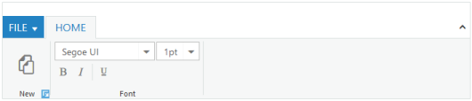

## Group Expander

The _Ribbon_ control has _group expander_ support. Set _EnableGroupExpander_ value to _true_ to enable the group expander for each group in the ribbon tab. The event for _group expander_ is _ClientSideOnGroupExpand_.



[ASP.NET]

[ASPX]

<ej:Ribbon ID="Ribbon" runat="server" Width="800px">

<ApplicationTab ItemID="menu" Type="ApplicationMenu">

<MenuSettings OpenOnClick="false"></MenuSettings>

</ApplicationTab>

<RibbonTabs>

<ej:RibbonTab Id="home" Text="HOME">

<TabGroupCollection>

<ej:TabGroup Text="New" AlignType="Columns" EnableGroupExpander="true">

<ContentCollection>

<ej:TabContent>

<ContentDefaults Width="100" />

<ContentGroupCollection>

<ej:ContentGroup Text="New" Id="new" ToolTip="New" Type="Button" IsBig="true">

<ButtonSettings ContentType="ImageOnly" PrefixIcon="e-ribbon e-new" />

</ej:ContentGroup>

</ContentGroupCollection>

</ej:TabContent>

</ContentCollection>

</ej:TabGroup>

<ej:TabGroup Text="Font" AlignType="Rows">

<ContentCollection>

<ej:TabContent>

<ContentGroupCollection>

<ej:ContentGroup Id="fontfamily" ToolTip="Font" Type="DropDownList">

<DropdownSettings Value="Segoe UI" Text="Fonts" Width="150"></DropdownSettings>

</ej:ContentGroup>

<ej:ContentGroup Id="fontsize" ToolTip="FontSize" Type="DropDownList">

<DropdownSettings Value="1pt" Width="65"></DropdownSettings>

</ej:ContentGroup>

</ContentGroupCollection>

</ej:TabContent>

<ej:TabContent>

<ContentGroupCollection>

<ej:ContentGroup Id="bold" Text="Bold" ToolTip="Bold">

<ButtonSettings ContentType="ImageOnly" Type="Reset" PrefixIcon="e-ribbon bold" Click="executeAction" />

</ej:ContentGroup>

<ej:ContentGroup Id="italic" Text="Italic" ToolTip="Italic" EnableSeparator="true">

<ButtonSettings ContentType="ImageOnly" Type="Reset" PrefixIcon="e-ribbon e-ribbonitalic" />

</ej:ContentGroup>

<ej:ContentGroup Id="underline" Text="Underline" ToolTip="Underline">

<ButtonSettings ContentType="ImageOnly" Type="Reset" PrefixIcon="e-ribbon e-ribbonunderline" />

</ej:ContentGroup>

</ContentGroupCollection>

<ContentDefaults Type="Button" IsBig="false" />

</ej:TabContent>

</ContentCollection>

</ej:TabGroup>

</TabGroupCollection>

</ej:RibbonTab>

</RibbonTabs>

</ej:Ribbon>

<ul id="menu">

<li><a>FILE</a>

<ul>

<li><a>New</a></li>

<li><a>Open</a></li>

</ul>

</li>

</ul>





[CS]

protected void Page_Load(object sender, EventArgs e)

{

List<FontFamily> fontlist = new List<FontFamily>();

fontlist.Add(new FontFamily(1, "Segoe UI"));

fontlist.Add(new FontFamily(2, "Arial"));

fontlist.Add(new FontFamily(3, "Times New Roman"));

fontlist.Add(new FontFamily(4, "Tahoma"));

fontlist.Add(new FontFamily(5, "Helvetica"));

this.fontfamily.DropdownSettings.DataSource = fontlist;

}

[Serializable]

class FontFamily

{

public int value { get; set; }

public string text { get; set; }

public FontFamily(int cvalue, string ctext)

{

this.value = cvalue;

this.text = ctext;

}

}



The following screenshot illustrates the group _New_ with the group expander.

{  | markdownify }
{:.image }

