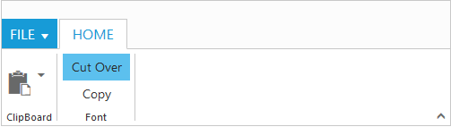
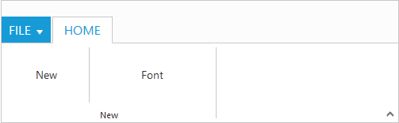
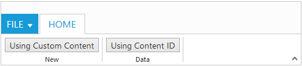
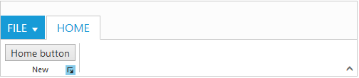

# Group

TabGroup is a collection of logical content groups that are combined under related Tab. Each TabGroup can be defined using ContentGroup or custom content.

## Adding Tab Groups

TabGroup items can be added to RibbonTabs by specifying `Text ` and corresponding `TabContent` to be displayed. The ContentGroup can be specified as either with `Content` collection, `ContentID` or `CustomContent`. You can add tab group dynamically in the ribbon control with given tab index, tab group object and group index position by using [`addTabGroup`](https://help.syncfusion.com/api/js/ejribbon#methods:addtabgroup) method.

### Adding Content

Add TabContent to TabGroup item which is based on `Type` of content specified. The available types are `Button` , `SplitButton`, `ToggleButton`,`Gallery`, and `DropDownList`.

ContentGroup and ContentDefaults can be added with the TabContent. You can add group content dynamically in the ribbon control with given tab index, group index, content, content index and sub group index position by using [`addTabGroupContent`](https://help.syncfusion.com/api/js/ejribbon#methods:addtabgroupcontent).

#### _Defaults_

The [`tabs.groups.content.defaults.height`](https://help.syncfusion.com/api/js/ejribbon#members:tabs-groups-content-defaults-height), [`tabs.groups.content.defaults.width`](https://help.syncfusion.com/api/js/ejribbon#members:tabs-groups-content-defaults-width), 
[`tabs.groups.content.defaults.type`](https://help.syncfusion.com/api/js/ejribbon#members:tabs-groups-content-defaults-type), [`tabs.groups.content.defaults.isBig`](https://help.syncfusion.com/api/js/ejribbon#members:tabs-groups-content-defaults-isbig) property to the controls in the [`group`](https://help.syncfusion.com/api/js/ejribbon#members:tabs-groups-content-groups) can be specified commonly.

The `Height` & `Width` applicable to Button, SplitButton, DropDownList ,ToggleButton controls and `IsBig` applicable to only Button controls ( Button, Split , Toggle).

#### _Adding Content Groups_

Controls such as button, split button, dropdown list, toggle button, gallery in the subgroup of the Ribbon tab can be rendered. All of these can be customized using its corresponding settings property such as `ButtonSettings`, `DropdownSettings`, etc.

Custom controls or items (such as table, div etc.) can be added when the `Type` set as `Custom`. `ContentDefaults` control settings of TabGroup can be specified for an `individual group` instead of specifying them to group’s collection commonly.

Tooltip and Custom Tooltip can be specified for each TabGroup controls.



	<ej:Ribbon ID="defaultRibbon" runat="server" Width="500px">
		<ApplicationTab MenuItemID="ribbonmenu" Type="Menu">
			<MenuSettings OpenOnClick="false"></MenuSettings>
		</ApplicationTab>
		<RibbonTabs>
			<ej:RibbonTab Id="home" Text="HOME">
				<TabGroupCollection>
					<ej:TabGroup Text="Clipboard" AlignType="Columns">
						<ContentCollection>
							<ej:TabContent>
								<ContentDefaults Width="50" Height="75" Type="SplitButton" />
								<ContentGroupCollection>
									<ej:ContentGroup Id="paste" ToolTip="Paste">
										<SplitButtonSettings ButtonMode="Dropdown" ArrowPosition="Bottom" TargetID="pasteul" ContentType="TextAndImage" PrefixIcon="e-icon e-ribbon e-ribbonpaste" />
									</ej:ContentGroup>
								</ContentGroupCollection>
							</ej:TabContent>
						</ContentCollection>
					</ej:TabGroup>
					<ej:TabGroup Text="Font" AlignType="Columns">
						<ContentCollection>	
							<ej:TabContent>
								<ContentDefaults Width="75" Height="30" IsBig="false" Type="ToggleButton" />
								<ContentGroupCollection>
									<ej:ContentGroup Id="cut">
										<ToggleButtonSettings DefaultText="Cut" ActiveText="Cut Over" />
									</ej:ContentGroup>
									<ej:ContentGroup Id="copy">
										<ToggleButtonSettings DefaultText="Copy" ActiveText="Copy Over" />
									</ej:ContentGroup>	
								</ContentGroupCollection>
							</ej:TabContent>
						</ContentCollection>
					</ej:TabGroup>
				</TabGroupCollection>
			</ej:RibbonTab>
		</RibbonTabs>
	</ej:Ribbon>	
	<ul id="ribbonmenu">
		<li><a>FILE</a>
			<ul>
				<li><a>Open</a></li>
			</ul>
		</li>
	</ul>
	<ul id="pasteul">
		<li><a>Paste</a></li>
	</ul>  



#### _Enable Separator_ 

Set “true” to `EnableSeparator`.Separates the control from the next control in the group when group `AlignType` is `Rows`. 



	<ej:Ribbon ID="defaultRibbon" runat="server" Width="500px">
		<ApplicationTab MenuItemID="ribbonmenu" Type="Menu">
			<MenuSettings OpenOnClick="false"></MenuSettings>
		</ApplicationTab>
		<RibbonTabs>
			<ej:RibbonTab Id="home" Text="HOME">
				<TabGroupCollection>
					<ej:TabGroup Text="New" AlignType="Rows">
						<ContentCollection>
							<ej:TabContent>
								<ContentDefaults Height="75" Type="Button" />
								<ContentGroupCollection>
									<ej:ContentGroup Id="new" Text="New" ToolTip="New" EnableSeparator="true">
										<ButtonSettings Width="100" />
									</ej:ContentGroup>
									<ej:ContentGroup Id="font" Text="Font" ToolTip="Font">
										<ButtonSettings Width="150" />
									</ej:ContentGroup>
								</ContentGroupCollection>
							</ej:TabContent>
						</ContentCollection>
					</ej:TabGroup>
				</TabGroupCollection>
			</ej:RibbonTab>
		</RibbonTabs>
	</ej:Ribbon>	
	<ul id="ribbonmenu">
		<li><a>FILE</a>
			<ul>
				<li><a>Open</a></li>
			</ul>
		</li>
	</ul> 



### Adding Custom Content 

Set ContentGroup `Type` as `custom` to add custom items such as div, table and custom controls. With type as custom, content can be added in two ways as specified below.

*	HTML contents can be directly added into the groups as string content using `CustomContent` property.

*	Custom template id can be specified to render those specific custom template using `ContentID` property.



	<ej:Ribbon ID="defaultRibbon" runat="server" Width="500px">
		<ApplicationTab MenuItemID="ribbonmenu" Type="Menu">
			<MenuSettings OpenOnClick="false"></MenuSettings>
		</ApplicationTab>
		<RibbonTabs>
			<ej:RibbonTab Id="home" Text="HOME">
				<TabGroupCollection>
					<ej:TabGroup Text="New" Type="custom" CustomContent="<Button id='CustomContent'>Using Custom Content</Button>">
					</ej:TabGroup>
					<ej:TabGroup Text="Data" Type="custom" ContentID="btn">
					</ej:TabGroup>
				</TabGroupCollection>
			</ej:RibbonTab>
		</RibbonTabs>
	</ej:Ribbon>	
	<ul id="ribbonmenu">
		<li><a>FILE</a>
			<ul>
				<li><a>Open</a></li>
			</ul>
		</li>
	</ul>
	<button id="btn">Using Content ID</button>
	


## Group Expander

Set [`enableGroupExpander`](https://help.syncfusion.com/api/js/ejribbon#members:tabs-groups-enablegroupexpander) as true to show Group Expander for each group in Tab. These expanders can be customized using [`groupExpand`](https://help.syncfusion.com/api/js/ejribbon#events:groupexpand) event, such as to show popup dialog. To specify tooltip for the group expander of the group [`tabs.groups.groupExpanderSettings`](https://help.syncfusion.com/api/js/ejribbon#members:tabs-groups-groupexpandersettings) and 
[`tabs.groups.groupExpanderSettings.toolTip`](https://help.syncfusion.com/api/js/ejribbon#members:tabs-groups-groupexpandersettings-tooltip) can be used.


	
	<ej:Ribbon ID="defaultRibbon" runat="server" Width="500px" GroupExpand="groupExpand">
		<ApplicationTab MenuItemID="ribbonmenu" Type="Menu">
			<MenuSettings OpenOnClick="false"></MenuSettings>
		</ApplicationTab>
		<RibbonTabs>
			<ej:RibbonTab Id="home" Text="HOME">
				<TabGroupCollection>
	
					<ej:TabGroup Text="New" Type="custom" ContentID="btn" EnableGroupExpander="true">
					</ej:TabGroup>
				</TabGroupCollection>
			</ej:RibbonTab>
		</RibbonTabs>
	</ej:Ribbon>	
	<ul id="ribbonmenu">
		<li><a>FILE</a>
			<ul>
				<li><a>Open</a></li>
			</ul>
		</li>
	</ul>
	<button id="btn">Home button</button>	
	



