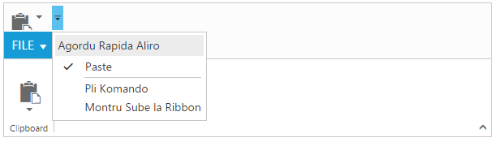

# Localization 

The localization support allows to customize the display of text within the Ribbon in a user-specific culture and locale. The Ribbon control can be localized in specific culture using the common API `Locale`along with the collection of localized words defined for that culture using the ej.Ribbon.Locale [culture-code].Please find the table with list of properties and its value in locale object.

<table>
<tr>
<th>
Locale key words </th><th>
Text</th></tr>
<tr>
<td>
CustomizeQuickAccess</td><td>
Customize Quick Access Toolbar</td></tr>
<tr>
<td>
RemoveFromQuickAccessToolbar</td><td>
Remove from Quick Access Toolbar</td></tr>
<tr>
<td>
AddToQuickAccessToolbar</td><td>
Add to Quick Access Toolbar</td></tr>
<tr>
<td>
ShowAboveTheRibbon</td><td>
Show Above the Ribbon</td></tr>
<tr>
<td>
ShowBelowTheRibbon</td><td>
Show Below the Ribbon</td></tr>
<tr>
<td>
MoreCommands</td><td>
More Commands...</td></tr>
</table>

N> By default, the Ribbon control is localized in `en-US` culture.

For further information on – how to refer the required culture scripts into your application, refer [`here`](http://help.syncfusion.com/js/localization).



	<ej:Ribbon ID="defaultRibbon1" runat="server" Width="500" ShowQAT="true" Locale="es-ES">
		<ApplicationTab MenuItemID="ribbonmenu" Type="Menu">
			<MenuSettings OpenOnClick="false"></MenuSettings>
		</ApplicationTab>
		<RibbonTabs>
			<ej:RibbonTab Id="home1" Text="HOME">
				<TabGroupCollection>
					<ej:TabGroup Text="Clipboard" AlignType="Columns">
						<ContentCollection>
							<ej:TabContent>
								<ContentDefaults Width="50" Height="75" Type="SplitButton" />
								<ContentGroupCollection>
									<ej:ContentGroup Id="paste" ToolTip="Paste" QuickAccessMode="ToolBar" Text="paste">
										<SplitButtonSettings ButtonMode="Dropdown" ArrowPosition="Bottom" TargetID="pasteul" ContentType="ImageOnly" PrefixIcon="e-icon e-ribbon e-ribbonpaste" />
									</ej:ContentGroup>
								</ContentGroupCollection>
							</ej:TabContent>
						</ContentCollection>
					</ej:TabGroup>
				</TabGroupCollection>
			</ej:RibbonTab>
		</RibbonTabs>
	</ej:Ribbon>
	<ul id="ribbonmenu">
		<li><a>FILE</a>
			<ul>
				<li><a>New</a></li>
				<li><a>Open</a></li>
			</ul>
		</li>
	</ul>
	<ul id="pasteul">
		<li><a>Paste</a></li>
	</ul>
	



