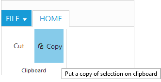
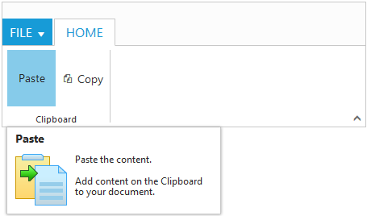
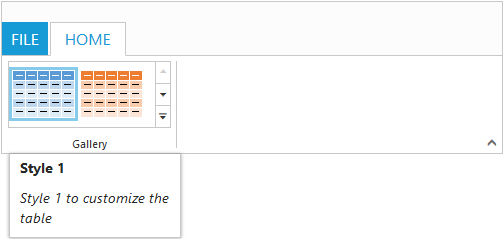
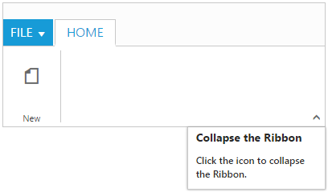
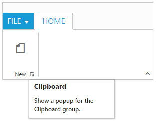

# Screen Tips

ScreenTip/Tooltip is used to reduce the controls related Help that are needed to the end user to do control related actions.

## HTML Tooltip

Standard `html tooltip` can be set using `ToolTip` property of each group item.



		<ej:Ribbon ID="defaultRibbon1" runat="server" Width="20%" AllowResizing="true">
		<ApplicationTab MenuItemID="ribbonmenu" Type="Menu">
			<MenuSettings OpenOnClick="false"></MenuSettings>
		</ApplicationTab>
		<RibbonTabs>
			<ej:RibbonTab Id="home" Text="HOME">
				<TabGroupCollection>
					<ej:TabGroup Text="Clipboard">
						<ContentCollection>
							<ej:TabContent>
								<ContentDefaults Height="70" Width="60" />
								<ContentGroupCollection>
									<ej:ContentGroup Id="cut" Text="Cut" ToolTip="Remove the selection and put it on clipboard">
									</ej:ContentGroup>
									<ej:ContentGroup Id="copy" Text="Copy" ToolTip="Put a copy of selection on clipboard">
										<ButtonSettings ContentType="TextAndImage" PrefixIcon="e-icon e-ribbon e-ribboncopy" />
									</ej:ContentGroup>
								</ContentGroupCollection>
							</ej:TabContent>
						</ContentCollection>
					</ej:TabGroup>
	
				</TabGroupCollection>
			</ej:RibbonTab>
		</RibbonTabs>
	</ej:Ribbon>
	<ul id="ribbonmenu">
		<li><a>FILE</a>
			<ul>
				<li><a>New</a></li>
				<li><a>Open</a></li>
			</ul>
		</li>
	</ul>



## Custom Tooltip

Custom Tooltip is used to set detailed help to the user about the controls. You can set `Title`, `Content` and `PrefixIcon` class to customize the tooltip with icons.

### For Groups 

`CustomToolTip` for each group controls can be specified. Such as to the controls button, split button, dropdown list etc.


	
	<ej:Ribbon ID="defaultRibbon1" runat="server" Width="450" AllowResizing="true">
		<ApplicationTab MenuItemID="ribbonmenu" Type="Menu">
			<MenuSettings OpenOnClick="false"></MenuSettings>
		</ApplicationTab>
		<RibbonTabs>
			<ej:RibbonTab Id="home" Text="HOME">
				<TabGroupCollection>
					<ej:TabGroup Text="Clipboard">
						<ContentCollection>
							<ej:TabContent>
								<ContentDefaults Height="70" Width="60" />
								<ContentGroupCollection>
									<ej:ContentGroup Id="paste" Text="Paste">
										<CustomToolTip Title="Paste" Content="<h6>Paste the content.  Add content on the Clipboard to your document.</h6>" PrefixIcon="e-pastetip" />
									</ej:ContentGroup>
									<ej:ContentGroup Id="copy" Text="Copy">
										<CustomToolTip Title="Copy" Content="<h6>Copy the content.</h6>" />
										<ButtonSettings ContentType="TextAndImage" PrefixIcon="e-icon e-ribbon e-ribboncopy" />
									</ej:ContentGroup>
								</ContentGroupCollection>
							</ej:TabContent>
						</ContentCollection>
					</ej:TabGroup>
	
				</TabGroupCollection>
			</ej:RibbonTab>
		</RibbonTabs>
	</ej:Ribbon>
	<ul id="ribbonmenu">
		<li><a>FILE</a>
			<ul>
				<li><a>New</a></li>
				<li><a>Open</a></li>
			</ul>
		</li>
	</ul>
	



### For Gallery

`CustomToolTip` for each `GalleryItem` and `CustomGalleryItem`  button control can be specified. 

N> CustomGalleryItem `Menu` is not supported to CustomToolTip.



	<ej:Ribbon ID="defaultRibbon1" runat="server" Width="500">
		<ApplicationTab MenuItemID="ribbonmenu" Type="Menu">
			<MenuSettings OpenOnClick="false"></MenuSettings>
		</ApplicationTab>
		<RibbonTabs>
			<ej:RibbonTab Id="home1" Text="HOME">
				<TabGroupCollection>
					<ej:TabGroup Text="Gallery">
						<ContentCollection>
							<ej:TabContent>
								<ContentGroupCollection>
									<ej:ContentGroup Text="Gallery" Type="Gallery" Id="Gallery1" Columns="2" ItemWidth="73" ItemHeight="54" ExpandedColumns="3">
										<GalleryItemCollection>
											<ej:GalleryItem Text="Style 1">
												<CustomToolTip Title="Style 1" Content="<I>Style 1 to customize the table</I>" />
												<ButtonSettings ContentType="ImageOnly" CssClass="e-gbtnposition" PrefixIcon="e-icon e-gallerycontent1 e-gbtnimg" />
											</ej:GalleryItem>
											<ej:GalleryItem Text="Style 2">
												<CustomToolTip Title="Style 2" Content="<I>Style 2 to customize the table</I>" />
												<ButtonSettings ContentType="ImageOnly" CssClass="e-gbtnposition" PrefixIcon="e-icon e-gallerycontent2 e-gbtnimg" />
											</ej:GalleryItem>
											<ej:GalleryItem Text="Style 3">
												<CustomToolTip Title="Style 3" Content="<I>Style 3 to customize the table</I>" />
												<ButtonSettings ContentType="ImageOnly" CssClass="e-gbtnposition" PrefixIcon="e-icon e-gallerycontent3 e-gbtnimg" />
											</ej:GalleryItem>
											<ej:GalleryItem Text="Style 4">
												<CustomToolTip Title="Style 4" Content="<I>Style 4 to customize the table</I>" />
												<ButtonSettings ContentType="ImageOnly" CssClass="e-gbtnposition" PrefixIcon="e-icon e-gallerycontent4 e-gbtnimg" />
											</ej:GalleryItem>
										</GalleryItemCollection>
										<CustomGalleryItemCollection>
											<ej:CustomGalleryItem CustomItemType="Menu" MenuId="custommenu">
												<MenuSettings OpenOnClick="false" />
											</ej:CustomGalleryItem>
											<ej:CustomGalleryItem Text="Clear Formatting" ToolTip="Clear Formatting" CustomItemType="Button">
												<CustomToolTip Title="Clear Format" Content="<I>To clear formatting</I>" />
												<ButtonSettings CssClass="e-extrabtnstyle" />
											</ej:CustomGalleryItem>
										</CustomGalleryItemCollection>
									</ej:ContentGroup>
								</ContentGroupCollection>
							</ej:TabContent>
						</ContentCollection>
					</ej:TabGroup>
				</TabGroupCollection>
			</ej:RibbonTab>
		</RibbonTabs>
	</ej:Ribbon>
	<ul id="ribbonmenu">
		<li><a>FILE</a>
			<ul>
				<li><a>New</a></li>
				<li><a>Open</a></li>
			</ul>
		</li>
	</ul>
	<ul id="custommenu">
		<li>
			<a>New Quick Step</a>
			<ul>
				<li><a>Flag and Move</a></li>
			</ul>
		</li>
	</ul>
	



### For Expand Pin

Specifies the `CustomToolTip` for expand pin in the Ribbon.



     <ej:Ribbon ID="defaultRibbon" runat="server" Width="300">
		<ApplicationTab MenuItemID="ribbonmenu" Type="Menu">
			<MenuSettings OpenOnClick="false"></MenuSettings>
		</ApplicationTab>
		<ExpandPinSettings>
			<CustomToolTip Title="Collapse the Ribbon" Content="<h6>Click the icon to collapse the Ribbon.</h6>" />
		</ExpandPinSettings>
		<RibbonTabs>
			<ej:RibbonTab Id="home" Text="HOME">
				<TabGroupCollection>
					<ej:TabGroup Text="New" AlignType="Columns">
						<ContentCollection>
							<ej:TabContent>
								<ContentGroupCollection>
									<ej:ContentGroup Id="new" Text="New" ToolTip="New" Type="Button">
										<ButtonSettings Type="Button" ContentType="ImageOnly" ImagePosition="ImageTop" PrefixIcon="e-icon e-ribbon e-new" />
									</ej:ContentGroup>
								</ContentGroupCollection>
								<ContentDefaults Width="60" Height="70" Type="Button" />
							</ej:TabContent>
						</ContentCollection>
					</ej:TabGroup>
				</TabGroupCollection>
			</ej:RibbonTab>
		</RibbonTabs>
	</ej:Ribbon>
	
	<ul id="ribbonmenu">
		<li><a>FILE</a>
			<ul>
				<li><a>New</a></li>
				<li><a>Open</a></li>
			</ul>
		</li>
	</ul>



### For Collapse Pin

Specifies the `CustomToolTip` for collapse pin in the Ribbon.


	
	<ej:Ribbon ID="defaultRibbon" runat="server" Width="300">
		<ApplicationTab MenuItemID="ribbonmenu" Type="Menu">
			<MenuSettings OpenOnClick="false"></MenuSettings>
		</ApplicationTab>
		<CollapsePinSettings>
			<CustomToolTip Title="Pin the Ribbon" Content="<h6>Keep it open while you work</h6>" />
		</CollapsePinSettings>
		<RibbonTabs>
			<ej:RibbonTab Id="home" Text="HOME">
				<TabGroupCollection>
					<ej:TabGroup Text="New" AlignType="Columns">
						<ContentCollection>
							<ej:TabContent>
								<ContentGroupCollection>
									<ej:ContentGroup Id="new" Text="New" ToolTip="New" Type="Button">
										<ButtonSettings Type="Button" ContentType="ImageOnly" ImagePosition="ImageTop" PrefixIcon="e-icon e-ribbon e-new" />
									</ej:ContentGroup>
								</ContentGroupCollection>
								<ContentDefaults Width="60" Height="70" Type="Button" />
							</ej:TabContent>
						</ContentCollection>
					</ej:TabGroup>
				</TabGroupCollection>
			</ej:RibbonTab>
		</RibbonTabs>
	</ej:Ribbon>	
	<ul id="ribbonmenu">
		<li><a>FILE</a>
			<ul>
				<li><a>New</a></li>
				<li><a>Open</a></li>
			</ul>
		</li>
	</ul>



### For GroupExpander

`CustomToolTip` for each group expander can be specified.



	<ej:Ribbon ID="defaultRibbon" runat="server" Width="300">
		<ApplicationTab MenuItemID="ribbonmenu" Type="Menu">
			<MenuSettings OpenOnClick="false"></MenuSettings>
		</ApplicationTab>
		<RibbonTabs>
			<ej:RibbonTab Id="home" Text="HOME">
				<TabGroupCollection>
					<ej:TabGroup Text="New" AlignType="Columns" EnableGroupExpander="true">
						<GroupExpanderSettings>
							<CustomToolTip Title="Clipboard" Content="<h6>Show a popup for the Clipboard group.</h6>" />
						</GroupExpanderSettings>
						<ContentCollection>
							<ej:TabContent>
								<ContentGroupCollection>
									<ej:ContentGroup Id="new" Text="New" ToolTip="New" Type="Button">
										<ButtonSettings Type="Button" ContentType="ImageOnly" ImagePosition="ImageTop" PrefixIcon="e-icon e-ribbon e-new" />
									</ej:ContentGroup>
								</ContentGroupCollection>
								<ContentDefaults Width="60" Height="70" Type="Button" />
							</ej:TabContent>
						</ContentCollection>
					</ej:TabGroup>
				</TabGroupCollection>
			</ej:RibbonTab>
		</RibbonTabs>
	</ej:Ribbon>
	<ul id="ribbonmenu">
		<li><a>FILE</a>
			<ul>
				<li><a>New</a></li>
				<li><a>Open</a></li>
			</ul>
		</li>
	</ul>



