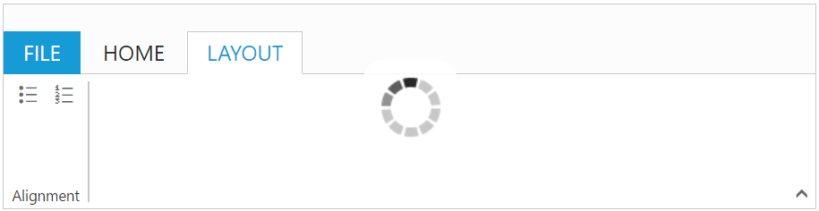

# Load on Demand

Set `EnableOnDemand` as true to enable load tab and backstage contents dynamically. Loading content on demand improves the initial rendering time of the ribbon by rendering tab and backstage content when tabs and backstage items are clicked.
 

          
            

                    <table>
                        <tr>
                            <td>
                                <button id="btn1" class="e-bsnewbtnstyle">Blank WorkBook</button>
                            </td>
                        </tr>
                    </table>
                

                

                    

                        User Information
                        

                            

                            

                                
user

                                
any@syncfusion.com

                            

                        

                    

                    <a href="#">Sign out</a>
                

                

                    <ej:Ribbon ID="defaultRibbon" runat="server" Width="50%" EnableOnDemand="true">
                       <ApplicationTab Type="Backstage">
                          <BackstageSettings HeaderWidth="125" Text="FILE" Height="360" Width="600">
                            <PageCollection>
                               <ej:BackstagePage Id="new" Text="New" ContentID="newCon"/>
                               <ej:BackstagePage Id="close" Text="Close"  ItemType="Button" EnableSeparator="true"/>
                               <ej:BackstagePage Id="account" Text="Office Account" ContentID="accountCon"/>
                            </PageCollection>
                          </BackstageSettings>
                        </ApplicationTab>
                          <RibbonTabs>
                            <ej:RibbonTab Id="home" Text="HOME">
                                <TabGroupCollection>
                                     <ej:TabGroup Text="Clipboard" AlignType="Columns">
                                       <GroupExpanderSettings ToolTip="Clipboard"></GroupExpanderSettings>
                                        <ContentCollection>
                                            <ej:TabContent>
                                                <ContentDefaults Width="50" Height="75" Type="Button" IsBig="true"/>
                                                <ContentGroupCollection>
                                                    <ej:ContentGroup Id="paste" ToolTip="Paste" Text="paste" Type="Button">
                                                        <ButtonSettings Type="Button" ContentType="ImageOnly" PrefixIcon="e-icon e-ribbon e-ribbonpaste"/>
                                                    </ej:ContentGroup>
                                                </ContentGroupCollection>
                                            </ej:TabContent>
                                        </ContentCollection>
                                    </ej:TabGroup>
                                    <ej:TabGroup Text="New" AlignType="Columns">
                                        <ContentCollection>
                                            <ej:TabContent>
                                                <ContentGroupCollection>
                                                    <ej:ContentGroup Id="new1" Text="New" ToolTip="New" Type="Button">
                                                        <ButtonSettings Type="Button" ContentType="ImageOnly" ImagePosition="ImageTop" PrefixIcon="e-icon e-ribbon e-new" />
                                                    </ej:ContentGroup>
                                                </ContentGroupCollection>
                                                <ContentDefaults Width="60" Height="70" Type="Button" />
                                            </ej:TabContent>
                                        </ContentCollection>
                                    </ej:TabGroup>
                                </TabGroupCollection>
                            </ej:RibbonTab>
                            <ej:RibbonTab Id="layout" Text="LAYOUT">
                                <TabGroupCollection>
                                    <ej:TabGroup Text="Alignment" AlignType="Rows">
                                        <ContentCollection>
                                            <ej:TabContent>
                                                <ContentDefaults Type="Button" IsBig="false" />
                                                <ContentGroupCollection>
                                                    <ej:ContentGroup Id="bullet" Text="Bullet Format" ToolTip="Bullets">
                                                        <ButtonSettings ContentType="ImageOnly" PrefixIcon="e-icon e-ribbon e-bullet" />
                                                    </ej:ContentGroup>
                                                    <ej:ContentGroup Id="number" Text="Number Format" ToolTip="Numbering">
                                                        <ButtonSettings ContentType="ImageOnly" PrefixIcon="e-icon e-ribbon e-numbericon" />
                                                    </ej:ContentGroup>
                                                </ContentGroupCollection>
                                            </ej:TabContent>
                                        </ContentCollection>
                                    </ej:TabGroup>
                                </TabGroupCollection>
                            </ej:RibbonTab>
                        </RibbonTabs>
                    </ej:Ribbon>
                 

       
    
    
    


# Initially Collapsible

Set `Collapsible` as true to render ribbon control in collapsed state, which results ribbon tabs to render without any content initially.
While using initially collapsible ribbon with `EnableOnDemand` feature improves the performance by reducing initial loading time of ribbon.


          
            

                    <table>
                        <tr>
                            <td>
                                <button id="btn1" class="e-bsnewbtnstyle">Blank WorkBook</button>
                            </td>
                        </tr>
                    </table>
                

                

                    

                        User Information
                        

                            

                            

                                
user

                                
any@syncfusion.com

                            

                        

                    

                    <a href="#">Sign out</a>
                

                

                    <ej:Ribbon ID="defaultRibbon" runat="server" Width="50%" EnableOnDemand="true" Collapsible="true">
                       <ApplicationTab Type="Backstage">
                          <BackstageSettings HeaderWidth="125" Text="FILE" Height="360" Width="600">
                            <PageCollection>
                               <ej:BackstagePage Id="new" Text="New" ContentID="newCon"/>
                               <ej:BackstagePage Id="close" Text="Close"  ItemType="Button" EnableSeparator="true"/>
                               <ej:BackstagePage Id="account" Text="Office Account" ContentID="accountCon"/>
                            </PageCollection>
                          </BackstageSettings>
                        </ApplicationTab>
                          <RibbonTabs>
                            <ej:RibbonTab Id="home" Text="HOME">
                                <TabGroupCollection>
                                     <ej:TabGroup Text="Clipboard" AlignType="Columns">
                                       <GroupExpanderSettings ToolTip="Clipboard"></GroupExpanderSettings>
                                        <ContentCollection>
                                            <ej:TabContent>
                                                <ContentDefaults Width="50" Height="75" Type="Button" IsBig="true"/>
                                                <ContentGroupCollection>
                                                    <ej:ContentGroup Id="paste" ToolTip="Paste" Text="paste" Type="Button">
                                                        <ButtonSettings Type="Button" ContentType="ImageOnly" PrefixIcon="e-icon e-ribbon e-ribbonpaste"/>
                                                    </ej:ContentGroup>
                                                </ContentGroupCollection>
                                            </ej:TabContent>
                                        </ContentCollection>
                                    </ej:TabGroup>
                                    <ej:TabGroup Text="New" AlignType="Columns">
                                        <ContentCollection>
                                            <ej:TabContent>
                                                <ContentGroupCollection>
                                                    <ej:ContentGroup Id="new1" Text="New" ToolTip="New" Type="Button">
                                                        <ButtonSettings Type="Button" ContentType="ImageOnly" ImagePosition="ImageTop" PrefixIcon="e-icon e-ribbon e-new" />
                                                    </ej:ContentGroup>
                                                </ContentGroupCollection>
                                                <ContentDefaults Width="60" Height="70" Type="Button" />
                                            </ej:TabContent>
                                        </ContentCollection>
                                    </ej:TabGroup>
                                </TabGroupCollection>
                            </ej:RibbonTab>
                            <ej:RibbonTab Id="layout" Text="LAYOUT">
                                <TabGroupCollection>
                                    <ej:TabGroup Text="Alignment" AlignType="Rows">
                                        <ContentCollection>
                                            <ej:TabContent>
                                                <ContentDefaults Type="Button" IsBig="false" />
                                                <ContentGroupCollection>
                                                    <ej:ContentGroup Id="bullet" Text="Bullet Format" ToolTip="Bullets">
                                                        <ButtonSettings ContentType="ImageOnly" PrefixIcon="e-icon e-ribbon e-bullet" />
                                                    </ej:ContentGroup>
                                                    <ej:ContentGroup Id="number" Text="Number Format" ToolTip="Numbering">
                                                        <ButtonSettings ContentType="ImageOnly" PrefixIcon="e-icon e-ribbon e-numbericon" />
                                                    </ej:ContentGroup>
                                                </ContentGroupCollection>
                                            </ej:TabContent>
                                        </ContentCollection>
                                    </ej:TabGroup>
                                </TabGroupCollection>
                            </ej:RibbonTab>
                        </RibbonTabs>
                    </ej:Ribbon>
                 

       
    
    
    


