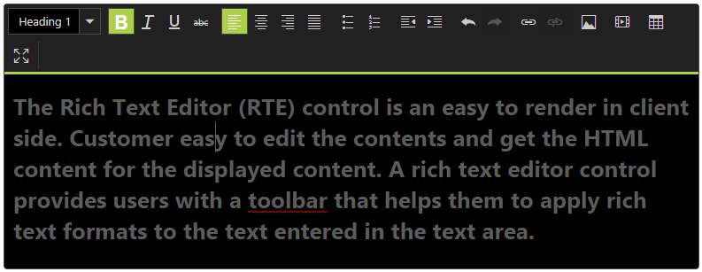
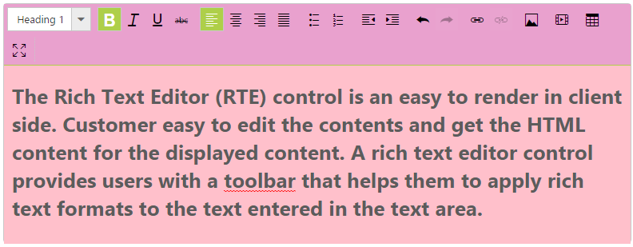

# Appearance and Styling

## Theme 

RTE control supports a rich appearance. This control consist of six flat themes and six gradient themes. To use these twelve themes, you can refer to the themes files in HTML. 

You require two style sheets to apply styles to RTE control; one ej.widgets.core.min.css and one ej.theme.min.css. When you use ej.widgets.all.min.css, then you do not require to use ej.widgets.core.min.css and ej.theme.min.css as ej.widgets.all.min.css is a combination of these two.

The core style sheet applies styles related to positioning and size, but are not related to the color scheme and are always required for the control to look right and function properly. The theme style sheet apples theme-specific styles, like colors and backgrounds.

The following is the list of the thirteen themes supported by RTE. 

* default-theme
* flat-azure-dark
* flat-lime
* flat-lime-dark
* flat-saffron
* flat-saffron-dark
* gradient-azure
* gradient-azure-dark
* gradient-lime
* gradient-lime-dark
* gradient-saffron
* gradient-saffron-dark
* bootstrap-theme

Add the following code in your ASPX page to initialize the RTE with gradient-azure-dark theme.



    <ej:RTE ID="rteSample" Width="850" runat="server"></ej:RTE>



Showcase of RTE with Gradient-azure-dark theme
{:.caption} 

## CSS Class

RTE control also allows you to customize its appearance by using ing-defined CSS and custom skin options for colors and backgrounds. To apply custom themes, use this property called CssClass. CssClass property sets the root class for RTE theme.

You can override the existing styles under the theme style sheet by using this property. The theme style sheet applies theme-specific styles like colors and backgrounds. 

<table>
<tr>
<th>
Class/Element name</th><th>
Description</th></tr>
<tr>
<td>
.e-rte</td><td>
Base class that is added to the RTE wrapper div element where the custom CSS class are also added</td></tr>
<tr>
<td>
.e-rte-toolbar</td><td>
RTE toolbar wrapper class inside which you add the Toolbar control for RTE</td></tr>
<tr>
<td>
.e-toolbarspan</td><td>
The div element’s class that has the individual list of tool bar items in the RTE</td></tr>
<tr>
<td>
.e-dialog-wrap</td><td>
Class that is used for Insert table, image, link and video dialog</td></tr>
<tr>
<td>
.editarea</td><td>
The div wrapper class for the editable iframe inside RTE</td></tr>
</table>

In the following example, the value of CssClass property is set as “light-Pink”. ”[light-Pink](http://www.w3schools.com/tags/ref_color_tryit.asp?color=DeepPink)” is added as the root class to RTE control at runtime. From this root class, you can customize the RTE control theme.

Add the following code in your ASPX page.



    <ej:RTE ID="rteSample" Width="850" CssClass="light-Pink" runat="server"></ej:RTE>



In the following style sheet, the active theme style sheet file is overridden by using root class “light-Pink”.

Add the following styles in your styles section. Here the RTE toolbar background, toolbar item selection and RTE editable area customized by overriding the corresponding predefined classes added from Syncfusion specific script and CSS classes



    .light-Pink .e-toolbar {

        color: black;

    }

    .light-Pink .e-toolbarspan {

        background-color: #E9A1CE;

    }

    .light-Pink .e-toolbar .e-active {

        background-color: #4C0F2E;

    }

    .light-Pink .editarea {

        background-color: pink;

    }



Server side events

<table>
<tr>
<th>
Event Name</th><th>
Description</th><th>
Parameters</th></tr>
<tr>
<td>
OnToolbarItemClick</td><td>
Event triggered when the RTE tool bar item is clicked</td><td>
(Object Sender, RTEEventArgs e)Values passed in argument are as below,CommandName – returns the corresponding toolbar item command</td></tr>
</table>
The following steps explains you on how to define server side event for a RTE control.

In an ASPX page, define the RTE control and add server side event



    <ej:RTE ID="RTESample" Width="650" Height="440" runat="server" OnToolbarItemClick="RTESample_ToolbarItemClick">        

</ej:RTE>



In the code behind define the action to be performed on clicking the toolbar item in RTE



protected void RTESample_ToolbarItemClick(object sender, Syncfusion.JavaScript.Web.RTEEventArgs e)

{    

    // e.CommandName – returns the currently clicked ToolBar item operation command

}



