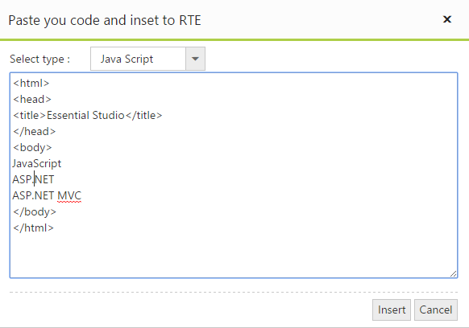
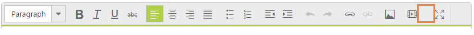
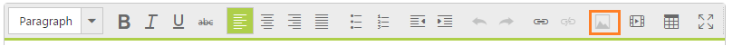

# Customized tools option

## Add the tool item

In Rich Text Editor, toolbars are customizable. When you want to include a new tool item with new functionality that is not available in the existing RTE toolbar items, it is possible to create a new tool item by using the custom tool option. The following example illustrates how to insert an HTML, JavaScript, or CSS code in the editing area as a code block. 

Add the following code in your ASPX page to render RTE with new tool item.



<ej:RTE ID="rteSample" AllowEditing="true" ToolsList="customTool" runat="server">

    <Tools>

        <CustomTool>

            <ej:CustomTool Action="showDialog" Css="codeInsert" Name="codeInsert" Tooltip="Insert code snippets" />

        </CustomTool>

    </Tools>

</ej:RTE>

    <ul>

        <li>Java Script</li>

        <li>HTML</li>

        <li>CSS</li>

    </ul>

<ej:Dialog ID="customSourceCode" Title="Paste you code and inset to RTE" ShowOnInit="false" EnableModal="true" Width="596" EnableResize="false" runat="server">

    <DialogContent>

        <table>

            <tr>

                <td style="width: 100px">Select type :</td>

                <td>

                    

                        <ej:DropDownList ID="languageList" TargetID="TargetList" SelectedItemIndex="0" runat="server" />

                    

                </td>

            </tr>

            <tr>

                <td colspan="2">

                    <textarea id="srcCode" style="width: 550px; height: 250px" rows="4"></textarea>

                </td>

            </tr>

            <tr>

                <td colspan="2">

                    

                        <ej:Button ID="insert" Type="Button" Text="Insert" runat="server" ClientSideOnClick="customBtnClick"></ej:Button>

                        <ej:Button ID="cancel" Type="Button" Text="Cancel" runat="server" ClientSideOnClick="customBtnClick"></ej:Button>

                    

                </td>

            </tr>

        </table>

    </DialogContent>

</ej:Dialog>



To Add Custom Toolbar to the RTE control, you have to include Syncfusion.JavaScript.Models namespace in your web.cofig file under &lt;system.web&gt; section



<system.web>

    <pages>

      <controls>

        <add  namespace="Syncfusion.JavaScript.Models, Version=XX.XXXX.X.XX, Culture=neutral, PublicKeyToken=3D67ED1F87D44C89" assembly="Syncfusion.EJ" tagPrefix="ej"/>

      </controls>

    </pages>

  </system.web>



Add the following code example to define the CustomTool action in script section



    var rteObj;

    function showDialog() {

            $("#srcCode").val("").show();

            $("#<%=customSourceCode.ClientID%>").ejDialog("open");

    }

    function customBtnClick() {

        rteObj = $("#<%=rteSample.ClientID%>").data("ejRTE");

        if (this._id == "<%=customSourceCode.ClientID%>_insert") {

            rteObj.executeCommand("inserthtml", $("#srcCode")[0].value);

        }

        $("#<%=customSourceCode.ClientID%>").ejDialog("close");

    }



The following screenshot demonstrates the functionality of new tool item.

## Remove the tool item

In some cases you may have to remove a particular item from existing toolbar item of RTE. It can easily be done by using the property removeToolBarItem in RTE. Consider a content blog that does not require "insert table" option. In that case, you can remove the “CreateTable” tool item from the toolbar. The following code illustrates how to remove the “CreateTable” tool item from list of toolbars.

Add the following code in your ASPX page.



<ej:RTE ID="rteSample" Width="850" runat="server"></ej:RTE>



Add the following code in script section.



    $("#<%=rteSample.ClientID %>").ejRTE();

    var rteeObj = $("#<%=rteSample.ClientID %>").data("ejRTE");

    rteeObj.removeToolbarItem("<%=rteSample.ClientID %>createTable"); // remove toolbar item



## Enable or disable

You can enable or disable the tool items that are available in the RTE toolbar. Intermittently, it is not possible to allow some tool item actions in the editing area. To avoid mistakes in such a situation, you can disable the unnecessary tool items. Later, you can enable the disabled tool items, and when you are not going to use images in your blog you can disable the image tool item by using the “disableToolbarItem” method. The following example illustrates how to disable the “image” tool.

Add the following code in your ASPX page.



<ej:RTE ID="rteSample" Width="850" runat="server">



Add the following code in script section.



    var rteobj;

    $("#<%=rteSample.ClientID %>").ejRTE();

rteobj = $("#<%=rteSample.ClientID %>").data("ejRTE");

    //Here the Insert image toolbar icon is disabled

rteobj.disableToolbarItem("<%=rteSample.ClientID%>image");



Showcase for disable the insert image in toolbar
{:.caption} 

