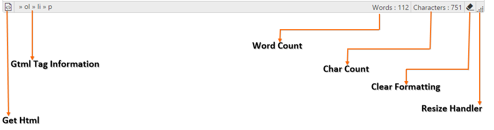
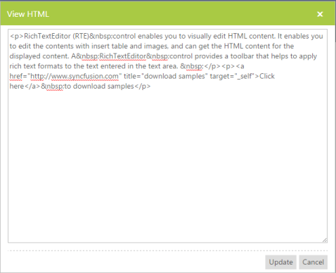
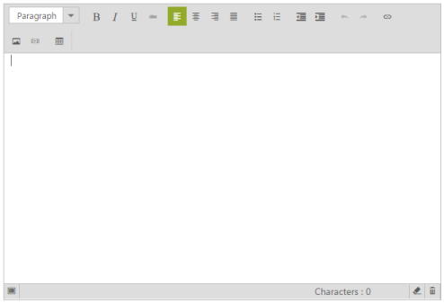

# Footer

RTE has footer option with some most frequently used tool items. To enable the footer you can set “ShowFooter” property as “True”. The following features have been added in footer:

* Get HTML
* Characters count
* HTML Tag information
* Clear formatting 
* Remove contents
* Resizing

Refer to the following code example to enable the footer in RTE.



<ej:RTE ID="rteSample" Width="850" runat="server" ShowFooter="true"></ej:RTE>



## Get HTML

RTE control provides support to view the source code of the editing area’s content as XHTML markup language. Text area is considered as div and the contents of the editing area are considered as the child of this div. All the styles, formatting, tables, image sources are maintained in that HTML. To get equivalent XHTML source code of editing area, use tool item in RTE Footer. Click this option to get the popup window that contains XHTML code. This also enables you to edit the HTML code and update the changes to the editing area content. 

## HTML Tag Information

RTE control maintains the current position of the cursor, its current tag and parent tag information in a footer.

## Characters Count

RTE counts the number of words in an editing area while you type. Consider a blog; the “About Me” profile information limit is maximum of 1,200 characters. In such a situation, you can get the number of characters you have typed by a simple alert. This count excludes white spaces.

## Clear formatting

With Clear Formatting function, you can remove all the formatting on a block of selected text, or a paragraph, or the whole text. Formatting such as font, size, text attributes such as bold or italic, and color you applied in the text can be cleared with one click, and then the text returns to its default style.

## Remove the contents

You can delete all the existing contents in editing area with one click of this tool item.

## Resizing

RTE provides support to resize the RTE. You can get this option from the right corner of the footer. Click the RTE resize handle and drag to reduce or increase the table size. Note that this method proportionally resizes RTE by split dimension in the form of columns and rows, but does not change RTE content. 

Customize the RTE Resizing

You can customize the RTE sizing with the help of EnableResize property. To customize this, enable the ShowFooter property so that resize handle is displayed. When ShowFooter is set to true, the default value of EnableResize is true that allows you to resize the control

The following example illustrates how to disable resizing for a RTE control.

Add the following code in your ASPX page.



<ej:RTE ID="RTESample" Width="650" Height="440" runat="server" EnableResize="false" ShowFooter="true">        

</ej:RTE>



