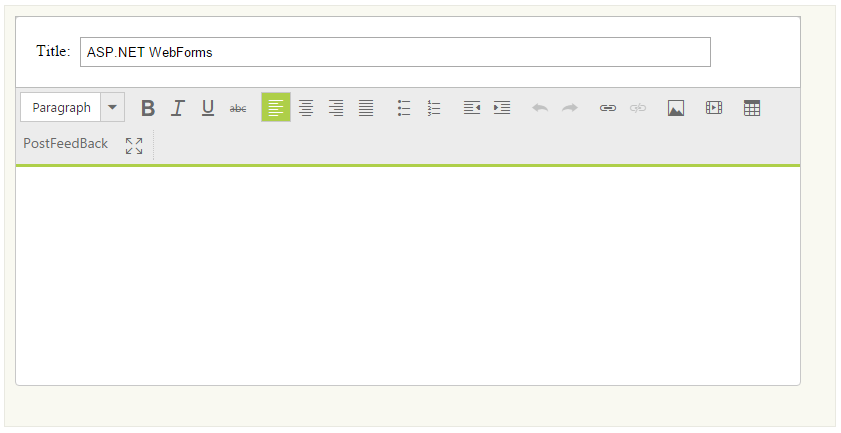
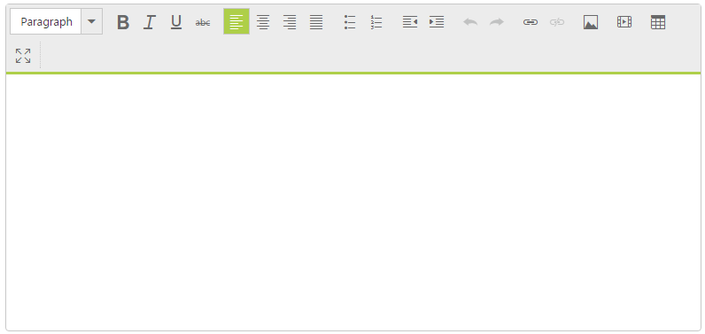
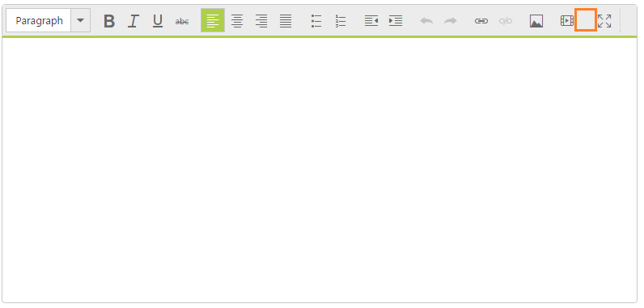
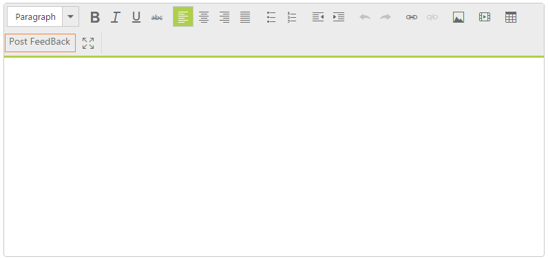
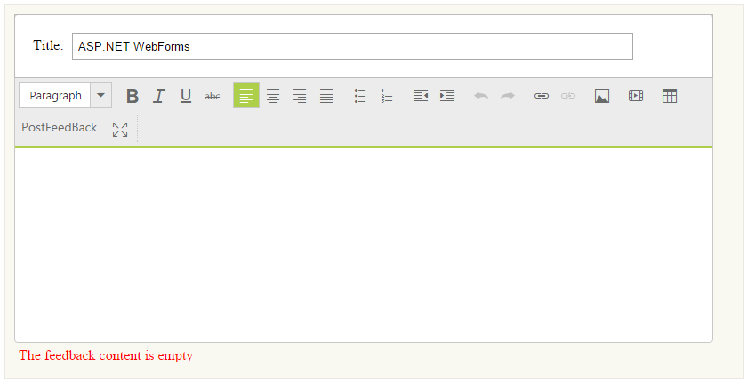

# Getting Started

## Create your first RichTextEditor in ASP.NET

The ASP.NET WebForms RichTextEditor (RTE) control allows you to edit contents, insert tables, images and to get the HTML content. In this section you can learn how to use RichTextEditor in order to get Feedback from the user. 

The following screenshot demonstrates how the RTE control is used in Feedback form.

In the above screenshot , the RTE consists of content editable area with Feedback title. In this RTE application, you can click the PostFeedback toolbar item to send the Feedback information.

Create a RichTextEditor 

ASP.NET WebForms RTE widget basically renders by using simple text area element. 

You can create an ASP.NET WebForms Project and add necessary Dll’s and scripts with the help of the given ASP.NET Webforms-Getting Started Documentation.

Add the following code example to the corresponding view page to render RichTextEditor.



<ej:RTE ID="FeedbackEditor" runat="server">

</ej:RTE>



The following RTE screenshot renders the output of the above steps.

### Configure the Toolbar

The RichTextEditor configures the toolbar items to provide editing and styling functionalities. In this scenario, you can use the default RTE toolbar item to provide Feedback form support. 

#### Add the Toolbar Item

The additional functionality toolbar item is necessary to perform the required operation. The RTE provides some additional toolbar items that are predefined, but not rendered.  

The following code example renders the additional inbuilt toolbar items to RTE toolbar list.



<ej:RTE ID="FeedbackEditor" runat="server">

    <Tools Font="fontName,fontSize,fontColor,backgroundColor">

    </Tools>

</ej:RTE>



 The following screenshot displays the RTE with inbuilt toolbar item.

#### Remove the ToolbarItem

Sometimes, an existing toolbar item is not necessary to perform the required operation. You can remove the particular toolbar item by using the removeToolbarItem method. 

For example, consider ‘create table’ toolbar item is not necessary for the Feedback scenario. You can easily remove the ‘create table’ toolbar item by using the following code example.



<ej:RTE ID="FeedbackEditor" runat="server">

</ej:RTE>





     window.onload = function () {

         $("#<%=FeedbackEditor.ClientID%>").ejRTE();

         var editorObj = $("#<%=FeedbackEditor.ClientID%>").data('ejRTE');

         //remove the create table toolbar item by specifying the create table toolbar id  

         editorObj.removeToolbarItem("<%=FeedbackEditor.ClientID%>createTable");

     };



The following screenshot displays ‘create table’ toolbar item is removed from the toolbar list.

### Configure Custom Toolbar item

To post the Feedback directly, an additionalToolbar item is required. The RTE control provides support to create the custom toolbar itemfor custom action. 

To Add Custom Toolbar to the RTE control, you can include Syncfusion.JavaScript.Models namespace in your web.cofig file. Include the following code example in web.config file under &lt;system.web&gt; section.



<pages>

      <controls>

        <add  namespace="Syncfusion.JavaScript.Models" assembly="Syncfusion.EJ" tagPrefix="ej"/>

       </controls>

</pages>



The following code example creates the custom toolbar item in the RTE control. 



<ej:RTE ID="FeedbackEditor" runat="server">

    <Tools>

        <CustomTool>

            <ej:CustomTool Name="Post Feedback" Css="Feedback" Tooltip="click to Post Feedback messages" />

        </CustomTool>

    </Tools>

</ej:RTE> 



Add the following styles for the custom toolbar item.



    .Feedback {

        height: 22px;

        width: 100px;

        display: block;

        text-align: center;

        font-weight: bold;

    }



The following screenshot displays RTE with custom toolbar item.

### Validate the Content

In some cases, to send the Feedback form without contents you can validate them before submitting the Feedback contents. To achieve this validation, you can use getText() method in RTE control.

When the content area is empty, you can set the notification message displayed in the &lt;div&gt; element area in order to give an alert message. The following HTML code example creates the Feedback form editor with the support of RTE control.

During the Feedback sending time, you can validate whether the content area is empty or not. To achieve this validation, you can use RTE client-side events. RTE provides the ‘action’ function to perform the client-side events to custom tool.

You can specify the custom tool same as previous section with validation operations.



    

        <label>Title:</label>

        <input type="text" class="input ejinput" />

    

    <!--RTE element section-->

    <ej:RTE ID="FeedbackEditor" runat="server">

        <Tools>

            <CustomTool>

                <ej:CustomTool Action="validate" Name="PostFeedback" Css="Feedback" Tooltip="click to Post Feedback messages" />

            </CustomTool>

        </Tools>

    </ej:RTE>

    <!-- validation message display area-->

    





     function validate() {

         var editorObj = $("#<%=FeedbackEditor.ClientID%>").data('ejRTE');

         if (($.trim(editorObj.getText()).length < 1)) {

             //the content area is empty

             $(".output").html("The Feedback content is empty");

         } else {   //the content area contains information

             $(".output").html("");

             //custom code to send the Feedback form contents

             alert("The Feedback content has been saved");

         }

     }



You can add the following styles to achieve the Feedback form editor application.



    .commentSection {

        width: 786px;

        background: none repeat scroll 0 0 #f9f9f1;

        border: 1px solid #e9e9e1;

        padding: 10px;

    }

    .titleSection {

        text-indent: 20px;

        float: left;

        padding: 20px 0px;

        width: 100%;

        border: 1px solid #bbbcbb;

    }

    .output {

        height: 20px;

        padding: 5px;

        color: red;

    }

    .titleSection .level {

        margin: 15px 0px 5px 0px;

    }

    .input.ejinput {

        text-indent: 5px;

        height: 24px;

        width: 80%;

        margin-left: 5px;

    }



The following screenshot displays the Feedback sending without content.

