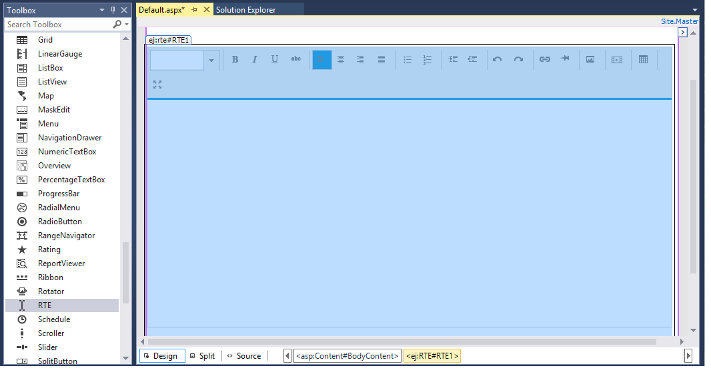
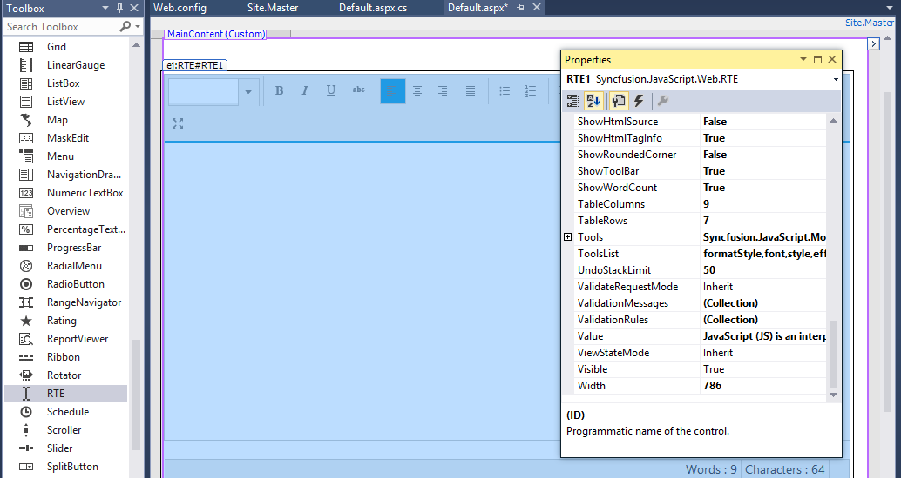

# Getting Started

This section helps to understand the getting started of RTE control with the step-by-step instruction.

## Create your First RichTextEditor in ASP.NET

1.	Create an ASP.Net Web Forms application and add RichTextEditor control to the Default.aspx page.

    

2.  Once the control is dragged and dropped into the page the embedded resource will add dependent script and CSS files from Synfusion.EJ.Web assembly and the assembly will be referred from GAC. This will add the follwing appSetting key in web.config file to load resource files.

    
        
           <appSettings>
                <add key="LoadEJResourcesFromAssembly" value="true"/>
                <add key="EJResources" value="jsrender:true;jqueryeasing:true;globalize:true;themes:true;"/>
           </appSettings>
            
    

    >Refer the [ASP.NET-Getting Started](http://help.syncfusion.com/aspnet/getting-started#manual-integration-of-syncfusion-aspnet-controls-into-the-newexisting-application) Documentation to know further details about necessary DLLs, Script and CSS files.

3.  Configure the RichTextEditor control using properties panel as well as set the value for the RichTextEditor as below.

    

    Switching from Design view to Source the RichTextEditor code looks like the below. 
    
    
    
    	 <ej:RTE ID="RTE1" runat="server" ShowFooter="True" Value="JavaScript (JS) is an interpreted computer programming language.">
      
         </ej:RTE>
    
    

## Toolbar–Configuration

You can configure the toolbar with the tools as your application requires.



	 <ej:RTE ID="RTE2" runat="server" ToolsList="style,doAction,lists,images,links">
        <RTEContent>
            <ul>
                <li>The Rich Text Editor  (RTE) control is an easy to render in client side. </li>
                <li>Customer easy to edit the contents and get the HTML content for the displayed content. </li>
                <li> A rich text editor control provides users with a toolbar that helps them to apply rich text formats to the text entered  in the text area.</li>
            </ul>       
	    </RTEContent>
         <Tools Styles="bold,italic,underline,strikethrough"
                Lists="unorderedList,orderedList"
                DoAction="undo,redo"
                Links="createLink,removeLink"
                Images="image">
         </Tools>
    </ej:RTE>
	


## Setting and Getting Content

You can set the content of the editor as follows.



	<ej:RTE ID="RTE1" runat="server">
        <RTEContent>
            The Rich Text Editor
           (RTE) control is an easy to render in client side. Customer easy to edit the contents
           and get the HTML content for the displayed content. A rich text editor control provides
           users with a toolbar that helps them to apply rich text formats to the text entered
           in the text area.
        </RTEContent>
    </ej:RTE>
		


To retrieve the editor contents using Value property,



	protected void onClick(object Sender, Syncfusion.JavaScript.Web.ButtonEventArgs e)
    {
        var currentValue = RTE1.Value;
    }
    


