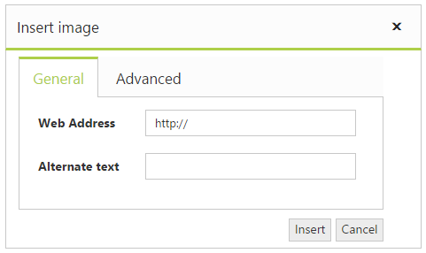
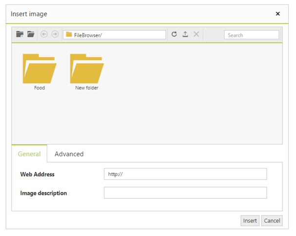
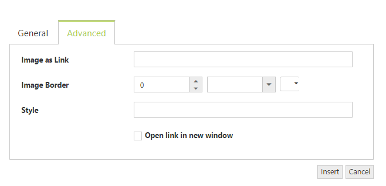
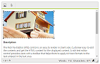

# Image and File browser

The editor allows you to manage the images and files using **FileExplorer**. The FileExplorer enables you to insert images from online source as well as local computer where you want to insert the image in your content. The Image and file browser is the ability to upload pictures and link file to the editor. 

## Insert a Image from Online Source

If you want to insert an image from online source like Google, ping, etc., you need to enable images tool on the editor’s toolbar. By default, the images tool is open a simple dialog which allows you to inserting an image from online source.


	
<ej:RTE ID="RTE1" ToolsList="images" runat="server">
    <RTEContent>
            Description:
            
 The Rich Text Editor (RTE) control is an easy to render in
            client side. Customer easy to edit the contents and get the HTML content for
            the displayed content. A rich text editor control provides users with a toolbar
            that helps them to apply rich text formats to the text entered in the text
            area. 

    </RTEContent>
    <Tools Images="image">
    </Tools>
</ej:RTE>
    


## Insert a Image from Your Computer

Configure the ImageBrowser and FileBrowser property to insert an image from your computer. You can specify the settings required by the FileExplorer to create, read, upload, and destroy the files and images from the explorer. 



<ej:RTE ID="RTE1" ToolsList="images" runat="server">
    <RTEContent>
            Description:
            
 The Rich Text Editor (RTE) control is an easy to render in
            client side. Customer easy to edit the contents and get the HTML content for
            the displayed content. A rich text editor control provides users with a toolbar
            that helps them to apply rich text formats to the text entered in the text
            area. 

    </RTEContent>
    <Tools Images="image"> </Tools>
    <ImageBrowser ExtensionAllow="*.png,*.gif,*.jpg,*.jpeg" FilePath="~/FileBrowser/"  AjaxAction="Default.aspx/FileActionDefault"/>
    <FileBrowser ExtensionAllow="*.png,*.txt,*.jpg,*.docx" FilePath="~/FileBrowser/" AjaxAction="Default.aspx/FileActionDefault"/>
</ej:RTE>
    




[System.Web.Services.WebMethod]
public static object FileActionDefault(string ActionType, string Path, string ExtensionsAllow, string LocationFrom, string LocationTo, string Name, string[] Names, string NewName, string Action, IEnumerable<CommonFileDetails> CommonFiles)
{
    FileExplorerOperations operation = new FileExplorerOperations();
    switch (ActionType)
    {
        case "Read":
            return (operation.Read(Path, ExtensionsAllow));
        case "CreateFolder":
            return (operation.CreateFolder(Path, Name));
        case "Paste":
            operation.Paste(LocationFrom, LocationTo, Names, Action, CommonFiles);
            break;
        case "Remove":
            operation.Remove(Names, Path);
            break;
        case "Rename":
            operation.Rename(Path, Name, NewName, CommonFiles);
            break;
        case "GetDetails":
            return (operation.GetDetails(Path, Names));
    }
    return "";
}
    
        

N> FileExplorer component has been implemented and integrated with the editor in Volume 1, 2015 release. For more information about FileExplorer component, see [here](http://helpjs.syncfusion.com/js/fileexplorer/overview#).

## Image Properties

You can set or modify the properties of an image by using the image dialog. It allows you to add links, apply border and set additional styles to the images. The editor provides an option to specify the alternate text for an image, if the image cannot be displayed.

## Resize an Image

You can resize an image either manually or by setting width and height in the image dialog. 

N> Set the default height and width of the Images which was inserted into the RTE text area in the client side event called “change” event of RTE - {{'[Link](http://jsplayground.syncfusion.com/Sync_rghpsadi)'| markdownify }}

### Resize Manually

You can resize an image manually by selecting an image. And drag the handle until the image is resized to the desired size. 

### Set Width and Height

The editor provides you to set the width and height properties to change the size of an image (rather than forcing you to set in style attributes) using ShowDimensions property. By default, the Constrain Proportion checkbox is selected to resize an image to an exact proportion. To apply the exact width and height that you specify into the Height and Width textboxes, uncheck the Constrain Proportions checkbox.



<ej:RTE ID="RTE1" ToolsList="images" ShowDimensions="true" runat="server">
    <RTEContent>
            Description:
            
 The Rich Text Editor (RTE) control is an easy to render in
            client side. Customer easy to edit the contents and get the HTML content for
            the displayed content. A rich text editor control provides users with a toolbar
            that helps them to apply rich text formats to the text entered in the text
            area. 

    </RTEContent>
    <Tools Images="image">

    </Tools>
</ej:RTE>



## Suppression of the Image Browser

The General and Advanced tabs in the RTE Image browser can be removed by setting its corresponding display CSS property to none.



    
 
 
 Can remove the Add `NewFolder` button by using [removeToolbarItem](https://help.syncfusion.com/js/api/ejrte#methods:removetoolbaritem) property of Image Browser in the RTE create event. 



<ej:RTE ID="browser" ClientSideOnCreate="onCreate" Width="100%" Height="440" runat="server" MinWidth="200px">
    <RTEContent>
        The Rich Text Editor (RTE) control is an easy to render in
        client side. Customer easy to edit the contents and get the HTML content for
        the displayed content. A rich text editor control provides users with a toolbar
        that helps them to apply rich text formats to the text entered in the text
        area. 
    </RTEContent>
    <ImageBrowser ExtensionAllow="*.png,*.gif,*.jpg,*.jpeg" FilePath="~/FileBrowser/" AjaxAction="FileAndImageBrowser.aspx/FileActionDefault" UploadAction="../FileExplorer/uploadFiles.ashx{0}"/>
    <FileBrowser ExtensionAllow="*.png,*.txt,*.jpg,*.docx" FilePath="~/FileBrowser/" AjaxAction="FileAndImageBrowser.aspx/FileActionDefault" UploadAction="../FileExplorer/uploadFiles.ashx{0}"/>
</ej:RTE>

 
 
 In RTE control, there is no direct support for the autoUpload option. But this can be achieved by enabling the autoUpload at create event of RTE.



<ej:RTE ID="browser" ClientSideOnCreate="onCreate" Width="100%" Height="440" runat="server" MinWidth="200px">
    <RTEContent>
        The Rich Text Editor (RTE) control is an easy to render in
        client side. Customer easy to edit the contents and get the HTML content for
        the displayed content. A rich text editor control provides users with a toolbar
        that helps them to apply rich text formats to the text entered in the text
        area. 
    </RTEContent>
    <ImageBrowser ExtensionAllow="*.png,*.gif,*.jpg,*.jpeg" FilePath="~/FileBrowser/" AjaxAction="FileAndImageBrowser.aspx/FileActionDefault" UploadAction="../FileExplorer/uploadFiles.ashx{0}"/>
    <FileBrowser ExtensionAllow="*.png,*.txt,*.jpg,*.docx" FilePath="~/FileBrowser/" AjaxAction="FileAndImageBrowser.aspx/FileActionDefault" UploadAction="../FileExplorer/uploadFiles.ashx{0}"/>
</ej:RTE>

    
 
