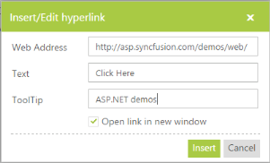
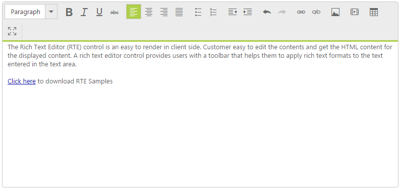

# Insert Hyperlink

RTE control provides the option to insert hyperlink in the editing area. Consider your blog needs to give a product’s download link, then you can include the download link by using “insert or edit hyperlink” tool item. 

By clicking this tool item, you can add Text, with hyperlink, and Tooltip, where a message appears when a cursor is positioned over a hyperlink. Also, this tool item enables you to add or edit the hyperlink, text, tooltip for selected text in the editing area. 

Add the following code in your ASPX page to initialize the RTE.



    <ej:RTE ID="rteSample" Width="850" runat="server"></ej:RTE>



Enter the hyperlink url in web address and Text that is to be linked in the pop up

The following screenshot illustrates the hyperlink of the “Click here” text. 

