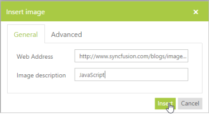
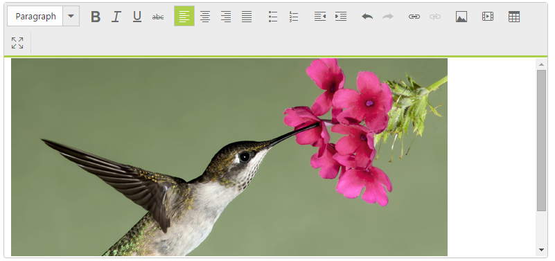
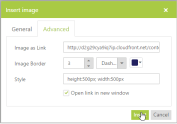
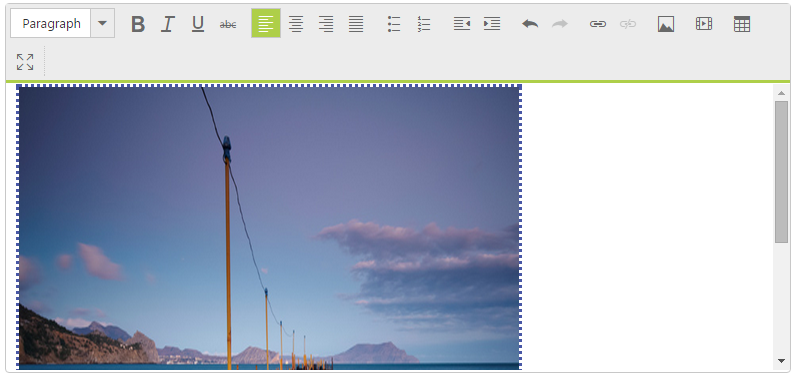

# Insert Image

You can insert all types of images from a defined pathinRich Text Editorcontrol. You can even insert your company’s logo in the page. When you explain about your product, insert images related to the product, for more interaction with viewers. And it also provides some additional features such as border support, navigation link support and custom styles for images.

## General Insert Image Steps 

Click on the Insert Image toolbar icon that opens a pop up, choose the General tab and refer to the following steps.

Specify the URL of the image. Use the following to insert an image in RTE, [http://www.syncfusion.com/blogs/image.axd?picture=clip_image003_thumb_6.jpg](http://www.syncfusion.com/blogs/image.axd?picture=clip_image003_thumb_6.jpg)

Description of the images is mandatory.

_Insert image popup_

## Advanced Insert Image steps

Click on the Insert Image toolbar icon that opens a pop up, choose the Advanced tab and refer to the following steps.

Specify the URL of the image that is to be opened on clicking the inserted image. Check by using the following URL,

[http://d2g29cya9iq7ip.cloudfront.net/content/images/home/bigdata_bannerimage.png](http://d2g29cya9iq7ip.cloudfront.net/content/images/home/bigdata_bannerimage.png)

Specify the Border size, style and color for the inserted image. Style is optional, you can set styling for customizing the image.



<ej:RTE ID="rteSample" Width="850" runat="server"></ej:RTE>



In the script section disable the edit option to open the popup on clicking the image inserted.



    // event triggered on image insert button click

    $("#<%=rteSample.ClientID%>_img_insert").click(function () {

        //Disable editing so that you can open the image on click

     $("#<%=rteSample.ClientID%>").ejRTE({ allowEditing: false });

    });



In order to open the URL on clicking the image you have to set the AllowEditing as false. Otherwise you can open the image URL by Open on new tab to view the image given in Advanced tab.

