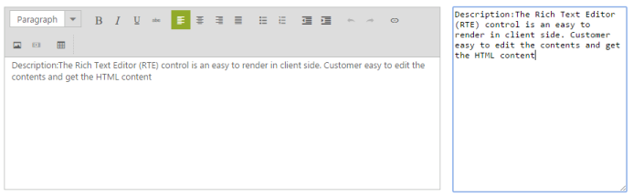
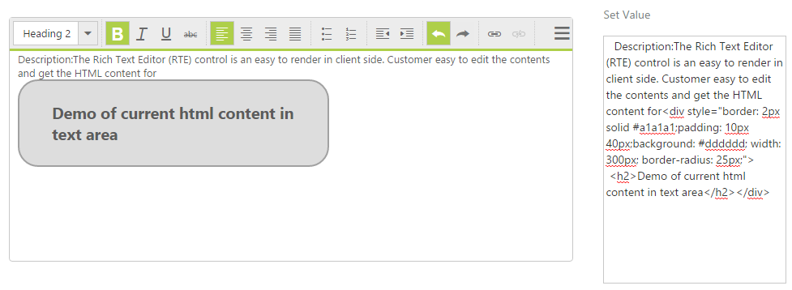

# Integration 

## Angular Binding

The RichTextEditor control supports two types of Angular JS support namely,

* One-way binding
* Two-way binding

One-way binding refers to the process of applying scope values to all the available properties of the RichTextEditor control, but the changes made in RichTextEditor control are not reflected or triggered in turn to the scope collection. This kind of binding applies to all the properties of the RichTextEditor control.

Two-way binding supports both the processes; it applies the scope values to the RichTextEditor properties as well as the changes made in the RichTextEditor control also get reflected back and triggered within the angular scope change function.

Apply the plugin and property assigning to the RichTextEditor control element through the directive that starts with the letter “e-“.

By using this, you can view the equivalent XHTML code of the content in the editing area while you type.

To know more details about the Angular binding, refer to the following link location,

[http://help.syncfusion.com/ug/js/default.htm#!documents/angularjs.htm](http://help.syncfusion.com/ug/js/default.htm%23!documents/angularjs.htm)

You can bind data to the RTE control through angular support.

The following example illustrates how to bind the RTE data with simple text box as a two-way binding.

Add the following code in your ASPX page to initialize the RTE control.



<script src="http://cdn.syncfusion.com/js/assets/external/angular.min.js">  

<script src="http://cdn.syncfusion.com/js/ej.widget.angular-latest.min.js">

        

            

                

                    <textarea id="rteSample" ej-rte e-width="100%" e-height="266" e-value="rteValue"></textarea>

                    <h6>Note:Two Way Angular Support</h6>

                

                

                    <textarea name="scroll" class="input ejinputarea" ng-model="rteValue"></textarea>

                

            

        

    



### Script section:



        angular.module('syncApp', ['ejangular'])

            .controller('RTECtrl', function ($scope) {

                $scope.rteValue = "Description:The Rich Text Editor (RTE) control is an easy to render in client side. Customer easy to edit the contents and get the HTML content for";

            });



## Knockout Binding

Knockout Binding uses a Model-View-View Model (MVVM) design pattern, where the model is your stored data and the view is the visual representation of that data (UI) and View Model acts as the intermediary between the model and the view. Sometimes to enter some text box value to replicate in RTE content area, use the knockout binding feature to control the contents from other view field.

Knockout support allows you to bind the HTML elements against any of the available data models. It is of two types.

* One-way binding
* Two-way binding

One-way binding refers to the process of applying observable values to all the available properties of the RichTextEditor control, but the changes made in RichTextEditor control are not reflected and triggered in turn to the observable collection. This kind of binding applies to all the properties of the RichTextEditor control.

Two-way binding supports both the processes; it applies the observable values to the RichTextEditor control properties as well as the changes made in the RichTextEditor control are also reflected back and triggered within the observable collections.

For more information about the Knockout Binding, refer to the following online documentation in the given link location,

[http://help.syncfusion.com/ug/js/documents/knockoutjs.htm](http://help.syncfusion.com/ug/js/documents/knockoutjs.htm)

To create an ASPX page for your application and there is a live demo for your ASPX page, then it is better to customize your ASPX page. You can achieve this by using knockout binding with RTE.

In the following example, one simple text area and one RTE control is created. Add some HTML code (“<h1>Description: The Rich Text Editor (RTE) control is an easy to render in client side. &lt;/h1&gt;”) in the normal text area. When you run the sample, you can get the result of this RTE text area. At runtime, add the following HTML code in normal text area.



	<h2>Demo of current html content in text area</h2>



When you type this HTML code and focus out from the text area, you can get the result of HTML code in RTE editing area. You can apply any styles or changes to this content in RTE editing area by using the RTE Toolbar or manually. It is reflected in the normal text area as HTML code.

Add the following code in your ASPX page to initialize the RTE control.



        

            

                

                    <textarea id="rteSample" ej-rte e-width="100%" e-height="266" e-value="rteValue"></textarea>

                    <h6>Note:Two Way Angular Support</h6>

                

                

                    <textarea name="scroll" class="input ejinputarea" ng-model="rteValue"></textarea>

                

            

        

    



### Configure the KO binding for RTE in script



        angular.module('syncApp', ['ejangular'])

            .controller('RTECtrl', function ($scope) {

                $scope.rteValue = "Description:The Rich Text Editor (RTE) control is an easy to render in client side. Customer easy to edit the contents and get the HTML content for";

            });



