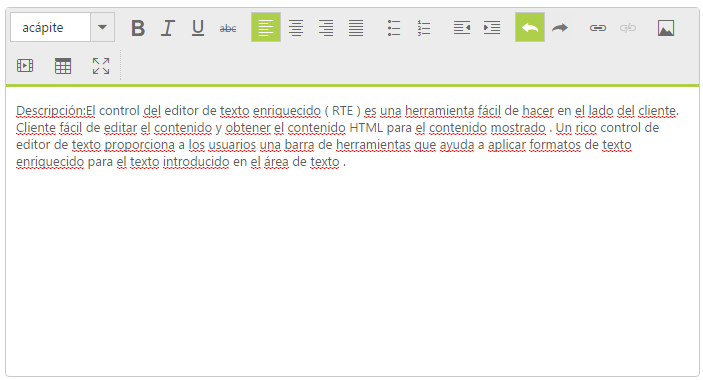

## Localization

Localization is language support based on the culture in RichTextEditordvancedoolbar icon is disabledovided URL in Advanced tabw the image given in Advanced tabe.  the steps below,. You can achieve the Localization by using “Locale” property in RichTextEditor.

The RichTextEditor control provides multi-language support by using globalization. You can customize the RichTextEditor with your own language style by using this feature. You can change the localization by using the Locale property. The default value for Locale property is en-US in RichTextEditor control.

In order to enable localization refer to the following scripts: globalize.cultures.js and globalize.js. The “globalize.cultures.js” includes different language support for JavaScript controls and the “globalize.js” is a simple JavaScript library that allows you to format the value based on the specified culture.

You can refer to the following online link reference for globalize.js

[http://cdn.syncfusion.com/js/assets/external/jquery.globalize.min.js](http://cdn.syncfusion.com/js/assets/external/jquery.globalize.min.js)

You can refer to the following online link reference for globalize.culture.js

[http://ajax.aspnetcdn.com/ajax/globalize/0.1.1/cultures/globalize.cultures.js](http://ajax.aspnetcdn.com/ajax/globalize/0.1.1/cultures/globalize.cultures.js)

You can get the script file of various cultures from the following path also:

"&lt;Installed Location&gt;\Syncfusion\Essential Studio\&lt;version&gt;\JavaScript\assets\external\cultures"

You can dynamically change the language based on their culture. In this example, globalize.min.js file is used that includes all the cultures information and Spanish culture is used. 

Add the following code in your ASPX section to initialize the RTE with Spanish content.



<ej:RTE ID="rteSample" Width="850" runat="server" Locale="es-ES"></ej:RTE>



Configure the RTE toolbar items for Spanish culture in java script



    ej.RTE.Locale["es-ES"] = {

        bold: "audaz",

        italic: "itálico",

        underline: "subrayar",

        strikethrough: "Tachado",

        justifyCenter: "Centrar texto",

        justifyLeft: "Alinear texto a la izquierda",

        justifyRight: "Alinear texto a la derecha",

        justifyFull: "justificar",

        fileBrowser: "archivo Browser",

        unorderedList: "Inserte lista desordenada",

        orderedList: "Insertar lista ordenada",

        indent: "muesca",

        outdent: "anular sangria",

        undo: "deshacer",

        redo: "rehacer",

        clearAll: "Borrar todo",

        clearFormat: "Claro Formato",

        createLink: "Insertar / Editar hipervínculo",

        image: "insertar una imagen",

        video: "insertar vídeo",

        embedVideo: "Pegue su código de inserción por debajo de",

        viewHtml: "Ver HTML",

        format: "formato",

        deleteAlert: "¿Está seguro que desea borrar todo el contenido?",

        copyPastAlert: "Your browser doesn't support direct access to the clipboard. Please use the Ctrl+X/C/V keyboard shortcuts instead.",

        videoError: "El área de texto no puede estar vacío",

        imageWebUrl: "URL web",

        imageAltText: "Descripción",

        dimensions: "dimensiones",

        constrainProportions: "Restringir proporciones",

        linkWebUrl: "URL web",

        linkText: "texto",

        linkToolTip: "ToolTip",

        html5Support: "Este icono de la herramienta sólo disponible en HTML5 apoyó navegadores",

        linkOpenInNewWindow: "Abrir enlace en una nueva ventana",

        tableColumns: "Columnas No.of",

        tableRows: "Numero de Filas",

        tableWidth: "ancho de la mesa",

        tableHeight: "altura de la mesa",

        tableCellSpacing: "El espaciado",

        tableCellPadding: "Relleno",

        tableBorder: "frontera",

        tableCaption: "subtítulo",

        tableAlignment: "alineación",

        dialogUpdate: "actualización",

        dialogInsert: "insertar",

        dialogCancel: "cancelar",

        dialogOk: "bueno",

        createTable: "Crear una tabla",

        addColumnLeft: "Añadir la columna de la izquierda",

        addColumnRight: "Añadir columna a la derecha",

        addRowAbove: "Añadir fila encima",

        addRowBelow: "Añadir fila abajo",

        deleteRow: "Elimine la fila",

        deleteColumn: "Eliminar la columna",

        deleteTable: "Eliminar la tabla",

        customTable: "Crear una tabla personalizada",

        characters: "Personajes"

    };

    var format_ES = [

    { text: "acápite", value: "p", spriteCssClass: "e-paragraph" },

    { text: "cita", value: "blockquote", spriteCssClass: "e-quotation" },

    { text: "título 1", value: "h1", spriteCssClass: "e-h1" },

    { text: "título 2", value: "h2", spriteCssClass: "e-h2" },

    { text: "título 3", value: "h3", spriteCssClass: "e-h3" },

    { text: "título 4", value: "h4", spriteCssClass: "e-h4" },

    { text: "título 5", value: "h5", spriteCssClass: "e-h5" },

    { text: "título 6", value: "h6", spriteCssClass: "e-h6" }

    ];
    $("#<%=rteSample.ClientID%>").ejRTE({ locale: "es-ES" });

    $("#<%=rteSample.ClientID%>").ejRTE("model.format", format_ES);



Showcase of RTE with Spanish culture
{:.caption} 

