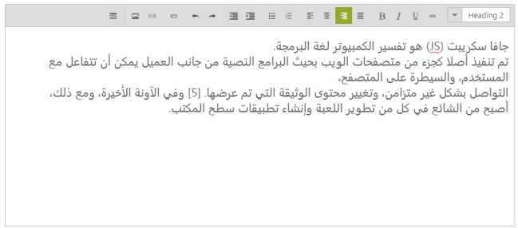

## RTL

RTL control supports right-to-left functionality and features for languages that work in a right-to-left way for entering, editing, and displaying text. You can change your display to read right-to-left. Arabic and Hebrew are written from right to left. The customers with writing style from right-to left can use this feature in RTE. 

You can achieve this in the editing area by using the EnableRTL property. Setting this property to “True” allows you to write in the right-to-left format. Position of the toolbars also changes from right to left.

Add the following code to the script section in your ASPX page to initialize the RTE.



<ej:RTE ID="rteSample" Width="850" EnableRTL="true" runat="server"></ej:RTE>



