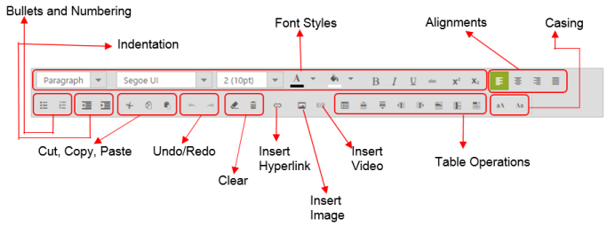

## Toolbar Support

The Rich Text Editor control provides a number of tool items that provide a rich look to the text entered in the editing area. It brings to the Web popular editing features found in desktop word processors such as Microsoft Word and OpenOffice.org Writer.

Text Formatting 

All the formatting tools allow you to change the appearance of text. Formatted text is visually interesting and easy for the visitor to read. Formatting tags provide emphasis or act as markers to help the visitor, find information. Some text styling options are also available as a drop-down list. Upon clicking them, the list opens and you can select a styling option.

List of Toolbar Items

* Alignment Formatting Tools: Left, right, center, and justify.
* Color palette: 
  * Fore-color: To change the color of text in editing area
  * Back-color: To change the background color of editing area
* Bulleting: Ordered and un-ordered list
* Style: Bold, Italic, Underline, and Strikethrough
* Subscript and Superscript 
* Text with subscript and superscript placed after or before the baseline respectively.
* Font options
  * To change the font type of text – Typeface that is applied to the document text.
  * To change the size of text – Determines how big or small the text will be.
* Format
* Predefined sets of formatting features that can be applied to block and to make elements of the document inline.
* Upper & lower case conversion
* Indent

Undo and Redo

As the name explains, the undo function allows you to undo a number of recent actions in an editing area. To go along with Undo is Redo. By using this tool, you can avoid mistakes while editing.

Clipboard action

Most used clipboard actions are cut, copy, and paste. These tools are used to rearrange the content within your editing area. You can copy and paste the images or text from locations other than the editing area.

To render Rich Text Editor with the above toolbar options, include the following code in your ASPX page.



<ej:RTE ID="AllToolsSample" Width="850" Height="440" ShowFooter="true" runat="server">

    <Tools Font="fontName,fontSize,fontColor,backgroundColor"

        Styles="bold, italic, underline, strikethrough"

        Alignment="justifyLeft, justifyCenter, justifyRight, justifyFull"

        Lists="unorderedList, orderedList"

        CopyPaste="cut, copy, paste"

        DoAction="undo, redo"

        Clear="clearFormat, clearAll"

        Links="createLink"

        Images="image,video"

        Tables="createTable, addRowAbove, addRowBelow, addColumnLeft, addColumnRight, deleteRow, deleteColumn, deleteTable"

        Scripts="superscript, subscript"

        Casing="upperCase, lowerCase"

        FormatStyle="format">

    </Tools>

</ej:RTE>



The following image consists of formatted content by using the available toolbar items in RTE control.

