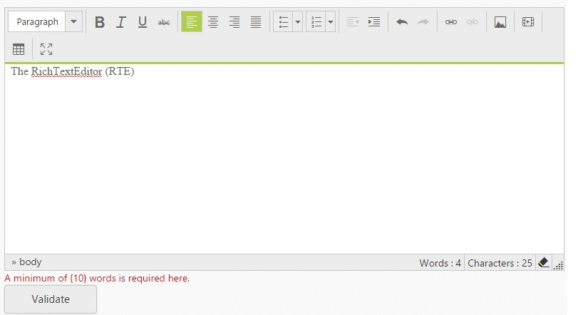
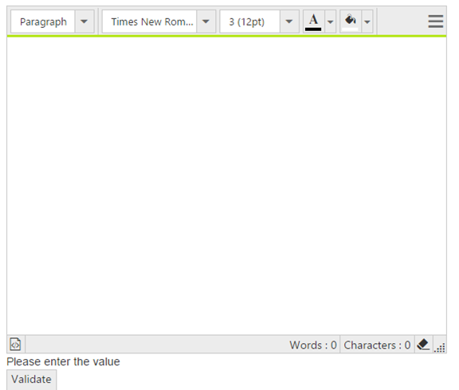

# Validation 

Validate the RichTextEditor’s value on form submission by applying ValidationRules and ValidationMessage to the RichTextEditor.

N> [jquery.validate.min](http://cdn.syncfusion.com/js/assets/external/jquery.validate.min.js) script file should be referred for validation, for more details, refer [here](http://jqueryvalidation.org/documentation).

## jQuery Validation Methods

The following are jQuery validation methods.

_List of jQuery validation methods_

<table>
<tr>
<th>
Rules</th><th>
Description</th></tr>
<tr>
<td>
required</td><td>
 Requires value for the RichTextEditor control.</td></tr>
<tr>
<td>
minWordCount</td><td>
 Requires the value to be of given minimum words count.</td></tr>
<tr>
<td>
minLength</td><td>
 Requires the value to be of given minimum characters count.</td></tr>
<tr>
<td>
maxLength</td><td>
 Requires the value to be of given maximum characters count.</td></tr>
</table>

### Validation Rules

The validation rules help you to verify the content by adding validation attributes to the text area. This can be set by using ValidationRules property.

### Validation Messages 

You can set your own custom error message by using ValidationMessage property. To display the error message, specify the corresponding annotation attribute followed by the message to display.

N> jQuery predefined error messages to that annotation attribute will be shown when this property is not defined. 

When you initialize the RichTextEditor widget, it creates a text area hidden element which is used to store the value. Hence, the validation is performed based on the value stored in this hidden element.

Required field and minWordCount values validation is demonstrated in the below given example.



<ej:RTE ID="RTE1"  runat="server">
    <ValidationRule>
        <ej:KeyValue Key="required" Value="true" />
        <ej:KeyValue Key="minWordCount" Value="10" />
        <ej:KeyValue Key="maxWordCount" Value="100" />
    </ValidationRule>
    <ValidationMessage >
        <ej:KeyValue Key="required" Value="Please enter the content" />
        <ej:KeyValue Key="minWordCount" Value="A minimum of {10} words is required here." />
        <ej:KeyValue Key="maxWordCount" Value="A maximum of {100} words is required here." />
    </ValidationMessage>
    <RTEContent>
        When a user          
    </RTEContent>
</ej:RTE>
 
<ej:Button ID="btn1" Text="Validate" OnClick="click" runat="server"> </ej:Button>
   


## Using ASP.NET Validator

To use ASP.NET validator with RichTextEditor control, set the ID of the RichTextEditor as the value of the ControlToValidate property of the validator.



<asp:ValidationSummary ID="ValidationSummary1" runat="server" 
    DisplayMode ="BulletList" ShowSummary ="true" HeaderText="Errors:" />

    <ej:RTE ID="rteSample" Width="550px" Height="440" ShowFooter="true" ShowHtmlSource="true" IsResponsive="true" runat="server">
    </ej:RTE>

<asp:RequiredFieldValidator ID="RequiredFieldValidator2"
    runat="server" ControlToValidate="rteSample"
    ErrorMessage="Please enter the value">
    </asp:RequiredFieldValidator>

<ej:Button Type="Submit" Text="Validate" runat="server"></ej:Button>
     



Executing the above code will validate the RichTextEditor control values on every form submit before post back occurs.

