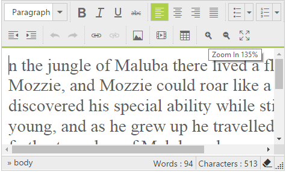

# Zoom

The editor provides zoom tools which enlarges the view of an editor's object enabling to see more detail. You can continuous zoomIn and zoomOut either using zoom tools or keyboard.

You can assign Increases and decreases of zooming range using [zoomStep](http://help.syncfusion.com/js/api/ejrte#members:zoomStep) property



<ej:RTE ID="rteSample" AllowEditing="true" ToolsList="view" ZoomStep="0.05" runat="server">

    <Tools View="zoomIn,zoomOut">

    </Tools>

</ej:RTE>
    


# Print

The editor provides print tools which use to print the contents of the editor.



<ej:RTE ID="rteSample" AllowEditing="true" ToolsList="print" runat="server">

    <Tools Print="print">

    </Tools>

</ej:RTE>



