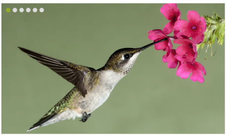
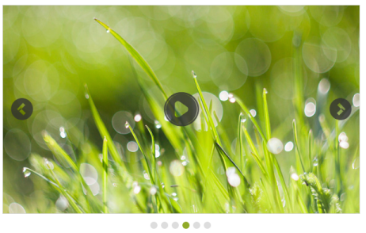

# Behavior Settings

## Enabling Rotator

Enabled property enables or disables the Rotator control. The default value is true. The value set to this property is Boolean type. The Rotator items are given directly without database. It is achieved by Items tag under the Rotator. The properties, Caption and URL can be used in the items. The tag RotatorItem is used to set the Rotator items under the tag name, Items.

In an ASPX page, add the following code example and set the Enabled property to true.



<ej:Rotator ID="slidercontent" runat="server" SlideWidth="600px" SlideHeight="350px" Enabled="true">

    <Items>

        <ej:RotatorItem Caption="Nature" Url="../images/rotator/nature.jpg"></ej:RotatorItem>

        <ej:RotatorItem Caption="Beautiful Bird" Url="../images/rotator/bird.jpg"></ej:RotatorItem>

        <ej:RotatorItem Caption="Amazing Sculptures" Url="../images/rotator/sculpture.jpg"></ej:RotatorItem>

        <ej:RotatorItem Caption="Sea-View" Url="../images/rotator/seaview.jpg"></ej:RotatorItem>

        <ej:RotatorItem Caption="Snow Fall" Url="../images/rotator/snowfall.jpg"></ej:RotatorItem>

        <ej:RotatorItem Caption="Credit Card" Url="../images/rotator/card.jpg"></ej:RotatorItem>

        <ej:RotatorItem Caption="Colorful Night" Url="../images/rotator/night.jpg"></ej:RotatorItem>

    </Items>

</ej:Rotator>



## Responsive Rotator

EnableResize property resizes the Rotator when the browser window is resized. The default value is false. The value set to this property is Boolean.

In an ASPX page, add the following code example and set the Enabled property to true.



<ej:Rotator ID="slidercontent" runat="server" SlideWidth="600px" SlideHeight="350px" EnableResize="true" DataCaptionField="Caption" DataUrlField="Url"></ej:Rotator>



## Auto Play

The Rotator Items continuously rotate without user interference by enabling the EnableAutoPlay property. The default value is false. The value set to this property is Boolean.

In an ASPX page, add the following code example and set the EnableAutoPlay property to true.



//Refers to the Local Data section for style and data bound for rotator items.

<ej:Rotator ID="slidercontent" runat="server" SlideWidth="600px" SlideHeight="350px" EnableAutoPlay="true" DataCaptionField="Caption" DataUrlField="Url"></ej:Rotator>



## Stop on Hover

StopOnHover property pauses the auto play while hovering on the Rotator content. The default value is false. The value set to this property is Boolean.

In an ASPX page, add the following code example and set the StopOnHover property to true.

//Refers to the Local Data section for style and data bound for rotator items.



<ej:Rotator ID="slidercontent" runat="server" SlideWidth="600px" SlideHeight="350px" EnableAutoPlay="true" StopOnHover="true" DataCaptionField="Caption" DataUrlField="Url">
</ej:Rotator>



## Pager settings

### Pager position

This property specifies the position of the showPager in the Rotator Item. The default value is outside. The value set to this property is string or enum. The table showcases the PagerPosition.

<table>
<tr>
<th>
PagerPosition</th><th>
Description</th></tr>
<tr>
<td>
BottomLeft</td><td>
Pager displays the bottom left position of the splitter.</td></tr>
<tr>
<td>
BottomRight</td><td>
Pager displays the bottom right position of the splitter.</td></tr>
<tr>
<td>
Outside</td><td>
Pager displays the outside position of the splitter.</td></tr>
<tr>
<td>
TopCenter</td><td>
Pager displays the top center position of the splitter.</td></tr>
<tr>
<td>
TopLeft</td><td>
Pager displays the top left position of the splitter.</td></tr>
<tr>
<td>
TopRight</td><td>
Pager displays the top right position of the splitter.</td></tr>
</table>

In an ASPX page, add the following code example and set the PagerPosition property as required.



//Refers to the Local Data section for style and data bound for rotator items.

<ej:Rotator ID="slidercontent" runat="server" SlideWidth="600px" SlideHeight="350px" PagerPosition="TopLeft" DataCaptionField="Caption" DataUrlField="Url"></ej:Rotator>



The following screenshot displays the output of the above code example.

### Show pager

This property turns on or off the pager support in the Rotator control. The Pager is used to navigate the Rotator Items. The default value is true. The value set to this property is Boolean.

In an ASPX page, add the following code example and set the ShowPager property to false.



//Refers to the Local Data section for style and data bound for rotator items.

<ej:Rotator ID="slidercontent" runat="server" SlideWidth="600px" SlideHeight="350px" ShowPager="false" DataCaptionField="Caption" DataUrlField="Url"></ej:Rotator>



The following screenshot displays the output of the above code example.

## Show options

### Show play button

This property enables play or pause button in the Rotator. The default value is false. The value set to this property is Boolean.

In an ASPX page, add the following code example and set the ShowPlayButton property to true.



// Refers to the Local Data section for style and data bound for rotator items.

<ej:Rotator ID="slidercontent" runat="server" SlideWidth="600px" SlideHeight="350px" ShowPlayButton="true" DataCaptionField="Caption" DataUrlField="Url"></ej:Rotator>



The following screenshot displays the output of the above code example.

### Show navigate button

This property turns on or off the slide buttons (next and previous) in the Rotator Items. Slide buttons are used to navigate the Rotator Items. The default value is false. The value set to this property is Boolean.

In an ASPX page, add the following code example and set the ShowNavigateButton property to false.



// Refers to the Local Data section for style and data bound for rotator items.

<ej:Rotator ID="slidercontent" runat="server" SlideWidth="600px" SlideHeight="350px" ShowNavigateButton="false" DataCaptionField="Caption" DataUrlField="Url"></ej:Rotator>



The following screenshot displays the output of the above code example.

### Show caption

When the Rotator Item is an image, you can specify a caption for the Rotator Item. The caption text for each Rotator Item is set by using the title attribute of the respective <image> tag. The caption cannot be displayed when multiple Rotator Items are present. The default value is false. The value set to this property is Boolean.

In an ASPX page, add the following code example and set the ShowCaption property to true.



// Refers to the Local Data section for style and data bound for rotator items.

<ej:Rotator ID="slidercontent" runat="server" SlideWidth="600px" SlideHeight="350px" ShowCaption="true" DataCaptionField="Caption" DataUrlField="Url"></ej:Rotator>



The following screenshot displays the output of the above code example.

