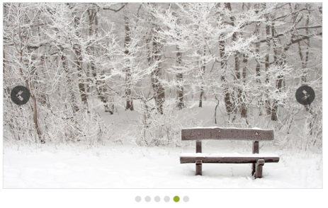
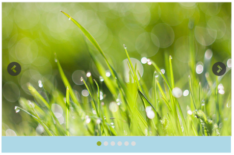

# Image with Contents

This feature allows you to add text along with the image in the Rotator control. This is achieved by splitting the content into two panels. In the following code example, image is given in the left panel and text is given in the right panel.



<ej:Rotator ID="sliderContent" runat="server"

            SlideWidth="700px"

            SlideHeight="300px"

            ShowPager="true"

            ShowPlayButton="true">

            <Items>

                <ej:RotatorItem>

                    <ContentSection>

                        

                            

                        

                        

                            
Tablet 

                            <ul>

                                <li>A tablet computer or simply tablet, is a mobile computer with display, circuitry, and battery in a single unit.</li>

                                <li>

                                Tablets are equipped with sensors, including cameras, microphone, accelerometer, and touchscreen,

                            </ul>

                        

                    </ContentSection>

                </ej:RotatorItem>

                <ej:RotatorItem>

                    <ContentSection>

                        

                            

                        

                        

                            
Nature 

                            <ul>

                                <li>The health of the natural environment is critical to the long-term future of the planet</li>

                                <li>Nature, in the broadest sense, is equivalent to the natural, physical, or material world or universe.</li>

                            </ul>

                        

                    </ContentSection>

                </ej:RotatorItem>

                <ej:RotatorItem>

                    <ContentSection>

                        

                            

                        

                        

                            
Credit card 

                            <ul>

                                <li>A credit card is a payment card issued to users as a system of payment</li>

                                <li>It allows the card holder to pay for goods and services based on the holder's promise to pay for them</li>

                            </ul>

                        

                    </ContentSection>

                </ej:RotatorItem>

                <ej:RotatorItem>

                    <ContentSection>

                        

                            

                        

                        

                            
Rose 

                            <ul>

                                <li>A rose is a woody perennial of the genus Rosa, within the family Rosaceae</li>

                                <li>Flowers vary in size and shape and are usually large and showy,

                    There are over 100 species

                                </li>

                            </ul>

                        

                    </ContentSection>

                </ej:RotatorItem>

            </Items>

        </ej:Rotator>



Define the style for the Rotator control.



        .frame

        {

            width: 700px;

        }

        #<%=sliderContent.ClientID%> > li

        {

            background-color: #9ee8d8;

        }

        #<%=sliderContent.ClientID%> > li .leftPanel

        {

            float: left;

            width: 700px;

            height: 300px;

            padding-right: 0px;

        }

        #<%=sliderContent.ClientID%> > li .leftPanel img

        {

            width: 700px;

            height: 300px;

        }

        #<%=sliderContent.ClientID%>  .rightPanel

        {

            background-color: #FFFFFF;

            height: 259px;

            margin-left: 410px;

            margin-top: 21px;

            opacity: 0.5;

            padding-left: 10px;

            position: absolute;

            width: 260px;

        }

        #<%=sliderContent.ClientID%> .rightPanel.credit

        {

            opacity: 0.6;

        }

        #<%=sliderContent.ClientID%>  .rightPanel.blck

        {

            background-color: black;

        }

        #<%=sliderContent.ClientID%>  .rightPanel.blck li

        {

            color: white;

            list-style: none;

            line-height: 2;

        }

        #<%=sliderContent.ClientID%>  .rightPanel.blck .contentPanel

        {

            padding-top: 30px;

            color: white;

        }

        #<%=sliderContent.ClientID%>  .rightPanel .contentPanel

        {

            color: #000000;

            font-size: large;

            font-weight: bold;

            left: 16px;

            padding-top: 30px;

            position: relative;

        }

        #<%=sliderContent.ClientID%> .rightPanel li

        {

            color: black;

            list-style: none;

            line-height: 2;

        }

        #<%=sliderContent.ClientID%> .rightPanel.rightSide

        {

            margin-left: 20px;

            background-color: black;

        }

        #<%=sliderContent.ClientID%> .rightPanel.rightSide li

        {

            color: white;

            list-style: none;

            line-height: 2;

        }

        #<%=sliderContent.ClientID%> .rightPanel.rightSide .contentPanel

        {

            padding-top: 30px;

            color: white;

        }

        .rightPanel > ul

        {

            padding: 6px 17px 17px;

        }



The following screenshot displays the output of the above code example.

 

## Display items

### Display Items count

This property specifies the number of Rotator items to be displayed. The default value is 1. The value set to this property is string or number.

In an ASPX page, add the following code example and set the DisplayItemCount property as required.



// Refers to the Local Data section for style and data bound for rotator items.

<ej:Rotator ID="slidercontent" runat="server" SlideWidth="200px" SlideHeight="165px" DisplayItemCount="3" DataCaptionField="Caption" DataUrlField="Url"></ej:Rotator>



The following screenshot displays the output of the above code example.

### Navigate Steps

This property specifies the number of Rotator Items to navigate on a single click (next/previous/play buttons). The NavigateSteps property value must be less than or equal to the displayItemsCount property value. The default value is 1. The value set to this property is string or number.

In an ASPX page, add the following code example and set the NavigateSteps property as required.



//Refers to the Local Data section for style and data bound for rotator items.

<ej:Rotator ID="slidercontent" runat="server" SlideWidth="200px" SlideHeight="165px"  DisplayItemCount="2" NavigateSteps="2" DataCaptionField="Caption" DataUrlField="Url"></ej:Rotator>



The following screenshot displays the output of the above code example.

 

### Start index

This property sets the index of the slide that is displayed first. The default value is 1. The value set to this property is string or number.

In an ASPX page, add the following code example and set the StartIndex property as required.



//Refers to the Local Data section for style and data bound for rotator items.

<ej:Rotator ID="slidercontent" runat="server" SlideWidth="600px" SlideHeight="350px" StartIndex="4" DataCaptionField="Caption" DataUrlField="Url"></ej:Rotator>



The following screenshot displays the output of the above code example.

### Frame space

This property sets the space between the Rotator Items. The value set to this property is string or number.

In an ASPX page, add the following code example and set the FrameSpace property as required.



// Refers to the Local Data section for style and data bound for rotator items.

<ej:Rotator ID="slidercontent" runat="server" SlideWidth="600px" SlideHeight="350px" FrameSpace="30px" DataCaptionField="Caption" DataUrlField="Url"></ej:Rotator>



## Animation

AnimationType property specifies the Animation type for the Rotator items. AnimationType options include slide, fastSlide, slowSlide, and other custom easing animationTypes. The default value is slide. The value set to this property is string.

In an ASPX page, add the following code example and set the AnimationType property as required.



// Refer Local Data section for style and data bound for rotator items

<ej:Rotator ID="slidercontent" runat="server" SlideWidth="600px" SlideHeight="350px" AnimationType="fastSlide" DataCaptionField="Caption" DataUrlField="Url"></ej:Rotator>



### Animation speed

This property sets the speed of slide transition. The default value is 60. The value set to this property is string or number.

In an ASPX page, add the following code example and set the AnimationSpeed property as required.



// Refers to the Local Data section for style and data bound for rotator items.

<ej:Rotator ID="slidercontent" runat="server" SlideWidth="600px" SlideHeight="350px" AnimationSpeed="2000" DataCaptionField="Caption" DataUrlField="Url"></ej:Rotator>



### Delay

This property sets the delay between the Rotator Items to move after the slide transition. The default value is 500. The value set to this property is string or number.

In an ASPX page, add the following code example and set the Delay  property as required.



// Refers to the Local Data section for style and data bound for rotator items.

<ej:Rotator ID="slidercontent" runat="server" SlideWidth="600px" SlideHeight="350px" Delay="5000" EnableAutoPlay="true"  AnimationSpeed="2000" DataCaptionField="Caption" DataUrlField="Url"></ej:Rotator>



## Theme

Rotator control’s style and appearance are controlled based on CSS classes. In order to apply styles to the Rotator control, refer to the files,ej.widgets.core.min.css and ej.theme.min.css. When the file ej.widgets.all.min.css is referred, then it is not necessary to include the files ej.widgets.core.min.css and ej.theme.min.css in your project, as ej.widgets.all.min.css is the combination of these.

By default, there are 13-theme supports available for the Rotator control,

* bootstrap-theme
* default-theme
* flat-azure-dark
* fat-lime
* flat-lime-dark
* flat-saffron
* flat-saffron-dark
* gradient-azure
* gradient-azure-dark
* gradient-lime
* gradient-lime-dark
* gradient-saffron
* gradient-saffron-dark

## CSS class

This property is used to set root class for the Rotator control theme. The value set to this property is string type.

In an ASPX page, add the following code example.



// Refers to the Local Data section for style and data bound for rotator items.

<ej:Rotator ID="slidercontent" runat="server" SlideWidth="600px" SlideHeight="350px" CssClass="blue" DataCaptionField="Caption" DataUrlField="Url"></ej:Rotator>



Define the style for the Rotator control.



    .flat-lime {

        background-color: yellowgreen;

    }

    .blue {

            background-color: lightblue;

    }



The following screenshot displays the output of the above code example.

 

