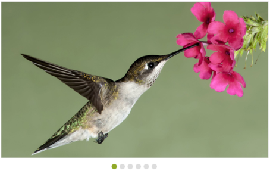
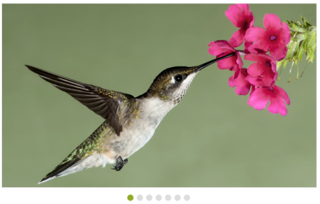

# Integration

Rotator provides a flexible approach for binding the data from various DataSources. There are various properties in the Rotator for Data Binding. The value set to this property is object type.

## Data fields and Configuration

The following sub-properties provide a way to bind the data either locally/remotely to the Rotator control. The value set to this property is object type.

### DataSource

This property specifies the list of data that contains a set of data fields. Each data value is used to render an item for the Rotator. The value set to this property is object type.

### Fields

It defines mapping fields for the data items of the Rotator. The value set to this property is object type.

### Text

It specifies the text content of the tag. The value set to this property is string type.

### URL

This property specifies the URL for an image. The value set to this property is string type.

### Query

This property retrieves data from remote data. This property is applicable only when a remote DataSource is used. Each data value is used to render an item for the Rotator. The value set to this property is object type.

## Local data binding

Rotator provides the data binding support for the Rotator item. So, you can bind the data from JSONData. For this behavior, you need to map the corresponding filed with their column names. The data can be bound as a list and it is assigned to the DataSource property. 

In an ASPX page, add the following code example to bind local data.



<ej:Rotator ID="sliderContent" runat="server" SlideWidth="600px" SlideHeight="350px" DataCaptionField="Caption" DataUrlField="Url"></ej:Rotator>



Add the following code in CS page.



public class RotatorData

    {

        public string Caption { get; set; }

        public string Url { set; get; }

    }

protected void Page_Load(object sender, EventArgs e)

        {

            List<RotatorData> data = new List<RotatorData>();

            data.Add(new RotatorData { Caption = "Beautiful Bird", Url = "../images/rotator/bird.jpg" });

            data.Add(new RotatorData { Caption = "Colorful Night", Url = "../images/rotator/night.jpg" });

            data.Add(new RotatorData { Caption = "Technology", Url = "../images/rotator/tablet.jpg" });

            data.Add(new RotatorData { Caption = "Nature", Url = "../images/rotator/nature.jpg" });

            data.Add(new RotatorData { Caption = "Snow Fall", Url = "../images/rotator/snowfall.jpg" });

            data.Add(new RotatorData { Caption = "Credit Card", Url = "../images/rotator/card.jpg" });

            this.sliderContent.DataSource = data;

        }



The following screenshot displays the output of the above code example.

## KnockoutJS support

KnockoutJS support allows you to bind the HTML elements against any of the available data model.

The two types of KnockoutJS binding supported are,

* One-way binding
* Two-way binding

One-way binding refers to the process of applying observable values to all the available properties of the Rotator. But, the changes made in the Rotator control are not reflected and triggered in turn to the observable collection. This kind of binding is applied to all the properties of the Rotator.

Two-way binding supports both the processes. It applies the observable values to the Rotator properties as well as the changes made in the Rotator control that are also reflected back and triggered within the observable collections.

For more information on the KnockoutJS binding, you can refer to the online documentation in the following link location: <http://help.syncfusion.com/js/knockoutjs>

N> Add the following script files along with the given code to access KnockoutJS binding. They have JS library for KnockoutJS binding.

* knockout-min.js
* ej.widget.ko-latest.min.js

The link for those script files are as follows:

[http://cdn.syncfusion.com/js/assets/external/knockout.min.js](http://cdn.syncfusion.com/js/assets/external/knockout.min.js)

[http://cdn.syncfusion.com/{{ site.releaseversion }}/js/common/ej.widget.ko.min.js](http://cdn.syncfusion.com/{{ site.releaseversion }}/js/common/ej.widget.ko.min.js)

In the ASPX page, add the following code example that shows the way to bind data to the Rotator through the KnockoutJS support.



<ul id="sliderContent" data-bind="ejRotator: { dataSource: dataList, slideWidth: width, slideHeight: height }" />



Add the following script to achieve KnockoutJS.



        $(function () {

            var imageList = [

              { text: "bird", url: "../images/rotator/bird.jpg" },

              { text: "night", url: "../images/rotator/night.jpg" },

              { text: "tablet", url: "../images/rotator/tablet.jpg" },

              { text: "nature", url: "../images/rotator/nature.jpg" },

              { text: "snowfall", url: "../images/rotator/snowfall.jpg" },

              { text: "card", url: "../images/rotator/card.jpg" },

              { text: "sculpture", url: "../images/rotator/sculpture.jpg" }

            ];

            window.viewModel = {

                dataList: ko.observableArray(imageList),

                height: ko.observable("350px"),

                width: ko.observable("600px"),

            };

            ko.applyBindings(viewModel);

        });



The following screenshot displays the output of the above code example.

 

## AngularJS support

Rotator is availed with two types of AngularJS support namely,

* One-way binding
* Two-way binding

One-way binding refers to the process of applying scope values to all the available properties of the Rotator. But the changes made in the Rotator control are not reflected or triggered in turn to the scope collection. This kind of binding is applied to all the properties of the Rotator.

Two-way binding supports both the processes. It applies the scope values to the Rotator properties as well as the changes made in the Rotator control that are also reflected back and triggered within the AngularJS scope change function.

To know more details about the AngularJS binding, you can refer to the following link location:

<http://help.syncfusion.com/js/angularjs>

N> Add the following script files as given in the following example to access KnockoutJS binding. They have JS library for 
AngularJS binding.

* angular-min.js
* ej.widget.angular-latest.min.js

The following code example shows the way to bind data to the Rotator control through AngularJS support.





        

            <ul id="sliderContent" ej-rotator e-datasource="dataList" e-slidewidth="600px" e-slideheight="350px" />

        

  





        var list = [

          { text: "snowfall", url: "../images/rotator/snowfall.jpg" },

          { text: "tablet", url: "../images/rotator/tablet.jpg" },

          { text: "nature", url: "../images/rotator/nature.jpg" },

          { text: "card", url: "../images/rotator/card.jpg" },

          { text: "bird", url: "../images/rotator/bird.jpg" },

          { text: "wheat", url: "../images/rotator/wheat.jpg" },

          { text: "night", url: "../images/rotator/night.jpg" }];

        angular.module('rotatorApp', ['ejangular']).controller('RotatorCtrl', function ($scope) {

            $scope.dataList = list;

        });





The following screenshot displays the output of the above code example.

