# Appointment 

## Read Only

* The interaction with appointments of the Schedule can be enabled/disabled through the ReadOnly property. When the ReadOnly property is set to true, we can’t be able to do any actions with the appointments, but simply we can navigate between the schedule dates, views and can also able to see the appointments detail in the quick window. 
* To enable the appointments interaction, we need to set the ReadOnly property to true. By default, the ReadOnly property is set as false.

The following code example explains how to enable ReadOnly property in the Schedule control.  



<%-- Enables ReadOnly property to the schedule -- %>

<asp:Content ID="ControlContent" runat="server" ContentPlaceHolderID="ControlsSection">

<ej:Schedule runat="server" ID="Schedule1" DataSourceID="SqlData" Width="100%" Height="525px" CurrentDate="5/12/2014" ReadOnly="true">

<AppointmentSettings Id="Id" Subject="Subject" AllDay="AllDay" StartTime="StartTime" EndTime="EndTime" Recurrence="Recurrence" RecurrenceRule="RecurrenceRule" Description="Description"/>

</ej:Schedule>

<asp: SqlDataSource ID="SqlData" runat="server" ConnectionString="<%$ ConnectionStrings: ScheduleConnectionString %>"

SelectCommand="SELECT * FROM [DefaultSchedule]"></asp:SqlDataSource>


The following screenshot displays the Schedule control with ReadOnly property set to true,

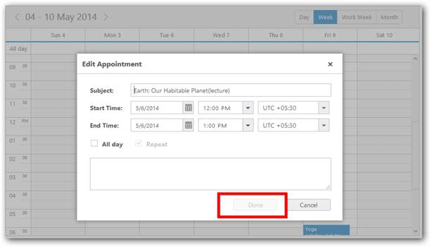

Figure 1: Schedule with Read Only property

## Appointment Creation

* Appointments play a vital role within the Schedule control with which you can interact. You can manipulate (add/edit/delete) the required appointments that reveals one of the main purposes of the Schedule control. 
* The appointments can be of normal type or recurrence type that avails with additional template customization options. The all-Day appointment available within the Schedule control that indicates the full day appointment or an appointment with duration greater than 24 hours.

###Using Normal Appointment window

* You can create the appointments by double-clicking on the Schedule cells across the required time slots. The appointment is created for the selected time cells.
* You can also change the start and end time and other appointment related details like its subject, description, time-zone in the appointment window before saving those details.  

The following screenshot displays the appointment window filled with the specific details like start & end time that opens while double-clicking on the specific cells.

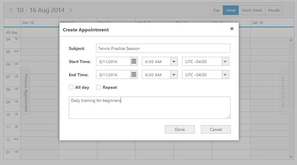

* When you fill the other details like Subject, Description and the recurrence details manually as per your requirements click Done to save the appointment details. The Schedule control is displayed as follows.

###Using quick appointment window

* You can manipulate appointments using quick appointment window that provides an easier and quicker way to proceed with the appointment creation. To create appointments using quick appointment window, click on the required cell and fill in the appointment Subject. Click “CreateAppointment” button.
* You can open the normal appointment window while the quick window is in open state by choosing the “Detailed” option present within the quick appointment window.The quick appointment window is displayed as follows.

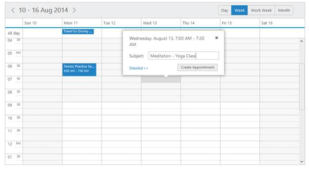

* When the appointment is saved, the Schedule control displays the created appointment as follows,

Important: We have a property named showQuickWindow that accepts Boolean value and set as true by default. When this property is set to false, it prevents the display of quick appointment window while single clicking on the Schedule cells or appointments. Thus the functionality of showing/hiding this quick window from the user depends on the value of this particular property.

###Using Context menu

* You can also easily manipulate appointments using the Context menu feature. By default the Context menu contains the menu items for adding, opening and deleting appointment.You can view the menu by right-clicking on the Schedule cells or on the appointments.
* To create an appointment using Context menu, right-click on the required Schedule cells and then select the “New Appointment” menu item in the Context menu. The new appointment window is opened and the appointment is saved in a usual manner followed in the previous methods.

The following screenshot displays the Contextmenu with a “New Appointment” option that is opened when you right-click on the cells.

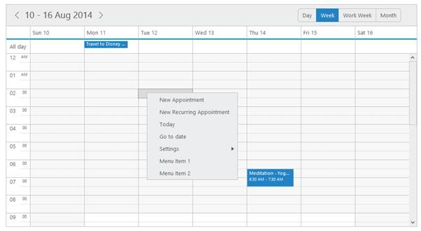

## Appointment Editing

###Using Normal Appointment window

* To edit the appointments created in the above specified steps, double-click on the required appointment to open the edit appointment window. You can change the required values and then click Done button to update those new values.

The following screenshot depicts the edit appointment window with its filled-in details.

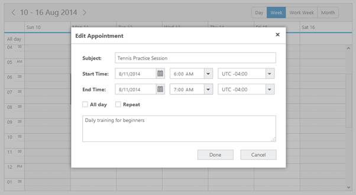

* In the above image, the end time has been changed from 8.00 AM to 7.00 AM, and once the changes are done, click the Done button. The appointment duration is changed and looks as follows.

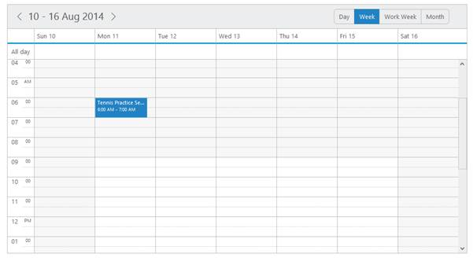

###Using quick appointment window

* To edit the appointments using quick appointment window, click on the appointment to be edited. Click on the Edit Appointment option to open the edit appointment window. In case of normal appointments, only the Edit Appointment label is enabled.
* When you click on a recurrence appointment, Edit Appointment and Edit Series options are enabled.  To edit the single occurrence of that recurrence appointment, choose Edit Appointment. Choose the EditSeries option to edit the entire series of that recurrence appointment.

The following screenshot displays the Schedule control with the quick appointment window with edit options when you click on a particular appointment.

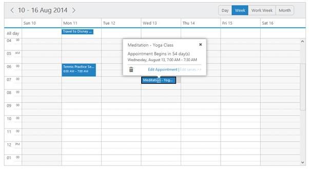

* Click on the Edit Appointment option to open the edit appointment window as follows.

* In the above screenshot, the end-time is changed to 8.00 AM from 7.00 AM. Once it is saved, the above appointment is displayed in the Schedule as displayed in the following screenshot.

Figure 65 : schedule with open the editing appointment window

###Using Context menu

* To edit the appointments using context menu option, right-click on the appointment to be edited and then select Open Appointment option from the context menu that pops up as displayed in the following screenshot.

Figure 66 :  schedule with open appointment using context menu.

* The following screenshot displays the Edit Appointment window that opens when you click OpenAppointment option.

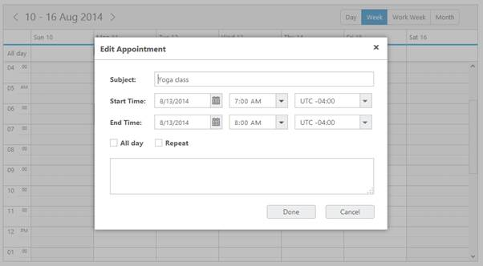

Figure 67 : schedule with display the edit appointment window.

* Click Done button to save the updated values.

## Appointment Deletion

###Using quick appointment window

* The delete option is available in the quick appointment window which will be opened when you single-click the appointments. To delete an appointment, click on the required appointment and then click the delete icon present in the quick appointment window as follows.

Figure 69 : schedule with Appointment deletion.

* When you click the delete icon, the appointment is deleted as displayed in the following screenshot.

Figure 70 : schedule with after the appointment deletion.

###Using Context menu

* To delete the appointments using Context menu option, select the Delete Appointment from the context menu that pops up when you right-click the appointment to be deleted. It is displayed in the following screenshot.

Figure 71 : schedule with appointment deletion using context menu.

## All-day Appointments

* The All-day appointments is created and edited like normal appointments described in the above steps. You can achieve this by selecting the “All-day” checkbox in the appointment window. 
* The All-day appointments denotes that it is scheduled for the entire day and normally rendered in the allday row that is present above all the workcells.Check the “All-day” checkbox in the appointment window as follows.

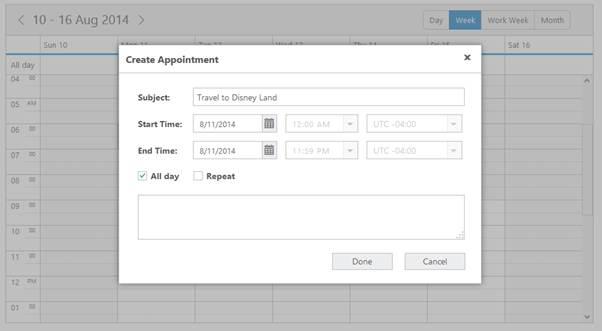

* Save the appointment so that the All-day appointment will be displayed in the All-day row as follows.

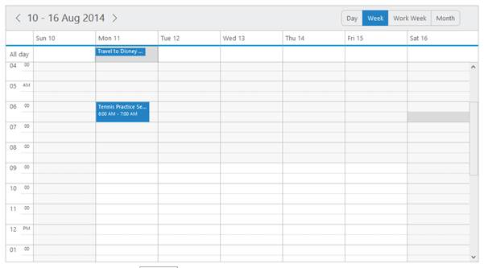

## Appointment Resizing

* The enableAppointmentResize option allows you to resize the appointment in order to change its start or end time faster. To start resizing the appointment, hover the mouse on it, so that the resizing handles are displayed on either sides of the appointment. 
* Click on any one of the handles and start dragging it towards top/bottom direction. 
* The appointments either expand or shrink according to the mouse movement.

The following code explains how the appointment resizing option is enabled for the Schedule control.



<ej:Schedule runat="server" ID="Schedule1" DataSourceID="SqlData"              Width="100%"

Height="525px"

CurrentView="Month"

EnableAppointmentResize="true">

<AppointmentSettings Id="Id" Subject="Subject" AllDay="AllDay" StartTime="StartTime" EndTime="EndTime" Recurrence="Recurrence" RecurrenceRule="RecurrenceRule" Description="Description"/>

</ej:Schedule>

<asp: SqlDataSource ID="SqlData" runat="server" ConnectionString="<%$ ConnectionStrings: ScheduleConnectionString %>"

SelectCommand="SELECT * FROM [DefaultSchedule]"></asp:SqlDataSource>



* In the following screenshot of the Schedule control, the appointment with the Subject Daily Planet is hovered for resizing.And you can see the resizing handle at both the ends of the appointment.

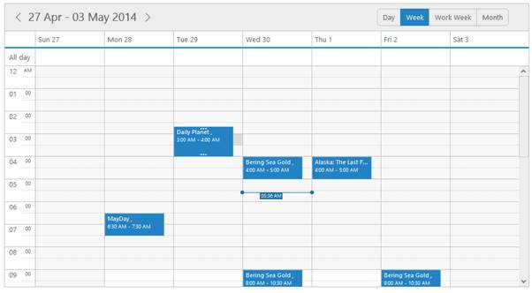

Figure 75: schedule with appointment resize.

* Once the resizing is stopped, the resized appointment with its new start time is displayed as follows.

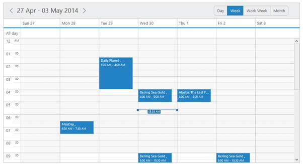

Figure 76: schedule with after the appointment resized.

## Appointment Search

* Schedule control is available with appointment search option. Appointment search can be done in two ways. 
1. Using Search string
2. Using Filters

###Using Search string

* Schedule control contains list of appointments. When you want to check some appointment that exist in the schedule, it is possible to search the appointment in the schedule datasource. 
* The public method searchAppointment is used to search the appointment in the schedule data source. It contains four arguments such as search string, search field, filter operator and ignorecase.
1. Search string is used to search the string in the appointments. 
2. Search field is the field, where only search operation takes place. (optional)
3. Filter operation contain keywords like contains, greaterthan or lessthan. (optional)
4. Ignorecase is a Boolean value to set the search string as case sensitive or not. (optional)

Use the following code example to search the appointment on the schedule datasource,



<input id="txtSearch" type="text" />

<input id="btnSearch" class="searchApp" type="button" value="Search" />

<ej:Schedule runat="server" ID="Schedule1" DataSourceID="objectDataSource1">

<%--Add the necessary schedule properties here-- %>

</ej:Schedule>

<asp:ObjectDataSource ID="objectDataSource1" runat="server"

TypeName="ScheduleAppointmentsObjDatum" SelectMethod="GetRecords">

</asp:ObjectDataSource>



Execute the above code to render the following output.

Figure 125: Schedule with appointment search

* After placing the cursor in search box, type the text that you want to search (for example here it is typed as “what”) in the schedule datasource, the grid renders with search result as follows.

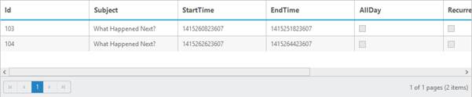

Figure 126 : Grid with appointment search result

###Using Filters

* In Appointment search you can filter the data instead of typing in the search box. You can pass the filter object with four properties such as field, operator, value and predicate. With that you can shortlist the appointments.
* The attribute value is used to search the string in the appointments. The attribute field is used to search the given string in certain fields. 



<input id="btnSearch" class="searchApp" type="button" value="Search" />

<ej:Schedule runat="server" ID="Schedule1" DataSourceID="objectDataSource1">

<%--Add the Necessary properties here -- %>

</ej:Schedule>

<asp:ObjectDataSource ID="objectDataSource1" runat="server" TypeName="ScheduleAppointmentsObjDatum" SelectMethod="GetRecords">

</asp:ObjectDataSource>



Execute the above code to render the following output.

Figure 127: Schedule with search appointment filters

* Click the search button to enable the filter option.

Figure 128: Grid with appointment search result

## Drag and Drop

* You can enable/disable the drag and drop functionality by setting ‘true’ or ‘false’ for the allowDragDrop property. By default it is set to ‘true’. 
* When you drag and drop the appointment to the new location, the starttime and endtime of the appointment gets changed automatically.



<ej:Schedule runat="server" ID="Schedule1" DataSourceID="SqlData"              Width="100%"

Height="525px"

CurrentDate="5/2/2014"

AllowDragDrop="true">

<AppointmentSettings Id="Id" Subject="Subject" AllDay="AllDay" StartTime="StartTime" EndTime="EndTime" Recurrence="Recurrence" RecurrenceRule="RecurrenceRule" Description="Description"/>

</ej:Schedule>

<asp: SqlDataSource ID="SqlData" runat="server" ConnectionString="<%$ ConnectionStrings: ScheduleConnectionString %>"

SelectCommand="SELECT * FROM [DefaultSchedule]"></asp:SqlDataSource>



* In the following screenshot, the Schedule control is displayed with the appointments in an order before the drag and drop action takes place.

Figure 72 : schedule with appointment drag and drop.

* When the appointment with the Subject “Daily Planet” is being dragged from its original location, it looks as the one following screenshot with the shadow of the appointment casting behind it.

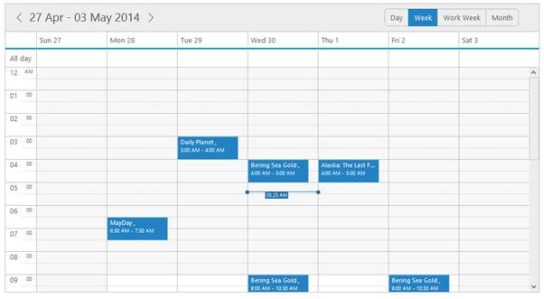

Figure 73 : schedule with appointment while dragging in the cell.

* The following screenshot displays the appointment with the subject “Daily Planet” in the timeline 1.00 AM – 2.00 AM (02 May, 2014) is dropped to the new location to the date 29th April, 2014 in the timeline between 3.00 AM – 4.00 AM.

Figure 74 :  schedule with appointment dropped in the cell.

## Recurrence Options

* There are scenarios where you require the same appointments to be repeatedly created for multiple days on the basis of daily, weekly, monthly or yearly. 
* This can be achieved with the help of in-built recurrence options available within the Schedule control that enforces the quicker creation of repeated appointments on the required days. 

* The various built-in recurrence patterns available are 

1. Daily 

2. Weekly 

3. Monthly 

4. Yearly 

5. Every weekday

* To create a recurrence appointment, you can select (check) the repeat option in the normal appointment window else you can select the New Recurring Appointment option from the Contextmenu that pops up when you right-click on the Schedule cells as follows.

Figure 77 : schedule with new recurrence appointment.

* On clicking the New Recurring Appointment option opens the recurrence appointment window as displayed in the following screenshot.

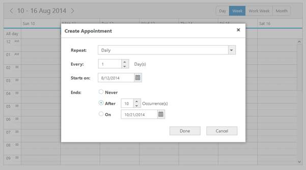

Figure 78 : schedule with creating the new recurrence.

* Once the required options are selected in the recurrence window click the Done button.It navigates you to its parent window with the appointment details. Fill-in those required details and click Done to save it.

Figure 79: schedule with after created the new recurrence.

* The recurrence appointment after getting saved to the Schedule is displayed as follows.

Figure 80 : schedule with after created the new recurrence appointment in week view.

* Since, you have chosen the option to end the recurrence after 10 occurrences on daily basis, the appointments repeat for continuous 10 days and then end. 
* This is viewed clearly by navigating to the month view, where the appointment with subject Automated testing saved for 10 days from 12 Aug 2014 to 21 Aug 2014.

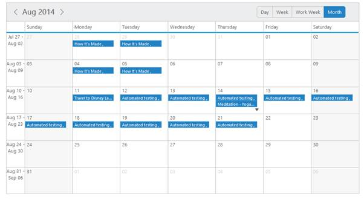

Figure 81 :  schedule with created recurrence appointment in month view.

