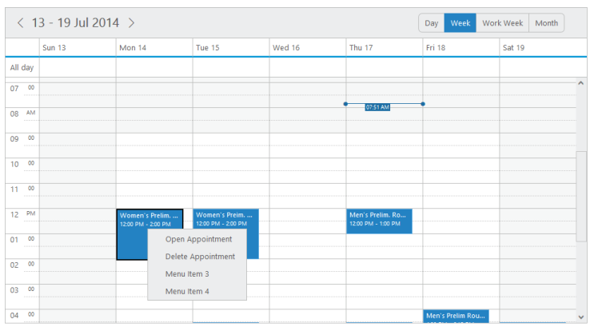
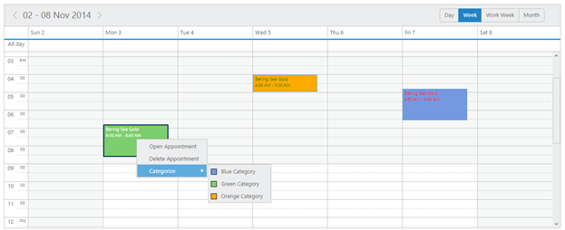

# Context Menu

* Schedule control is added with the context menu options that opens when you right-click over the cells or appointments. In addition to the default menu items available, it allows you to add the custom menu items and also the sub menu-items as per your requirement.

contextMenuSettings

* It is a collection that holds the menu items data.

enable

* It specifies whether to enable/disable the Context menu options.

menuItems

* It holds the appointment and cell related menu and custom-menu options.

appointment

* This collection accepts the id, text and parent Id of the menu items that are to be displayed when you right-click the appointments. It can also include custom-menu items.

cells

* This collection accepts the id, text and parent Id of the menu items that are to be displayed when you right-click the Schedule cells. It also include custom-menu items.

Appointment Menu Items

* By default, the appointment menu options are provided with 2 items namely Open Appointment and Delete Appointment. 
* If you want to customize and use your own custom menu items, then you can replace the appointment menu items with their desired collections as explained in the following code.


[ASP]

<ej:Schedule runat="server" ID="Schedule1" DataSourceID="SqlData" Width="100%" Height="525px" CurrentDate="5/2/2014">

<ContextMenuSettings Enable="true">

<MenuItems>

<AppointmentCollection>

<ej:Appointment Id="open" Text="Open Appointment" />

<ej:Appointment Id="delete" Text="Delete Appointment" />

<ej:Appointment Id="custommenu3" Text="Custom menu3" />

<ej:Appointment Id="custommenu4" Text="Custom menu4" />

</AppointmentCollection>

</MenuItems>

</ContextMenuSettings>

<AppointmentSettings Id="Id" Subject="Subject" AllDay="AllDay" StartTime="StartTime" EndTime="EndTime" Recurrence="Recurrence" RecurrenceRule="RecurrenceRule" Description="Description"/>

</ej:Schedule>

<asp: SqlDataSource ID="SqlData" runat="server" ConnectionString="<%$ ConnectionStrings: ScheduleConnectionString %>"

SelectCommand="SELECT * FROM [DefaultSchedule]"></asp:SqlDataSource>



Execute the above code to render the following output.

 _Figure_ _98_:  schedule with appointment menu items_

##Categorize 

* A new default menu item is included in the appointment menu items to support the categorize option through context menu. 
* The categorize data collection that are passed through the categorizesettings is utilised in rendering the categorize options in the context menu. 

You can refer the following code example to render the categorize options in the context menu.



<ej:Schedule runat="server" ID="Schedule1" DataSourceID="SqlData">

<ContextMenuSettings Enable="true">

<MenuItems>

<AppointmentCollection>

<ej:Appointment Id="open" Text="Open Appointment" />

<ej:Appointment Id="delete" Text="Delete Appointment" />

<ej:Appointment Id="categorize" Text="Categorize" />

</AppointmentCollection>

</MenuItems>

</ContextMenuSettings>

<CategorizeSettings Enable="true" AllowMultiple="true" Id="id" Color="color" FontColor="fontColor" Text="text">

</CategorizeSettings>

<AppointmentSettings Id="Id" Subject="Subject" AllDay="AllDay" StartTime="StartTime" EndTime="EndTime" Recurrence="Recurrence" RecurrenceRule="RecurrenceRule" Description="Description" Categorize="Categorize"/>

</ej:Schedule>

<asp: SqlDataSource ID="SqlData" runat="server" ConnectionString="<%$ ConnectionStrings: ScheduleConnectionString %>"

SelectCommand="SELECT * FROM [DefaultSchedule]"></asp:SqlDataSource>





public partial class ScheduleController : Controller

{

public ActionResult CategorizeOption()

{

// categorize data collection

List<Categorize> CategorizeValue = new List<Categorize>();

CategorizeValue.Add(new Categorize { text = "Blue Category", id = 1, color = "#7499e1", fontColor = "Red" });

CategorizeValue.Add(new Categorize { text = "Green Category", id = 2, color = "#7cce6e", fontColor = "White" });

CategorizeValue.Add(new Categorize { text = "Orange Category", id = 3, color = "#ffaa00", fontColor = "Green" });

var DataSource = new ScheduleDataDataContext().DefaultSchedules.ToList();

ViewBag.datasource = DataSource;

ViewBag.categorize = CategorizeValue;

return View();

}

public class Categorize

{

public string text { set; get; }

public int id { set; get; }

public string fontColor { set; get; }

public string color { set; get; }

}

}



* Execute the above code to render the following output with categorized appointments. Also when you right click “Appointment”, the context menu with categorize option is displayed as follows.

##Cells 

* By default, the cells menu options are provided with 5 items namely New Appointment, New Recurring Appointment, Today, Go to Date and Settings with sub-options for views, time-mode and highlighting business hours. 
* You can customize and use your own custom menu itemsby replacing the cell menu items with the desired collection as explained in the following code example.



<ej:Schedule runat="server" ID="Schedule1" DataSourceID="SqlData" Width="100%" Height="525px" CurrentDate="5/2/2014">

<ContextMenuSettings Enable="true">

<MenuItems>

<AppointmentCollection>

<ej:Appointment Id="open" Text="Open Appointment" />

<ej:Appointment Id="delete" Text="Delete Appointment" />

<ej:Appointment Id="custommenu3" Text="Custom menu3" />

<ej:Appointment Id="custommenu4" Text="Custom menu4" />

</AppointmentCollection>

<CellsCollection>

<ej:Cells Id="new" Text="New Appointment" />

<ej:Cells Id="recurrence" Text="New recuring Appointment"/>

<ej:Cells Id="today" Text="Today" />

<ej:Cells Id="gotodate" Text="Go to Date" />

<ej:Cells Id="settings" Text="Settings"/>

<ej:Cells Id="view" Text="view" ParentId="settings"/>

<ej:Cells Id="timemode" Text="Time Mode" ParentId="settings"/>

<ej:Cells Id="view_Day" Text="Day" ParentId="view"/>

<ej:Cells Id="view_Week" Text="Week" ParentId="view"/>

<ej:Cells Id="view_Workweek" Text="Workweek" ParentId="view"/>

<ej:Cells Id="view_Month" Text="Month" ParentId="view"/>

<ej:Cells Id="timemode_Hour12" Text="12 Hours" ParentId="timemode"/>

<ej:Cells Id="timemode_Hour24" Text="24 Hours" ParentId="timemode"/>

<ej:Cells Id="businesshours" Text="Business Hours" ParentId="settings"/>

<ej:Cells Id="custommenu1" Text="Custom Menu1"/>

<ej:Cells Id="custommenu2" Text="Custom Menu2"/>

</CellsCollection>

</MenuItems>

</ContextMenuSettings>

<AppointmentSettings Id="Id" Subject="Subject" AllDay="AllDay" StartTime="StartTime" EndTime="EndTime" Recurrence="Recurrence" RecurrenceRule="RecurrenceRule" Description="Description"/>

</ej:Schedule>

<asp: SqlDataSource ID="SqlData" runat="server" ConnectionString="<%$ ConnectionStrings: ScheduleConnectionString %>"

SelectCommand="SELECT * FROM [DefaultSchedule]"></asp:SqlDataSource>



Execute the above code to render the following output when you right-click on the cells.

 _Figure_ _100_:  schedule with cells._

