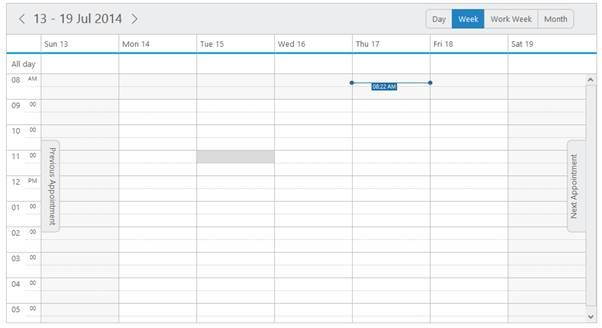
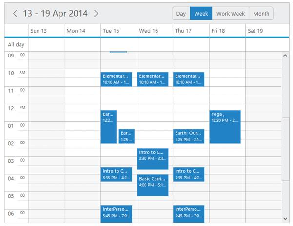
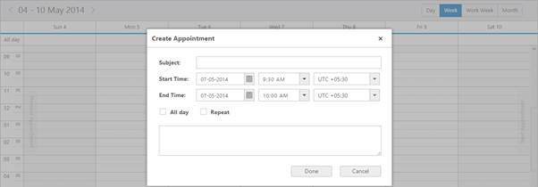
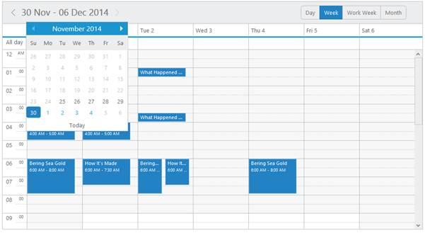
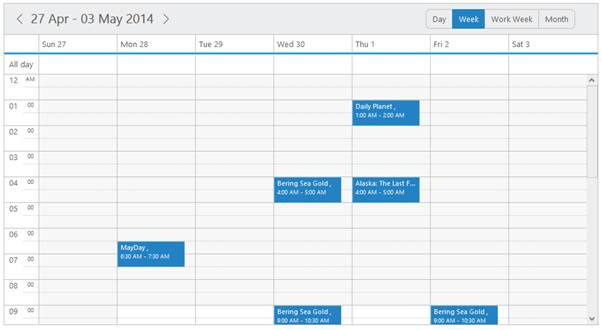
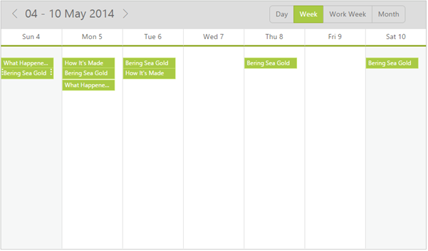

# Customization

## Customized Appointment window 

* You can display your own customized appointment window instead of the default appointment window while double-clicking on the cells. To achieve this, you can use the event appointmentWindowOpen. 
* The customized window is designed with the dialog control separately.

This example explains you on how to add the customized appointment window using the following code example.



<asp:Content ID="Content1" ContentPlaceHolderID="SampleHeading" runat="server">

Schedule / Custom Window

</asp:Content>

<asp:Content ID="ControlContent" runat="server" ContentPlaceHolderID="ControlsSection">

<ej:Schedule ClientIDMode="Static" runat="server" ID="Schedule1" DataSourceID="SqlData" Width="100%" Height="525px" CurrentDate="5/2/2014" AppointmentWindowOpen="onAppointmentWindowOpen">

<AppointmentSettings Id="Id" Subject="Subject" AllDay="AllDay" StartTime="StartTime" EndTime="EndTime" Recurrence="Recurrence" RecurrenceRule="RecurrenceRule" Description="Description"/>

</ej:Schedule>

<table width="100%" cellpadding="5">

<tbody>

<tr style="display: none">

<td>Id:

</td>

<td colspan="2">

<input id="customId" type="text" name="Id" />

</td>

</tr>

<tr>

<td>Subject:

</td>

<td colspan="2">

<input id="subject" type="text" value="" name="Subject" onfocus="temp()" style="width: 100%" />

</td>

</tr>

<tr>

<td>Description:

</td>

<td colspan="2">

<textarea id="customdescription" name="Description" rows="3" cols="50" style="width: 100%; resize: vertical"></textarea>

</td>

</tr>

<tr>

<td>StartTime:

</td>

<td>

<ej:DateTimePicker runat="server" ID="StartTime" Width="150"></ej:DateTimePicker>

</td>

</tr>

<tr>

<td>EndTime:

</td>

<td>

<ej:DateTimePicker runat="server" ID="EndTime" Width="150"></ej:DateTimePicker>

</td>

</tr>

<tr>

<td colspan="3">

AllDay:

<input id="allday" type="checkbox" name="AllDay" />

Recurrence:

<input id="recurrence" type="checkbox" name="Recurrence" onchange="recurCheck()" />

</td>

</tr>

<tr class="recurrence" style="display: none">

<td>Type:

</td>

<td>

<select id="rType" name="freq">

<option value="daily">Daily</option>

<option value="weekly">Weekly</option>

<option value="monthly">Monthly</option>

<option value="yearly">Yearly</option>

</select>

</td>

</tr>

</tbody>

</table>

<button type="submit" onclick="save()">

Submit</button>

<button type="submit" onclick="cancel()">

Cancel</button>

<asp: SqlDataSource ID="SqlData" runat="server" ConnectionString="<%$ ConnectionStrings: ScheduleConnectionString %>"

SelectCommand="SELECT * FROM [DefaultSchedule]"></asp:SqlDataSource>

</asp:Content>

<asp:Content ID="ScriptContent" runat="server" ContentPlaceHolderID="ScriptSection">

</asp:Content>

<asp:Content runat="server" ID="Style" ContentPlaceHolderID="StyleSection">

</asp:Content>



Execute the above code and then double-click on the required Schedule cells. The customized appointment window is opened instead of the default appointment window as follows.

* Add the required details on the above displayed appointment window and then click Submit button to save the appointment.

## Editing Customized Appointment window

* To edit the appointments in customized appointment window, you can use appointmentWindowOpen event to avoid displaying the default appointment window when you double-click the appointments. 
* The customized window is designed with the dialog control separately and it is display when you double-click appointments. 

The following code example is added to the previous code example of appointment creation for Customized Appointment window.



<asp:Content ID="Content1" ContentPlaceHolderID="SampleHeading" runat="server">

Schedule / Custom Window

</asp:Content>

<asp:Content ID="ControlContent" runat="server" ContentPlaceHolderID="ControlsSection">

<ej:Schedule ClientIDMode="Static"  runat="server" ID="Schedule1" DataSourceID="SqlData" Width="100%" Height="525px" CurrentDate="5/2/2014" AppointmentWindowOpen="onAppointmentWindowOpen">

<AppointmentSettings Id="Id" Subject="Subject" AllDay="AllDay" StartTime="StartTime" EndTime="EndTime" Recurrence="Recurrence" RecurrenceRule="RecurrenceRule" Description="Description"/>

</ej:Schedule>

<table width="100%" cellpadding="5">

<tbody>

<tr style="display: none">

<td>Id:

</td>

<td colspan="2">

<input id="customId" type="text" name="Id" />

</td>

</tr>

<tr>

<td>Subject:

</td>

<td colspan="2">

<input id="subject" type="text" value="" name="Subject" onfocus="temp()" style="width: 100%" />

</td>

</tr>

<tr>

<td>Description:

</td>

<td colspan="2">

<textarea id="customdescription" name="Description" rows="3" cols="50" style="width: 100%; resize: vertical"></textarea>

</td>

</tr>

<tr>

<td>StartTime:

</td>

<td>

<ej:DateTimePicker runat="server" ID="StartTime" Width="150"></ej:DateTimePicker>

</td>

</tr>

<tr>

<td>EndTime:

</td>

<td>

<ej:DateTimePicker runat="server" ID="EndTime" Width="150"></ej:DateTimePicker>

</td>

</tr>

<tr>

<td colspan="3">

AllDay:

<input id="allday" type="checkbox" name="AllDay" />

Recurrence:

<input id="recurrence" type="checkbox" name="Recurrence" onchange="recurCheck()" />

</td>

</tr>

<tr class="recurrence" style="display: none">

<td>Type:

</td>

<td>

<select id="rType" name="freq">

<option value="daily">Daily</option>

<option value="weekly">Weekly</option>

<option value="monthly">Monthly</option>

<option value="yearly">Yearly</option>

</select>

</td>

</tr>

</tbody>

</table>

<button type="submit" onclick="save()">

Submit</button>

<button type="submit" onclick="cancel()">

Cancel</button>

<asp: SqlDataSource ID="SqlData" runat="server" ConnectionString="<%$ ConnectionStrings: ScheduleConnectionString %>"

SelectCommand="SELECT * FROM [DefaultSchedule]"></asp:SqlDataSource>

</asp:Content>

<asp:Content ID="ScriptContent" runat="server" ContentPlaceHolderID="ScriptSection">

</asp:Content>

<asp:Content runat="server" ID="Style" ContentPlaceHolderID="StyleSection">

</asp:Content>



* Only the bolded texts in the above code examples are added to open the custom appointment window when you double-click the appointments. Execute the above code and then double-click on the appointment, the custom appointment window is displayed as follows.

_Figure_ _68_: schedule with appointment using customized appointment window._

* You can change the details in the above window and then click Submit button to save the updated values.

## Hour Customization

###Schedule Start/End Hour

You can customize the appearance of the Schedule control by setting the specific start and end hour to it. To set the specific start/end hour for a Schedule control, the following properties are required to be used.

###startHour

* Specify the start hour to set for the Schedule control.

###endHour

* Specify the end hour to set for the Schedule control.



// setting the schedule start and end hour

<ej:Schedule runat="server" ID="Schedule1" DataSourceID="SqlData"

Width="100%" Height="500px"

StartHour="4"

EndHour="24">

<AppointmentSettings Id="Id" Subject="Subject" AllDay="AllDay" StartTime="StartTime" EndTime="EndTime" Recurrence="Recurrence" RecurrenceRule="RecurrenceRule" Description="Description"/>

</ej:Schedule>

<asp: SqlDataSource ID="SqlData" runat="server" ConnectionString="<%$ ConnectionStrings: ScheduleConnectionString %>"

SelectCommand="SELECT * FROM [DefaultSchedule]"></asp:SqlDataSource>



Execute the above code to render the output as follows with the Schedule control beginning with 08.00am and ending with 06.00pm.

Figure 107 :  schedule with hour customization.

### Business hours

* There is an option highlightBusinessHours in the Schedule control to enable/disable the action of highlighting the business hours. 
* It is controlled with two additional options businessStartHour and businessEndHour to specify the time range to be defined as the business hours. By default, the business hours are highlighted in the Schedule control.

#### businessStartHour

* It allows you to specify the start time to indicate the business start hour.

#### businessEndHour

* It allows you to specify the end time to indicate the business end hour.

* To enable the highlightBusinessHours and to customize the business start and end hours, refer the following code example.



<ej:Schedule runat="server" ID="Schedule1" DataSourceID="SqlData" BusinessEndHour="18"

BusinessStartHour="10"

HighlightBusinessHours="True"

Height="800px" ShowCurrentTimeIndicator="True"

ShowQuickWindow="True"

Width="100%">

<AppointmentSettings Id="Id" Subject="Subject" AllDay="AllDay" StartTime="StartTime" EndTime="EndTime" Recurrence="Recurrence" RecurrenceRule="RecurrenceRule" Description="Description"/>

</ej:Schedule>

<asp: SqlDataSource ID="SqlData" runat="server" ConnectionString="<%$ ConnectionStrings: ScheduleConnectionString %>"

SelectCommand="SELECT * FROM [DefaultSchedule]"></asp:SqlDataSource>


Execute the above code to render the following output that explains the highlighting of business hours in the Schedule control from 10.00am to 3.00pm.

   Figure 108 :  schedule with Business hours

## Date/Time Customization

### Current date

* By default, the Schedule control displays the current system date. 
* You can change the current date of the Schedule control by setting the currentDate option with the required date value. 

The following code example explains how to change the current date of the Schedule control.



<ej:Schedule runat="server" ID="Schedule1" DataSourceID="SqlData"

Width="100%" Height="525px"

CurrentDate="5/4/2014">

<AppointmentSettings Id="Id" Subject="Subject" AllDay="AllDay" StartTime="StartTime" EndTime="EndTime" Recurrence="Recurrence" RecurrenceRule="RecurrenceRule" Description="Description"/>

</ej:Schedule>

<asp: SqlDataSource ID="SqlData" runat="server" ConnectionString="<%$ ConnectionStrings: ScheduleConnectionString %>"

SelectCommand="SELECT * FROM [DefaultSchedule]"></asp:SqlDataSource>



Execute the above code and the following screenshot displays the Schedule control with the current date set to (May 05, 2014).

  Figure 118:  schedule with current time

###Date Format

* The Schedule control uses different types of date formats to denote the dates used in it. You can specify your required format for the dates by using the dateFormat property. 
* When the date format is explicitly defined with particular value such as “dd-MM-yyyy”, then the datepicker control that is used within the Schedule control make use of this specific format.

The following code example explains how to change the dateFormat of the Schedule control.  



<%-- Setting the DateFormat to the schedule -- %>

<ej:Schedule runat="server" ID="Schedule1" DataSourceID="SqlData" Width="100%" Height="525px" CurrentDate="5/2/2014" DateFormat="dd-MM-yyyy">

<AppointmentSettings Id="Id" Subject="Subject" AllDay="AllDay" StartTime="StartTime" EndTime="EndTime" Recurrence="Recurrence" RecurrenceRule="RecurrenceRule" Description="Description"/>

</ej:Schedule>

<asp: SqlDataSource ID="SqlData" runat="server" ConnectionString="<%$ ConnectionStrings: ScheduleConnectionString %>"

SelectCommand="SELECT * FROM [DefaultSchedule]"></asp:SqlDataSource>



The following screenshot displays the Schedule control with the dateFormat set as “dd-MM-yyyy”.

###Minimum and Maximum Dates

* This feature allows you to specify the minimum and maximum dates for the Schedule control. It can be defined with the minDate and maxDate properties. 
* Specifying minimum and maximum dates is especially useful when scheduling appointments for a project with fixed start and end dates.
* When these minimum and maximum dates are set, the dates apart from the specified range act as invalid/disabled dates and navigation beyond those dates are not possible.

The following code example explains how to set the minimum and maximum date of the Schedule control.  



<%-- Sets the minimum and maximum date to the schedule -- %>

<ej:Schedule runat="server" ID="Schedule1" DataSourceID="SqlData" Width="100%" Height="525px" CurrentDate="5/12/2014" MinDate="5/5/2014" MaxDate="5/25/2014" >

<AppointmentSettings Id="Id" Subject="Subject" AllDay="AllDay" StartTime="StartTime" EndTime="EndTime" Recurrence="Recurrence" RecurrenceRule="RecurrenceRule" Description="Description"/>

</ej:Schedule>

<asp: SqlDataSource ID="SqlData" runat="server" ConnectionString="<%$ ConnectionStrings: ScheduleConnectionString %>"

SelectCommand="SELECT * FROM [DefaultSchedule]"></asp:SqlDataSource>



The following screenshot displays the Schedule control with MinDate and MaxDate set to 11/25/2014 and 12/4/2014, respectively.

###Timemode

* You can set two types of time mode, either 12 or 24 hour format for the Schedule control.  It accepts the following enum values,
1. ej.Schedule.TimeMode.Hour12
2. ej.Schedule.TimeMode.Hour24
* Set the Schedule control to 24 hour time mode using the following code example.



// setting the 24 hour mode for the schedule

<ej:Schedule runat="server" ID="Schedule1" DataSourceID="SqlData" Width="100%" Height="525px"

TimeMode="Hour24">

<AppointmentSettings Id="Id" Subject="Subject" AllDay="AllDay" StartTime="StartTime" EndTime="EndTime" Recurrence="Recurrence" RecurrenceRule="RecurrenceRule" Description="Description"/>

</ej:Schedule>

<asp: SqlDataSource ID="SqlData" runat="server" ConnectionString="<%$ ConnectionStrings: ScheduleConnectionString %>"

SelectCommand="SELECT * FROM [DefaultSchedule]"></asp:SqlDataSource>



The following screenshot displays the Schedule control when time mode is set to 24 hour mode.

   Figure 114 :  schedule time customization.

###TimeZone

* Appointments within the Schedule control is displayed based on the provided timezone. 
* If no specific timezones are set for the Schedule control, then it takes the local system timezone into consideration.
* [Click here](http://en.wikipedia.org/wiki/List_of_tz_database_time_zones) to see the complete list of supported timezones.

You can set the timezone to the Schedule control as follows. 



<asp:Content ID="Content1" ContentPlaceHolderID="SampleHeading" runat="server">

Schedule / Template

</asp:Content>

<asp:Content ID="ControlContent" runat="server" ContentPlaceHolderID="ControlsSection">

<ej:Schedule runat="server" ID="Schedule1" DataSourceID="SqlData" Width="100%" Height="525px" AppointmentTemplateId="#MyTemplate" TimeZone="UTC +3:00"  CurrentDate="5/2/2014">

<AppointmentSettings Id="Id" Subject="Subject" AllDay="AllDay" StartTime="StartTime" EndTime="EndTime" Recurrence="Recurrence" RecurrenceRule="RecurrenceRule" Description="Description"/>

</ej:Schedule>

<asp: SqlDataSource ID="SqlData" runat="server" ConnectionString="<%$ ConnectionStrings: ScheduleConnectionString %>"

SelectCommand="SELECT * FROM [Template]"></asp:SqlDataSource>

</asp:Content>

<asp:Content ID="styleContent" runat="server" ContentPlaceHolderID="StyleSection">

</asp:Content>

<asp:Content ID="ScriptContent" runat="server" ContentPlaceHolderID="ScriptSection">

</asp:Content>



* Add new appointments to the Schedule control. The appointments are rendered based on the time difference that tends to the timezone set to it.

  Figure 115 :  schedule with timezone.

* In the above output, an appointment is initially created in the time-range 7.00am - 8.30am, it is saved in the timeslot between 9.00am – 10.30 am due to the time zone set to “UTC +2:00” in the Schedule control.

##Current Time indicator

* The current time indicator denotes the current system time and it is marked on the Schedule control with a horizontal line drawn across the current date. 
* The showCurrentTimeIndicator property allows you to show/hide the time indicator on the Schedule control.

The following screenshot displays the Schedule control with the current time indicator marked with 5.41 AM across the date 30 April, 2014,

 Figure 116 :  schedule time customization

The following code example explains how to disable the current time indicator from the Schedule control. 



<ej:Schedule runat="server" ID="Schedule1" DataSourceID="SqlData"

Width="100%" Height="525px"

ShowCurrentTimeIndicator="false">

<AppointmentSettings Id="Id" Subject="Subject" AllDay="AllDay" StartTime="StartTime" EndTime="EndTime" Recurrence="Recurrence" RecurrenceRule="RecurrenceRule" Description="Description"/>

</ej:Schedule>

<asp: SqlDataSource ID="SqlData" runat="server" ConnectionString="<%$ ConnectionStrings: ScheduleConnectionString %>"

SelectCommand="SELECT * FROM [DefaultSchedule]"></asp:SqlDataSource>



* After setting showCurrentTimeIndicator property to ‘false’, the Schedule control is displayed without the current time indicator as follows.

Figure 117 :  schedule with show current time indicator.

## Show/Hide TimeScale

The TimeScale depicting the time duration (either in 12 or 24 hour format) is usually displayed at the left side of the schedule control. It can be shown or hidden from the Schedule control by using the showTimeScale property that is supported in both the Schedule orientations (Vertical and Horizontal). It is set to true, by default. The following code example explains on how to use the showTimeScale property.



<%-- Show / Hide TimeScale property to the schedule -- %>
 
<asp:Content ID="ControlContent" runat="server" ContentPlaceHolderID="ControlsSection">

<ej:Schedule runat="server" ID="Schedule1" DataSourceID="SqlData" Width="100%" Height="525px" CurrentDate="5/12/2014" ShowTimeScale ="false">
 
<AppointmentSettings Id="Id" Subject="Subject" AllDay="AllDay" StartTime="StartTime" EndTime="EndTime" Recurrence="Recurrence" RecurrenceRule="RecurrenceRule" Description="Description"/>
</ej:Schedule>
 

<asp: SqlDataSource ID="SqlData" runat="server" ConnectionString="<%$ ConnectionStrings: ScheduleConnectionString %>"
SelectCommand="SELECT * FROM [DefaultSchedule]"></asp:SqlDataSource>



Figure 80: Schedule without TimeScale