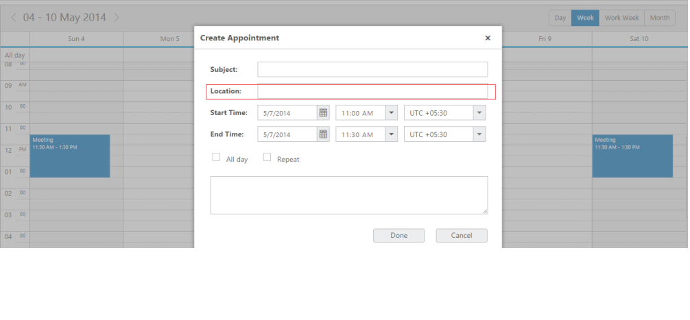
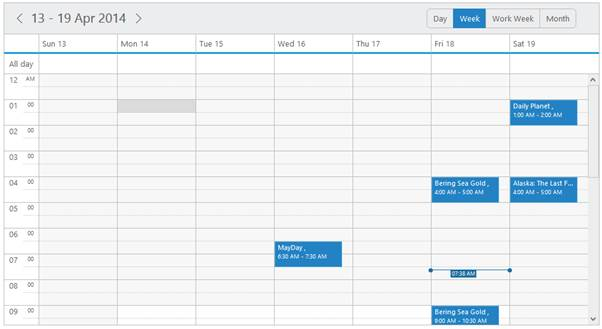
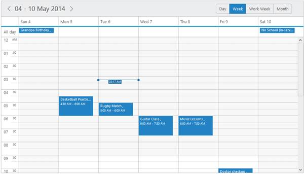
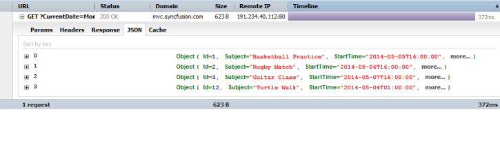

# Data-binding

* To render appointments to the Schedule control, you are required to bind the appointment data. The following sub-properties helps you to bind either the local/remote data to the Schedule control by binding the appropriate appointment data fields to the corresponding options.

dataSource

* This property assigns the local json data or remote (url binding) data to the Schedule control.

query 

* It accepts the data of object type, which is usually the query string to fetch the required data from a specific table based on certain condition. As this property is optional, it is not specified. 

The entire records that are initially assigned through dataSource is taken into consideration.

tableName

* It maps the corresponding name of the table from the location and the records are fetched to the Schedule control. As this property is optional, it is not specified. It takes the default dataSource into consideration. 

id

* It maps the corresponding id field name from the data table or json data that is assigned to the dataSource with the id property of the Schedule control. The id value that is fetched from the table is unique for each appointment.

subject

* It maps the corresponding subject field name from the data table or json data that is assigned to the dataSource with the subject property of the Schedule control. The Subject field denotes the appointment subject and it accepts the value of string type.

description

* It maps the corresponding description field name from the data table or json data that is assigned to the dataSource with the description property of the Schedule control. The description field is used to save more information related to the appointments. It accepts the value of string type.

startTime

* It maps the corresponding start time field name from the data table or json data that is assigned to the dataSource with the startTime property of the Schedule control. The startTime denotes the starting time of the appointment and it accepts the value of type dateTime.

endTime

* It maps the corresponding end time field name from the data table or json data that is assigned to the dataSource with the endTime property of the Schedule control. The endTime denotes the ending time of the appointment and it accepts the dateTime values from the database.

recurrence

* It maps the corresponding recurrence field name from the data table or json data that is assigned to the dataSource with the recurrence property of the Schedule control. This field determines whether the appointment is  normal or recurrence type. It accepts the Boolean type value either true/false. 

recurrenceRule

* It maps the corresponding recurrence rule field name from the data table or json data that is assigned to the dataSource with the recurrenceRule property of the Schedule control. This field defines the recurrence repeat string and accepts the string value.

allDay

* It maps the corresponding all day field name from the data table or json data that is assigned to the dataSource with the allDay property of the Schedule control. This field determines whether the appointment is created for the whole day or not. It accepts the Boolean value and when it is true, the appointment is created as an allday appointment in the Schedule control.

resourceFields

* It accepts the resource related field names as a string separated by a comma separator. When multiple resources are rendered on a Schedule control with multiple categories, then the name availed for each resource level is binded.

categorize

* It maps the corresponding categorize field name from the data table or JSON data, to the categorize property of the Schedule control.

startTimeZone

* It maps the corresponding start timezone field name from the data table or json data that is assigned to the Schedule dataSource. The startTimeZone denotes the timeZone of the appointment start time and accepts the value of type string.

endTimeZone

* It maps the corresponding end timezone field name from the data table or json data that is assigned to the Schedule dataSource. The endTimeZone denotes the timeZone of the appointment end time and accepts the value of type string.

Daylight Saving Time

The Schedule control provides support to observe the Daylight Saving Time (DST). So that,the users in the regions with summer-time adjust the clocks forward one hour close to the start of spring or adjust them backward in the autumn to standard time. In Schedule control, the DST can either be kept on/off that is handled by the newly introduced property isDST. By default, this property is set to false and when it is set to true, you can render the Schedule control appointments with the appropriate DST time difference based on the countries. 

The following code example explains how to include the Daylight saving time option.



 <%-- enables the Daylight Saving time property to the schedule --%>

<asp:Content ID="ControlContent" runat="server" ContentPlaceHolderID="ControlsSection">

    

<ej:Schedule runat="server" ID="Schedule1" DataSourceID="SqlData" Width="100%" Height="525px" CurrentDate="5/12/2014" IsDST = "true">

    <AppointmentSettings Id="Id" Subject="Subject" AllDay="AllDay" StartTime="StartTime" EndTime="EndTime" Recurrence="Recurrence" RecurrenceRule="RecurrenceRule" Description="Description"/>

</ej:Schedule>

    

    <asp:SqlDataSource ID="SqlData" runat="server" ConnectionString="<%$ ConnectionStrings:ScheduleConnectionString %>"

            SelectCommand="SELECT * FROM [DefaultSchedule]"></asp:SqlDataSource>



##appointment settings:

###location

* It maps the corresponding location field name from the data table or JSON data, to the location property of the Schedule control.
* To display the “location field” enable the property “showLocationField”. ShowLocationField is used to display/show the appointments/events location details.
* You can use the following code example to include the “location field” in schedule control.



<ej:Schedule ID="Schedule1" Width="100%" runat="server" DataSourceID="ScheduleData" ShowLocationField="true"> // To display the Location field in the appointment Window need to enable this property

<AppointmentSettings Id="Id" Subject="Subject" AllDay="AllDay" StartTime="StartTime" EndTime="EndTime" Description="Description" Recurrence="Recurrence" Location="Location"/> // To display the Location value need to bind the property like this

</ej:Schedule>

<asp: SqlDataSource ID="SqlData" runat="server" ConnectionString="<%$ ConnectionStrings: ScheduleConnectionString %>"

SelectCommand="SELECT * FROM [DefaultSchedule]"></asp:SqlDataSource>



On executing the above specified code the Location field will be added in the create appointment window as follows:

###priority

* It maps the corresponding priority field name from the data table or JSON data, to the priority property of the Schedule control.

###Local data

* You can locally assign the data to Scheduler control. Inorder to define the local data to the Scheduler control, map the user-defined json data names with its appropriate dataSource column names. 
* Specify the valid array of appointment objects to the dataSource property of the Schedule control as shown in the below code. 


[ASP]

<ej:Schedule runat="server" ID="Schedule1" DataSourceID="SqlData"              Width="100%"

Height="525px"

CurrentView="Month">

<AppointmentSettings Id="Id" Subject="Subject" AllDay="AllDay" StartTime="StartTime" EndTime="EndTime" Recurrence="Recurrence" RecurrenceRule="RecurrenceRule" Description="Description"/>

</ej:Schedule>

<asp: SqlDataSource ID="SqlData" runat="server" ConnectionString="<%$ ConnectionStrings: ScheduleConnectionString %>"

SelectCommand="SELECT * FROM [DefaultSchedule]"></asp:SqlDataSource>



On executing the above specified code the Scheduler displays the appointments across the specific timeslots as follows:

_Figure_ _50_: schedule with Local Data Binding_

###Remote data

* Apart from assinging the local data you can bind the remote data to the Schedule control using service url.
* Inorder to avail that option refer the following steps:



<ej:Schedule runat="server" ID="Schedule1" Width="100%" Height="525px" AllowDragDrop="false" EnableAppointmentResize="false" CurrentDate="5/6/2014" Create="onCreate">

<%--query to fetch the records from the specified table “Events”-- %>

<AppointmentSettings Id="Id" Subject="Subject" StartTime="StartTime" EndTime="EndTime" AllDay="AllDay" Recurrence="Recurrence" RecurrenceRule="RecurrenceRule"/>

<%--referring data from remote service url binding-- %>

<DataManager CrossDomain="true" URL="http://mvc.syncfusion.com/OdataServices/Northwnd.svc/Events"/>

</ej:Schedule>



The following screenshot displays the remote data bound to the Schedule control.

Figure 51: Schedule with Remote Data Binding

##Load On Demand

* Load on demand is a powerful technique that is used to reduce the bandwidth size of consuming data. Load on demand support has been added in our Schedule control, so that, it retrieves only the required appointment data from service/database during loading time, and that too for the current view. 
* The_enableLoadOnDemand property is used to enable or disable the load on demand functionality of the schedule.
* If you have developer tools, you can capture the network transfer to check the consumed data of the Schedule. The following screnshot shows the data being loaded in Schedule.

_Figure 3: Schedule demanded data_

The following code example shows you how load on demand works with Schedule.



<table>
<tr>
<td>
[ASPX]<%-- Enable load on demand property to the schedule -- %><asp:Content ID="ControlContent" runat="server" ContentPlaceHolderID="ControlsSection">
<ej:Schedule ClientIDMode="Static" runat="server" ID="Schedule1" Width="100%" Height="525px" EnableLoadOnDemand="true" EnableAppointmentNavigation="false" CurrentDate="5/2/2014"><DataManager  URL="LoadOnDemand.aspx/Data" Adaptor="UrlAdaptor" /><AppointmentSettings Id="ID" Subject="Subject" AllDay="AllDay" StartTime="StartTime" EndTime="EndTime" Description="Description" Recurrence="Recurrence" RecurrenceRule="RecurrenceRule" /></ej:Schedule>
</asp:Content></td></tr>
<tr>
<td>
[ASPX.CS]//Refer the required namespacepublic partial class LoadOnDemand : System.Web.UI.Page{protected void Page_Load(object sender, EventArgs e){HttpContext.Current.Session["Appointments"] = null;}//To Get the records from database then filter the collection and return appointment list with count details.[WebMethod][ScriptMethod(ResponseFormat = ResponseFormat.Json)]public static object Data(String CurrentView, String CurrentAction, DateTime CurrentDate){var data = FilterAppointment(CurrentDate, CurrentAction, CurrentView);BatchDataResult result = new BatchDataResult();result.result = data;result.count = GetAllRecords ().ToList ().Count > 0? GetAllRecords().ToList().Max(p => p.ID) : 1;return result;}public class BatchDataResult{public IEnumerable result { get; set; }public int count { get; set; }}public static ScheduleAppointmentsObjData GetObjectValue(Dictionary<string, object> objValue){Dictionary<string, object> KeyVal = objValue;ScheduleAppointmentsObjData appointValue = new ScheduleAppointmentsObjData();foreach (KeyValuePair<string, object> keyval in KeyVal){if (keyval.Key == "ID")appointValue.ID = Convert.ToInt32(keyval.Value);else if (keyval.Key == "Subject")appointValue.Subject = Convert.ToString(keyval.Value);else if (keyval.Key == "Location")appointValue.Location = Convert.ToString(keyval.Value);else if (keyval.Key == "StartTime")appointValue.StartTime = Convert.ToDateTime(keyval.Value).ToString("MM'/'dd'/'yyyy hh:mm:ss tt");else if (keyval.Key == "EndTime")appointValue.EndTime = Convert.ToDateTime(keyval.Value).ToString("MM'/'dd'/'yyyy hh:mm:ss tt");else if (keyval.Key == "Description")appointValue.Description = Convert.ToString(keyval.Value);else if (keyval.Key == "AllDay")appointValue.AllDay = Convert.ToBoolean(keyval.Value);else if (keyval.Key == "Recurrence")appointValue.Recurrence = Convert.ToBoolean(keyval.Value);else if (keyval.Key == "RecurrenceRule")appointValue.RecurrenceRule = Convert.ToString(keyval.Value);}return appointValue;}public static IList<ScheduleAppointmentsObjData> GetAllRecords(){IList<ScheduleAppointmentsObjData> appoint = (IList<ScheduleAppointmentsObjData>)HttpContext.Current.Session["Appointments"];ScheduleAppointmentsObjDatum obj = new ScheduleAppointmentsObjDatum();if (appoint == null)HttpContext.Current.Session["Appointments"] = appoint = obj.GetRecords().ToList();return appoint;}//To filter the appointment based on current date, current action and current viewpublic static List<ScheduleAppointmentsObjData> FilterAppointment(DateTime CurrentDate, String CurrentAction, String CurrentView){DateTime CurrDate = Convert.ToDateTime(CurrentDate);DateTime StartDate = FirstWeekDate(CurrDate.Date);DateTime EndDate = FirstWeekDate(CurrDate.Date);List<ScheduleAppointmentsObjData> appointmentList = GetAllRecords().ToList();switch (CurrentView){case "day":StartDate = CurrentDate;EndDate = CurrentDate;break;case "week":EndDate = EndDate.AddDays(7);break;case "workweek":EndDate = EndDate.AddDays(5);break;case "month":StartDate = CurrDate.Date.AddDays(-CurrDate.Day + 1);EndDate = StartDate.AddMonths(1);break;}appointmentList = GetAllRecords().ToList().Where(app =>((DateTime.ParseExact(app.StartTime.ToString(), "MM/dd/yyyy hh:mm:ss tt", CultureInfo.InvariantCulture).ToLocalTime().Date >= Convert.ToDateTime(StartDate.Date)) &&(DateTime.ParseExact(app.StartTime.ToString(), "MM/dd/yyyy hh:mm:ss tt", CultureInfo.InvariantCulture).ToLocalTime().Date <= Convert.ToDateTime(EndDate.Date)) || app.Recurrence == true)).ToList();return appointmentList;}//To Get first day of schedule based on current dateinternal static DateTime FirstWeekDate(DateTime CurrentDate){try{DateTime FirstDayOfWeek = CurrentDate;DayOfWeek WeekDay = FirstDayOfWeek.DayOfWeek;switch (WeekDay){case DayOfWeek.Sunday:break;case DayOfWeek.Monday:FirstDayOfWeek = FirstDayOfWeek.AddDays(-1);break;case DayOfWeek.Tuesday:FirstDayOfWeek = FirstDayOfWeek.AddDays(-2);break;case DayOfWeek.Wednesday:FirstDayOfWeek = FirstDayOfWeek.AddDays(-3);break;case DayOfWeek.Thursday:FirstDayOfWeek = FirstDayOfWeek.AddDays(-4);break;case DayOfWeek.Friday:FirstDayOfWeek = FirstDayOfWeek.AddDays(-5);break;case DayOfWeek.Saturday:FirstDayOfWeek = FirstDayOfWeek.AddDays(-6);break;}return (FirstDayOfWeek);}catch{return DateTime.Now;}}</td></tr>
</table>



The following screenshot is the result of the above code example.

_Figure 4: Schedule with load on demand_

* [Click here](http://asp.syncfusion.com/demos/web/schedule/loadondemand.aspx) to see how load on demand works with Schedule.

