# Getting started

* This section encompasses on how to configure the Schedule control for your business requirements. You can pass any data that are bound to the Schedule control through various API’s available within it. 
* The most important data used in the Schedule control is the appointment data that is bound to it through the “AppointmentSettings” and “DataManager” property. You can pass the appointment data either locally or remotely to the Schedule control.
* In addition, you have several options available in the Schedule control to customize the appearance and behaviour of it. In this example, you can see how to add a Schedule control to an application to manage some of the important activities in a worksheet.  

The following screen shot displays the Schedule control with daily important activities

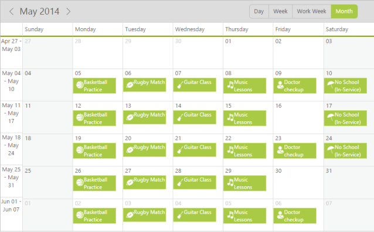

_Figure_ _34_: Schedule control with daily important activities_

##Creating a Schedule

1. ASP.NET Schedule widget basically renders with flexible API’s. You can easily create the Schedule widget by using the following code sample.
2. First create an ASP.NET Project and add necessary dll’s and scripts with the help of the given [ASP-Getting Started](http://help.syncfusion.com/ug/js/default.htm) Documentation.
3. Add the following code example to the corresponding designer page for Schedule rendering.



<ej:Schedule ID="schedule1" runat="server"></ej:Schedule>



4. On executing the above code example an empty Scheduler is displayed without appointments. In Order, to display the appointments in the Schedule you need to pass data to it.

_Figure_ _35_: Empty Schedule control_

Passing data to Schedule control

* You can add appointment to the Schedule control by passing data to the Schedule control either locally or remotely. In the following code example, you can see how to bind the remote data to the Schedule control.

In order to bind the remote data to the Schedule control use the DataManager propertyas follows.

<DataManager CrossDomain="true" URL="http://mvc.syncfusion.com/OdataServices/Northwnd.svc/Events" />

* You can also bind the field names used in the referred table “Events” with the corresponding AppointmentSettings property of the Scheduler as illustrated in the following code example.



<ej:Schedule runat="server" ID="Schedule1" CurrentDate="5/4/2014">

<AppointmentSettings Id="Id" Subject="Subject" StartTime="StartTime" EndTime="EndTime" AllDay="AllDay" Recurrence="Recurrence" RecurrenceRule="RecurrenceRule" />

<DataManager CrossDomain="true" URL="http://mvc.syncfusion.com/OdataServices/Northwnd.svc/Events" />

</ej:Schedule>



The following screen shot displays a Schedule control with the appointments in a normal style.

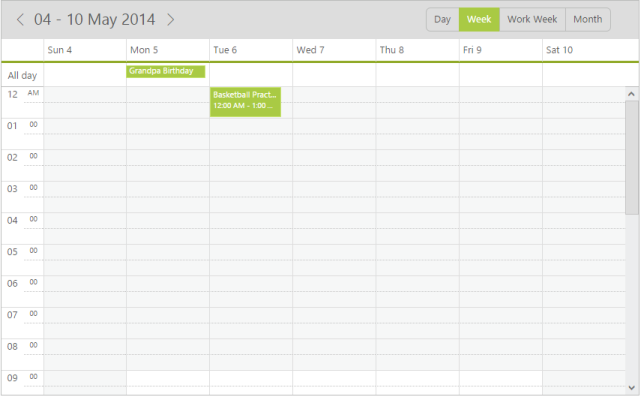

_Figure_ _36_: Schedule control with the appointments in a normal style_

* You can also customize the appointments within the Scheduler using the template support discussed in the following sections.

##Add Templates to the appointments

* You can change the appearance of the appointments and also can add images better look-and-feel of the appointments. You can use the template concept to achieve this.
* In order to add templates to the Schedule appointments, you need to pass the id of the template to the “AppointmentTemplateId” property. 



<ej:Schedule runat="server" ID="Schedule1" Width="100%" Height="525px" AppointmentTemplateId="#MyTemplate" CurrentDate="5/4/2014">

<AppointmentSettings Id="Id" Subject="Subject" AllDay="AllDay" StartTime="StartTime" EndTime="EndTime" Recurrence="Recurrence" RecurrenceRule="RecurrenceRule" Description="Description" />

<DataManager CrossDomain="true" URL="http://mvc.syncfusion.com/OdataServices/Northwnd.svc/Events" />

</ej:Schedule>

[Template Content]



Important: The images in the above code sample are taken from the installation location of the Essential JavaScript Studio in your machine,
For example : $system drive: \Program Files\ Syncfusion\EssentialStudio\12.1.0.43\JavaScript\samples\web\images\schedule

* You can create a folder named “Images” in the same location of your newly created ASP.NET project and then move all the images from the installation folder to the newly created “Images” folder. This helps you in referring appointments appropriately within the Schedule control.
* Once you set the template for the appointments, the Scheduler is displayed with the customized appointments as illustrated in the following screen shot.

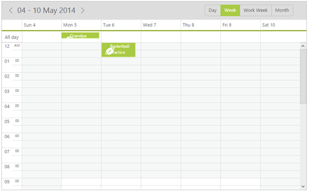

_Figure_ _37_: Scheduler with customized appointments_

##Change the Schedule View

* You can change the view of the schedule from “Week” to “Month” by using the CurrentView property. By default, the Schedule control is displayed in a “Week” view.



<ej:Schedule runat="server" ID="Schedule1"

Width="100%" Height="525px"

AppointmentTemplateId="#MyTemplate"

CurrentDate="5/4/2014"

CurrentView="Month">

<AppointmentSettings Id="Id" Subject="Subject" AllDay="AllDay" StartTime="StartTime" EndTime="EndTime" Recurrence="Recurrence" RecurrenceRule="RecurrenceRule" Description="Description" />

<DataManager CrossDomain="true" URL="http://mvc.syncfusion.com/OdataServices/Northwnd.svc/Events" />

</ej:Schedule>

[Template Content]



* When you execute the above code example, a Scheduler is displayed as follows with the fixed appointment height in a “Month” view. 

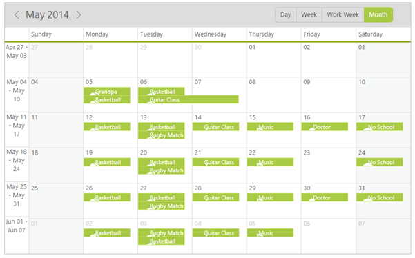

_Figure_ _38_: Scheduler with fixed appointment height in Month view_

##Change the appointment height through CSS

* The default height of an appointment is always suitable for the text.  In order to display an image and text in the appointment, you can change the height of the appointments in a “Month” view, through css styles manually as illustrated in the following code example. You can set the appointment height to auto to display the images within it.







<ej:Schedule runat="server" ID="Schedule1"

Width="100%" Height="525px"

AppointmentTemplateId="#MyTemplate"

CurrentDate="5/4/2014"

CurrentView="Month">

<AppointmentSettings Id="Id" Subject="Subject" AllDay="AllDay" StartTime="StartTime" EndTime="EndTime" Recurrence="Recurrence" RecurrenceRule="RecurrenceRule" Description="Description" />

<DataManager CrossDomain="true" URL="http://mvc.syncfusion.com/OdataServices/Northwnd.svc/Events" />

</ej:Schedule>

[Template Content]



* After you set the height for appointments in “Month" view, the Schedule control is rendered as follows.

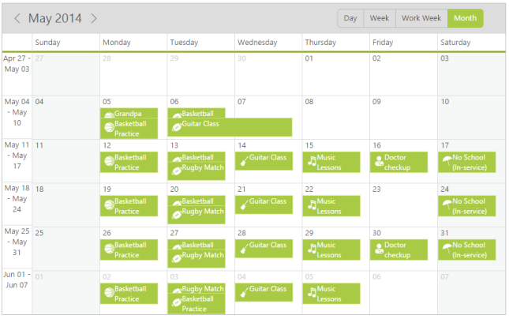

_Figure_ _39_: Customized Schedule_

##Manipulate the Appointments

###Appointment Creation

* Initially, you saw how the appointments are rendered by binding the remote data. In order to add the appointments through the user interface (run-time) to the Schedule control, double-click on the appropriate Schedule cell and provide the required details in the appointment window pop-up.
* You can quickly create an appointment by clicking on the exact schedule cell with appropriate time slot and then fill only the subject of that appointment in a quick appointment pop up. 

Important: When you add new appointments to the schedule control either by using local or remote data, the new appointment data is saved automatically to the appointment collection.

The following screen shot displays an appointment window pop- up that appears when you double-click on the Schedule cells.

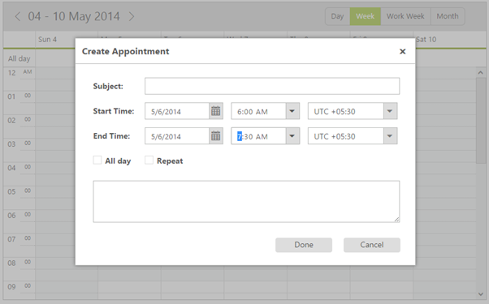

_Figure_ _40_: Schedule with appointment window pop- up_

The following screen shots illustrates a quick appointment pop-up window.

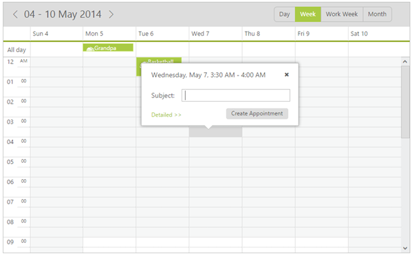

_Figure_ _41_: Schedule with quick appointment pop-up window_

Important: Incase, you need to manipulate with newly created or edited appointments, you can use the events available within the Schedule control.

* The event named “AppointmentSaved” is triggered when saving a new appointment to the Schedule control. It provides the new appointment data as an argument that helps you to retrieve the newly entered appointment data through a function. 

##Edit/Delete Appointments

* You can edit or delete the appointments in the Schedule control and access the data using events “AppointmentEdited” and “AppointmentDeleted” respectively. 
* In order to edit the appointments, double-click the desired appointment, and then edit the required fields in the appointment pop-up as displayed in the following screen shot.

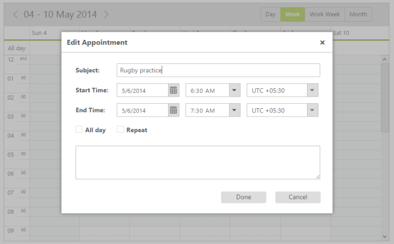

_Figure_ _42_: Schedule with appointment edit pop up_

* To delete an appointment, click the appointment, and then click delete icon in the quick appointment pop-up as illustrated in the following screen shot.

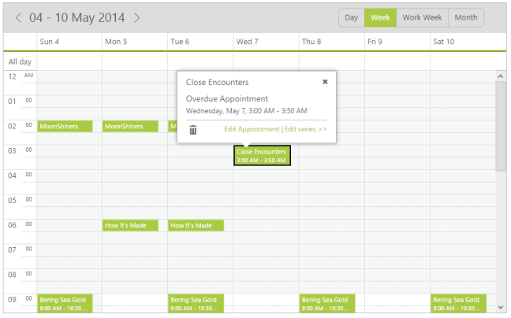

_Figure_ _43_: Schedule with delete appointment pop up_

* You can also delete the required appointment in the schedule control using the delete key option. This works only when you set “AllowKeyboardNavigation” option to “True”.

##Manipulate Recurrence Appointments

###Add Recurrence Appointment

* To add recurrence appointments, you need to check the “repeat” option in the appointment window as illustrated in the following screen shot.

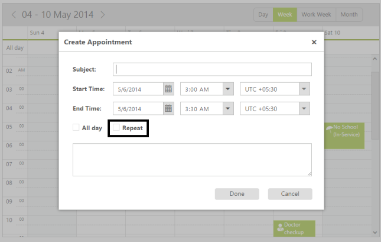

_Figure_ _44_: Appointment pop up with Repeat option_

* When you check the repeat option, the sub-options available in the recurrence category are displayed in the appointment pop-up as follows.

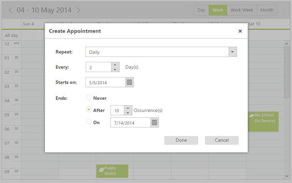

_Figure_ _45_: Appointment pop up with sub options of Repeat_

* You can choose the required recurrence pattern from the available options and then click Done.The main appointment pop-up appears as illustrated in the following screen shot.

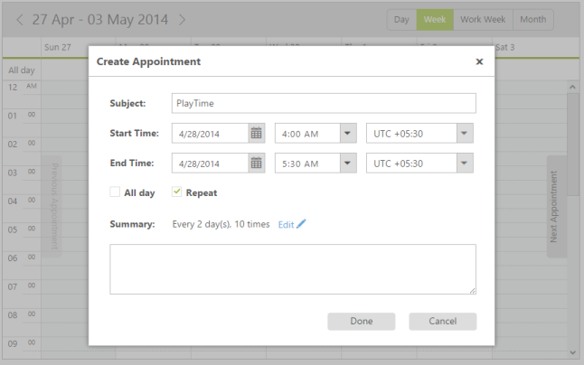
Figure 46: Main appointment pop up

* Click “Done”. The recurrence appointment with daily pattern is created for every two days that ends after 10 occurrences.

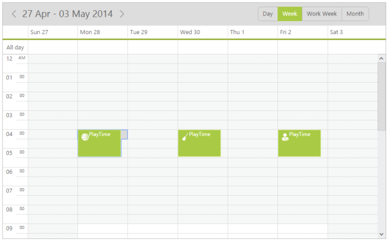

_Figure_ _47_: Recurrence appointment with daily pattern_

* You can store the chosen recurrence options usually in a RecurrenceRule field in a string format.  Also, the Recurrence field indicates whether the appointments created are normal or recurrence type. You can create appointments in a recurrence type by setting Boolean type to True.

###Edit/Delete Recurrence Appointment

* You can follow the same procedure for editing/deleting recurrence appointments. But in recurrenceappointment, you can either edit/delete the single occurrence of the appointment or the entire series in an intermediate confirmation pop-up.

* When you double-click the recurrence appointment a pop-up window appears as shown in the following screen shot. 

_Figure_ _48_: Schedule with Edit repeat appointment pop up_

* When you click the recurrence appointment, a quick appointment window opens with the following options: “Edit Appointment”, “Edit Series” and “delete” icon for deleting the appointments.

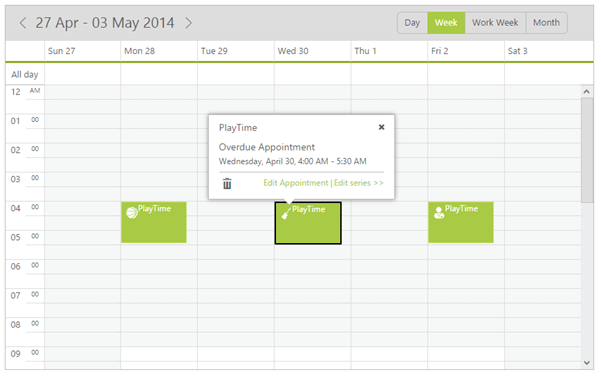
Figure 49: Schedule with quick appointment pop up

##Behaviour Customization using the events

###Restrict the display of appointment window

* You can restrict the creation of the appointments during weekends in ScheduleASP using the events and by validating its arguments such as startTime and endTime.
* For example, you can block the appointment pop-up on all the weekends (Default week start date is Monday) using the following code sample with AppointmentWindowOpen event. 


[ASP.NET]

<ej:Schedule runat="server" ID="Schedule1"

Width="100%" Height="525px"

CurrentDate="5/4/2014"

AppointmentWindowOpen="onAppointmentBeforeOpen">

<AppointmentSettings Id="Id" Subject="Subject" AllDay="AllDay" StartTime="StartTime" EndTime="EndTime" Recurrence="Recurrence" RecurrenceRule="RecurrenceRule" Description="Description" />

<DataManager CrossDomain="true" URL="http://mvc.syncfusion.com/OdataServices/Northwnd.svc/Events" />

</ej:Schedule>



