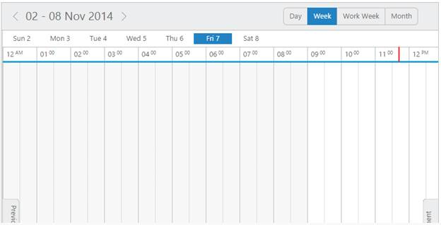
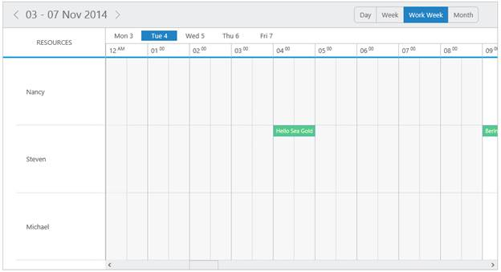

## Horizontal View

* You can customize the appearance of the Schedule control by using schedule modes. This can change the view of the schedule. 
* It is possible to change the mode of the schedule. It can be customized by using orientation property.

Orientation

* It defines the orientation type of the Schedule control. It renders the Schedule either in horizontal mode or vertical mode. By default, orientation property is set as “Vertical”. 
* The valid enum values that are accepted by orientation property are as follows,
1. ej.Schedule.Orientation.Vertical
2. ej.Schedule.Orientation.Horizontal
* You can set the Schedule control to horizontal mode using the following code example.

[ASP]

&lt;%--Setting Orientation as horizontal mode-- %&gt;

&lt;ej:Schedule runat="server" ID="Schedule1" DataSourceID="SqlData"  orientation=Horizontal&gt;&lt;/ej:Schedule&gt;

&lt;asp: SqlDataSource ID="SqlData" runat="server" ConnectionString="&lt;%$ ConnectionStrings: ScheduleConnectionString %&gt;"

SelectCommand="SELECT * FROM [DefaultSchedule]">&lt;/asp:SqlDataSource&gt;

Execute the above code to render the following output.

{  | markdownify }
{:.image }

The above example illustrates the horizontal view of Schedule control. Similarly you can also set the mode of the Schedule as “vertical”.

[ASP]

&lt;%--Setting Orientation as horizontal mode-- %&gt;

&lt;ej:Schedule runat="server" ID="Schedule1" DataSourceID="SqlData"  orientation=Vertical&gt;

&lt;/ej:Schedule&gt;

&lt;asp: SqlDataSource ID="SqlData" runat="server" ConnectionString="&lt;%$ ConnectionStrings: ScheduleConnectionString %&gt;"

SelectCommand="SELECT * FROM [DefaultSchedule]">&lt;/asp:SqlDataSource&gt;

Execute the above code to render the following output.

{  | markdownify }
{:.image }

Resources

Horizontal Multiple Resources

* Horizontal Multiple Resource feature provides support for rendering multiple resources on the Schedule control. You can group multiple resources under certain categories. You can also save the appointments simultaneously on multiple resources or within the multiple categories using allowMultiple property enabled for different levels of resources.
* Horizontal Multiple Resources is varied from Multiple resources by including the orientation property.It can change the appearance of the Schedule.
* Horizontal view contains another property as resourceHeaderTemplateId. It allows you to render the resource header of the Schedule. When the orientation is in horizontal mode, resourceHeaderTemplateId can be applied.

[ASP]

&lt;%--Setting Orientation as horizontal mode--%&gt;

&lt;ej:Schedule runat="server" ID="Schedule1" DataSourceID="SqlData" Orientation="Horizontal" Width="100%" CurrentDate="5/5/2014" CurrentView="Month" &gt;

&lt;Group Resources="Owners" /&gt;

&lt;%--Setting multiple resources-- %&gt;

&lt;Resources&gt;

&lt;ej:Resources Field="OwnerId" Name="Owners" Title="Owner" AllowMultiple="true"&gt;

&lt;ResourceSettings Color="color" Id="id" Text="text"&gt;

&lt;/ResourceSettings&gt;

&lt;/ej:Resources&gt;

&lt;/Resources&gt;

&lt;%--Setting appointments-- %&gt;

&lt;AppointmentSettings Id="Id" Subject="Subject" AllDay="AllDay" StartTime="StartTime" EndTime="EndTime" Recurrence="Recurrence" RecurrenceRule="RecurrenceRule" Description="Description" ResourceFields="OwnerId"/&gt;

&lt;/ej: Schedule&gt;&lt;asp: SqlDataSource ID="SqlData" runat="server" ConnectionString="&lt;%$ ConnectionStrings: ScheduleConnectionString %&gt;"

SelectCommand="SELECT * FROM [MultipleResource]">&lt;/asp:SqlDataSource&gt;

[ASPX.CS]

// follow the code as same as declared in Resources part

Execute the above code to render the following output.

{  | markdownify }
{:.image }

Horizontal Resource Grouping

* The Schedule control supports another important property as group related to the multiple resources that accepts the unique name assigned to each resources in the resource collection. The names that are all listed in this option is grouped in the Schedule control.
* It is possible to change the orientation in horizontal resource grouping. Horizontal view has another one property as resourceHeaderTemplateId. It allows to render the resource header of the schedule. When the orientation is in horizontal mode, resourceHeaderTemplateId can be applied.

[ASP]

&lt;%--Setting Orientation as horizontal mode-- %&gt;

&lt;ej:Schedule runat="server" ID="Schedule1" DataSourceID="SqlData" Orientation="Horizontal"&gt;

&lt;%--Setting resources-- %&gt;

&lt;Resources&gt;

&lt;ej:Resources Field="RoomId" Name="Rooms" Title="Room" AllowMultiple="true"&gt;

&lt;ResourceSettings Color="color" Id="id" Text="text"&gt;

&lt;/ResourceSettings&gt;

&lt;/ej:Resources&gt;

&lt;ej:Resources Field="OwnerId" Name="Owners" Title="Owner" AllowMultiple="true"&gt;

&lt;ResourceSettings Color="color" Id="id" Text="text" GroupId="groupId"&gt;

&lt;/ResourceSettings&gt;

&lt;/ej:Resources&gt;

&lt;/Resources&gt;

&lt;%--Grouping resources-- %&gt;

&lt;Group Resources="Rooms,Owners"/&gt;

&lt;%--Setting appointments-- %&gt;

&lt;AppointmentSettings Id="Id" Subject="Subject" AllDay="AllDay" StartTime="StartTime" EndTime="EndTime" Recurrence="Recurrence" RecurrenceRule="RecurrenceRule" Description="Description" ResourceFields="RoomId,OwnerId"/&gt;

&lt;/ej:Schedule&gt;

&lt;asp: SqlDataSource ID="SqlData" runat="server" ConnectionString="&lt;%$ ConnectionStrings: ScheduleConnectionString %&gt;"

SelectCommand="SELECT * FROM [MultipleResource]">&lt;/asp:SqlDataSource&gt;

[ASPX.CS]

// follow the code as same as declared in Resource Grouping  part

Execute the above code to render the following output.

{  | markdownify }
{:.image }

