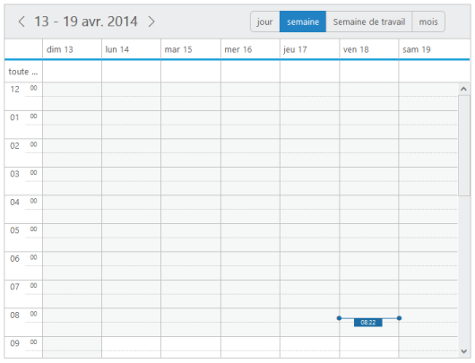
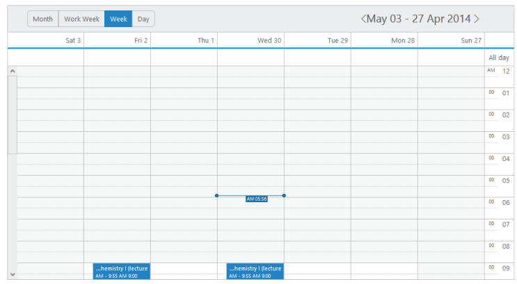

# Localization

* You can set any of the cultures to the Schedule control by using locale property. It is necessary to define all the localized words used in the Schedule control separately, as per the culture that isused within it. 
* By default, en-US culture is set to the Schedule control.

##Localization String for Schedule control

* The following table contains the Key values and its corresponding localized String values for en-US culture. Therefore, to apply your localization/culture to the schedule control, change the “value (string value)” against the “each Key”.

Table 2 : List of keys and string values

<table>
<tr>
<th>
    Key</th><th>
   Value</th></tr>
<tr>
<td>
    ReminderWindowTitle</td><td>
   Reminder window</td></tr>
<tr>
<td>
    CreateAppointmentTitle</td><td>
   Create Appointment</td></tr>
<tr>
<td>
    RecurrenceEditTitle</td><td>
   Edit repeat appointment</td></tr>
<tr>
<td>
    RecurrenceEditMessage</td><td>
   How would you like to change the event in the series?</td></tr>
<tr>
<td>
    RecurrenceEditOnly</td><td>
   Only this appointment</td></tr>
<tr>
<td>
    RecurrenceEditSeries        </td><td>
   Entire series</td></tr>
<tr>
<td>
    PreviousAppointment</td><td>
   Previous Appointment</td></tr>
<tr>
<td>
    NextAppointment</td><td>
   Next Appointment</td></tr>
<tr>
<td>
    AppointmentSubject            </td><td>
   Subject</td></tr>
<tr>
<td>
    StartTime</td><td>
   Start Time</td></tr>
<tr>
<td>
    EndTime</td><td>
   End Time</td></tr>
<tr>
<td>
    AllDay</td><td>
   All day</td></tr>
<tr>
<td>
    Today</td><td>
   Today</td></tr>
<tr>
<td>
    Recurrence</td><td>
   Repeat</td></tr>
<tr>
<td>
    Done</td><td>
   Done</td></tr>
<tr>
<td>
    Cancel</td><td>
   Cancel</td></tr>
<tr>
<td>
    Ok</td><td>
   Ok</td></tr>
<tr>
<td>
    RepeatBy</td><td>
   Repeat by</td></tr>
<tr>
<td>
    RepeatEvery</td><td>
   Repeat every</td></tr>
<tr>
<td>
    RepeatOn</td><td>
   Repeat on</td></tr>
<tr>
<td>
    StartsOn</td><td>
   Starts on</td></tr>
<tr>
<td>
    Ends</td><td>
    Ends</td></tr>
<tr>
<td>
    Summary</td><td>
    Summary</td></tr>
<tr>
<td>
    Daily</td><td>
    Daily</td></tr>
<tr>
<td>
    Weekly</td><td>
    Weekly</td></tr>
<tr>
<td>
    Monthly</td><td>
    Monthly</td></tr>
<tr>
<td>
    Yearly</td><td>
    Yearly</td></tr>
<tr>
<td>
    Every</td><td>
    Every</td></tr>
<tr>
<td>
    EveryWeekDay</td><td>
    Every weekday</td></tr>
<tr>
<td>
    Never</td><td>
    Never</td></tr>
<tr>
<td>
    After</td><td>
    After</td></tr>
<tr>
<td>
    Occurrence</td><td>
    Occurrence(s)</td></tr>
<tr>
<td>
    On</td><td>
    On</td></tr>
<tr>
<td>
    Edit</td><td>
    Edit</td></tr>
<tr>
<td>
    RecurrenceDay</td><td>
    Day(s)</td></tr>
<tr>
<td>
    RecurrenceWeek</td><td>
    Week(s)</td></tr>
<tr>
<td>
    RecurrenceMonth</td><td>
    Month(s)</td></tr>
<tr>
<td>
    RecurrenceYear</td><td>
    Year(s)</td></tr>
<tr>
<td>
    The</td><td>
    The</td></tr>
<tr>
<td>
    OfEvery</td><td>
    of every</td></tr>
<tr>
<td>
    First</td><td>
    First</td></tr>
<tr>
<td>
    Second</td><td>
    Second</td></tr>
<tr>
<td>
    Third</td><td>
    Third</td></tr>
<tr>
<td>
    Fourth</td><td>
    Fourth</td></tr>
<tr>
<td>
    Last</td><td>
    Last</td></tr>
<tr>
<td>
    WeekDay</td><td>
    Weekday</td></tr>
<tr>
<td>
    WeekEndDay</td><td>
    Weekendday</td></tr>
<tr>
<td>
    Subject</td><td>
    Subject</td></tr>
<tr>
<td>
    Categorize</td><td>
    Categories</td></tr>
<tr>
<td>
    DueIn</td><td>
    Due In</td></tr>
<tr>
<td>
    DismissAll</td><td>
    Dismiss All</td></tr>
<tr>
<td>
    Dismiss</td><td>
    Dismiss</td></tr>
<tr>
<td>
    OpenItem</td><td>
    Open Item</td></tr>
<tr>
<td>
    Snooze</td><td>
    Snooze</td></tr>
<tr>
<td>
    Day</td><td>
    Day</td></tr>
<tr>
<td>
    Week</td><td>
    Week</td></tr>
<tr>
<td>
    WorkWeek</td><td>
    Work Week</td></tr>
<tr>
<td>
    Month</td><td>
    Month</td></tr>
<tr>
<td>
    CustomView</td><td>
    Custom View</td></tr>
<tr>
<td>
    Agenda</td><td>
    Agenda</td></tr>
<tr>
<td>
    Detailed</td><td>
    Detailed</td></tr>
<tr>
<td>
    EventBeginsin</td><td>
    Appointment Begins in</td></tr>
<tr>
<td>
    Editevent</td><td>
    Edit Appointment</td></tr>
<tr>
<td>
    Editseries</td><td>
    Edit series</td></tr>
<tr>
<td>
    Times</td><td>
    times</td></tr>
<tr>
<td>
    Until</td><td>
    until</td></tr>
<tr>
<td>
    Eventwas</td><td>
    Appointment was</td></tr>
<tr>
<td>
    Hours</td><td>
    hrs</td></tr>
<tr>
<td>
    Minutes</td><td>
    mins</td></tr>
<tr>
<td>
    Overdue</td><td>
    Overdue Appointment</td></tr>
<tr>
<td>
    Days</td><td>
    day(s)</td></tr>
<tr>
<td>
    Event</td><td>
    Subject</td></tr>
<tr>
<td>
    Select</td><td>
    Select</td></tr>
<tr>
<td>
    Previous</td><td>
    Prev</td></tr>
<tr>
<td>
    Next</td><td>
    Next</td></tr>
<tr>
<td>
    Close</td><td>
    Close</td></tr>
<tr>
<td>
    Delete</td><td>
    Delete</td></tr>
<tr>
<td>
    Date</td><td>
    Date</td></tr>
<tr>
<td>
    Showin</td><td>
    Show in</td></tr>
<tr>
<td>
    Gotodate</td><td>
    Go To Date</td></tr>
<tr>
<td>
    Resources</td><td>
    RESOURCES</td></tr>
</table>

* To learn about localizing in the Schedule control on your required culture, refer the following code example. 



<asp:Content ID="Content1" ContentPlaceHolderID="SampleHeading" runat="server">

Schedule / Localization

</asp:Content>

<asp:Content ID="ControlContent" runat="server" ContentPlaceHolderID="ControlsSection">

<ej:Schedule runat="server" ID="Schedule1" DataSourceID="SqlData" Locale="fr-FR" Width="100%" Height="525px" CurrentDate="5/2/2014">

<AppointmentSettings Id="Id" Subject="Subject" AllDay="AllDay" StartTime="StartTime" EndTime="EndTime" Recurrence="Recurrence" RecurrenceRule="RecurrenceRule" Description="Description"/>

</ej:Schedule>

<asp: SqlDataSource ID="SqlData" runat="server" ConnectionString="<%$ ConnectionStrings: ScheduleConnectionString %>"

SelectCommand="SELECT * FROM [Localization]"></asp:SqlDataSource>

</asp:Content>

<asp:Content ID="ScriptContent" runat="server" ContentPlaceHolderID="ScriptSection">

</asp:Content>

<asp:Content ID="Content2" runat="server" ContentPlaceHolderID="PropertySection">

Select Culture

<ej:DropDownList runat="server" ID="ddlLocale" Width="115px" SelectedItemIndex="1" ClientSideOnChange="onChange" ClientSideOnSelect="onChange">

<Items>

<ej:DropDownListItem  Text="fr-FR" Value="fr-FR"/>

<ej:DropDownListItem  Text="en-US" Value="en-US"/>

<ej:DropDownListItem  Text="vi-VN" Value="vi-VN"/>

</Items>

</ej:DropDownList>

</asp:Content>





Important: An important note while making use of localization in the schedule control, it is necessary to refer the required culture script file (globalize.culture.xx-XX.min.js) in the script reference section of the sample as follows.



* Once the fr-Fr culture is set to the Schedule control, the Schedule control with localization applied is displayed as follows.

Figure 104 :  schedule with localization.

###RTL

* The enableRTL option allows the schedule control to display it in the right to left direction. By default, this option is set to ‘false’ in the Schedule control.

The following code example explains how to enable the rtl property of the Schedule control.



<ej:Schedule runat="server" ID="Schedule1" DataSourceID="SqlData"

Width="100%" Height="500px"

EnableRTL="true">

<AppointmentSettings Id="Id" Subject="Subject" AllDay="AllDay" StartTime="StartTime" EndTime="EndTime" Recurrence="Recurrence" RecurrenceRule="RecurrenceRule" Description="Description"/>

</ej:Schedule>

<asp: SqlDataSource ID="SqlData" runat="server" ConnectionString="<%$ ConnectionStrings: ScheduleConnectionString %>"

SelectCommand="SELECT * FROM [DefaultSchedule]"></asp:SqlDataSource>



* When the rtl is set to ‘true’, the Schedule control is displayed as follows.

   Figure 105 :  schedule with RTL.

