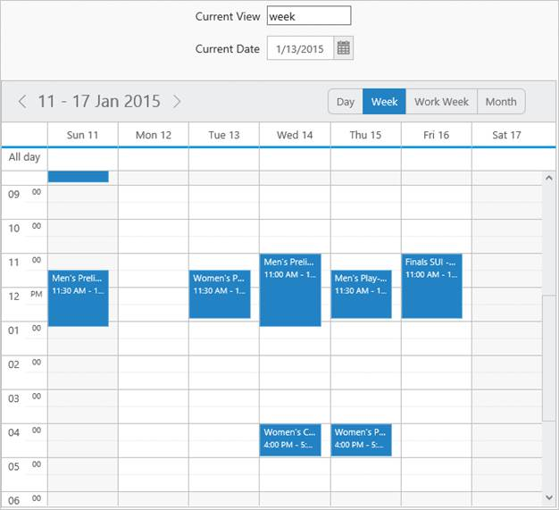
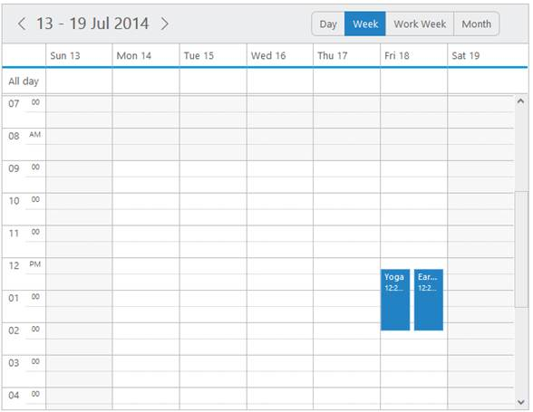

# MVVM

## Angular JS

* Schedule contains angular support. You can add object as well as array object in the Schedule.
* The two way binding support is given to the currentView, currentDate and datasource properties. 
* ej-Schedule is the control tag in which ej is tag prefix and Schedule is the control name.

### Rendering the Schedule

You can render the Schedule by using the following code example. Object in the array collection such as appointmentSetting, contextMenuSettings, etc. are extended with hyphen in the same tag.

Example: e-contextMenuSettings-enable.



<asp:Content ID="ControlContent" runat="server" ContentPlaceHolderID="ControlsSection">

<ej-Schedule style="float: left" id="Schedule1"

e-appointmentSettings-datasource="appointments"

e-appointmentSettings-id="Id"

e-appointmentSettings-subject="Subject"

e-appointmentSettings-startTime="StartTime"

e-appointmentSettings-endTime="EndTime"

e-appointmentSettings-description="Description"

e-appointmentSettings-allDay="AllDay"

e-appointmentSettings-recurrence="Recurrence"

e-appointmentSettings-recurrenceRule="RecurrenceRule"

e-width="100%" e-height="525px" e-currentview="setView"

e-currentdate="setDate" e-contextMenuSettings-enable="true">

</ej-Schedule>

</asp:Content>



### Adding Context menu settings

* Context menu is an object type that has inner array object. 
* contextMenuSettings contains an object called menuItem.
* Menu item has two types of array objects for cells and appointment respectively.


<!--To Render the Schedule-->

<ej-Schedule style="float: left" id="Schedule1">

<!--Adding content menu item for appointment -->

<e-contextMenuSettings-menuItems-appointment>

< e-appointment e-id="open" e-text="Open Appointment"></ e-appointment>

< e-appointment e-id="delete" e-text="Delete Appointment"></ e-appointment>

< e-appointment e-id="categorize" e-text="Delete Appointment">

</ e-appointment>

</e-contextMenuSettings-menuItems-appointment>

<!--Adding content menu item for cells -->

<e-contextMenuSettings-menuItems-cells>

<e-contextMenuSettings-menuItems-cell

e-id="new" e-text="Create New Appointment">

</e-contextMenuSettings-menuItems-cell>

<e-contextMenuSettings-menuItems-cell

e-id="recurrence" e-text="Create recurrence Appointment">

</e-contextMenuSettings-menuItems-cell>

</e-contextMenuSettings-menuItems-cells>

</ej-Schedule>



### Adding Categorize option

* Categorizeoption is an array object. 
* contextMenuSettings contains an object called menuItem.
* Menu item has two types of array objects for cells and appointment respectively.


<!--To Render the Schedule-->

<ej-Schedule style="float: left" id="Schedule1" e-categorizesetting-enable="true"

e-categorizesetting-allowMultiple="true" e-categorizesetting-text="text"

e-categorizesetting-color="color"

e-categorizesetting-fontcolor="fontcolor" e-categorizesetting-id="id">

<!--Adding content menu item for appointment -->

<e-contextMenuSettings-menuItems-appointment>

</e-contextMenuSettings-menuItems-appointment>

<!--Adding content menu item for cells -->

<e-contextMenuSettings-menuItems-cells>

</e-contextMenuSettings-menuItems-cells>

<e-categorizesetting-datasource>

<e-categorizesetting-datasource text="Blue category"

color="Blue" fontcolor="Red" id="1">

</e-categorizesetting-datasource>

<e-categorizesetting-datasource text="yellow category"

color="yellow" fontcolor="Red" id="2">

</e-categorizesetting-datasource>

<e-categorizesetting-datasource text="red category" color="red"

fontcolor="Red" id="3">

</e-categorizesetting-datasource>

<e-categorizesetting-datasource text="orange category" color="orange"

fontcolor="Red" id="4">

</e-categorizesetting-datasource>

</e-categorizesetting-datasource>

</ej-Schedule>



Execute the above codes to render the Resultant schedule as follows.

## Two Way Binding 

* Schedule control supports two way binding for the property currentView , currentDate and datasource as mentioned earlier. 

* The following code example explains how to achieve the two way binding to the Schedule control.


<asp:Content ID="ControlContent" runat="server" ContentPlaceHolderID="ControlsSection">

Current View

<input id="ddlView" ej-dropdownlist e-datasource="dataList" e-value="drpvalue" e-width="107px" />

Current Date

<input id="datepick1" ej-datepicker e-value="setDate" e-width="107px" />

<ej-Schedule style="float: left" width="400" id="Schedule1"

e-appointmentSettings-datasource="appointments"

e-appointmentSettings-id="Id" e-appointmentSettings-subject="Subject"

e-appointmentSettings-startTime="StartTime"

e-appointmentSettings-endTime="EndTime"

e-appointmentSettings-description="Description"

e-appointmentSettings-allDay="AllDay"

e-appointmentSettings-recurrence="Recurrence"

e-appointmentSettings-recurrenceRule="RecurrenceRule"

e-width="100%" e-height="525px" e-currentview="setView"

e-currentdate="setDate" e-contextMenuSettings-enable="true"

e-categorizesetting-enable="true" e-categorizesetting-allowMultiple="true"

e-categorizesetting-text="text" e-categorizesetting-color="color"

e-categorizesetting-fontcolor="fontcolor" e-categorizesetting-id="id">

<e-categorizesetting-datasource>

<e-categorizesetting-datasource text="Blue category" color="Blue" fontcolor="Red" id="1"></e-categorizesetting-datasource>

<e-categorizesetting-datasource text="yellow category" color="yellow" fontcolor="Red" id="2"></e-categorizesetting-datasource>

<e-categorizesetting-datasource text="red category" color="red" fontcolor="Red" id="3"></e-categorizesetting-datasource>

<e-categorizesetting-datasource text="orange category" color="orange" fontcolor="Red" id="4"></e-categorizesetting-datasource>

</e-categorizesetting-datasource>

<e-contextMenuSettings-menuItems-appointment>             <appointment e-id="open" e-text="Open Appointment"></appointment>

<appointment e-id="delete" e-text="Delete Appointment"></appointment>

</e-contextMenuSettings-menuItems-appointment>

<e-contextMenuSettings-menuItems-cells>

<e-contextMenuSettings-menuItems-cell

e-id="new" e-text="Create New Appointment">

</e-contextMenuSettings-menuItems-cell>

<e-contextMenuSettings-menuItems-cell

e-id="recurrence" e-text="Create recurrence Appointment">

</e-contextMenuSettings-menuItems-cell>

<e-contextMenuSettings-menuItems-cell

e-id="today" e-text="Today">

</e-contextMenuSettings-menuItems-cell>

<e-contextMenuSettings-menuItems-cell

e-id="gotodate" -text="Go to date">

</e-contextMenuSettings-menuItems-cell>

</e-contextMenuSettings-menuItems-cells>

</ej-Schedule>

</asp:Content>



Execute the above code to render the following output.

## Knockout binding

* Knockoutsupport allows you to bind the html elements against the available data models.Two types of knockoutbinding are supported,

  1. one-way binding
  2. two-way binding

* One way binding refers to the process of applying observable values to all the available properties of the Schedule control. The changes made in Schedule control is not reflected and triggered in turn to the observable collection. This kind of binding applies to all the properties of the Schedule control.
* Two-way binding supports both the processes – it applies the observable values to the Schedule properties along with the changes made in the Schedule control is reflected back and triggered within the observable collections. Only few Schedule properties support two-way binding and they are as follows.

  1. currentView
  2. currentDate
  3. dataSource (within appointmentSettings object)

* Apply the plugin and property assigning to the Schedule element through the directive that starts with a letter “e-“. The following example depicts the way to bind data to the Schedule control through the knockoutsupport.



<asp:Content ID="Content1" ContentPlaceHolderID="SampleHeading" runat="server">

Schedule / Knockout Binding

</asp:Content>

<asp:Content ID="ControlContent" runat="server" ContentPlaceHolderID="ControlsSection">

<asp: SqlDataSource ID="SqlData" runat="server" ConnectionString="<%$ ConnectionStrings: ScheduleConnectionString %>"

SelectCommand="SELECT * FROM [Localization]"></asp:SqlDataSource>

</asp:Content>

<asp:Content ID="ScriptContent" runat="server" ContentPlaceHolderID="ScriptSection">

</asp:Content>

<asp:Content ID="Content2" runat="server" ContentPlaceHolderID="PropertySection">

Current View

<input type="text" name="view" value="" style="width: 100px" data-bind="value: view" />

Current Date

<input id="datepick" data-bind="ejDatePicker: { value: date, width: '107px' }" />

</asp:Content>

<asp:Content ID="styleSection" ContentPlaceHolderID="StyleSection" runat="server">

</asp:Content>



Output of the above code example is as follows.

Schedule with Knockout Binding
{:.caption} 

