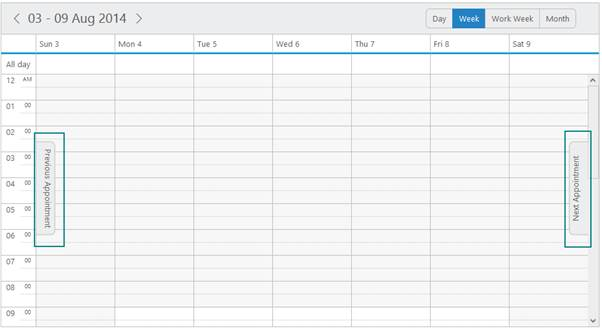
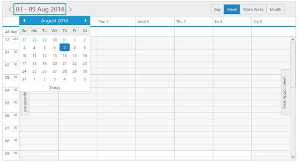
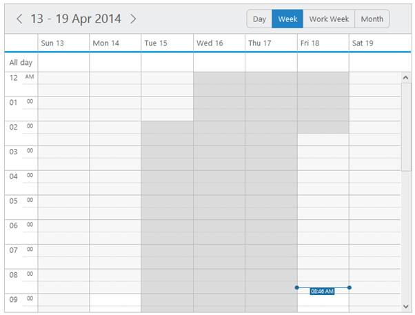

## Navigation

Appointment Navigation

* The enableAppointmentNavigation option allows the Schedule control to show/hide the previous and next appointment navigation tabs that is usually rendered parallel to each other when it is set to ‘true’. 
* When you click on the previous/next appointment tab, it takes you to the previous/next corresponding closest date on the Schedule that contains appointments on that particular day. By default, it is set to ‘true’.

The following code example explains how to set the value for enableAppointmentNavigation property.

[ASP]

&lt;ej:Schedule runat="server" ID="Schedule1" DataSourceID="SqlData" Width="100%" Height="525px" CurrentDate="5/2/2014" EnableAppointmentNavigation="true"&gt;

&lt;AppointmentSettings Id="Id" Subject="Subject" AllDay="AllDay" StartTime="StartTime" EndTime="EndTime" Recurrence="Recurrence" RecurrenceRule="RecurrenceRule" Description="Description"/&gt;

&lt;/ej:Schedule&gt;

&lt;asp: SqlDataSource ID="SqlData" runat="server" ConnectionString="&lt;%$ ConnectionStrings: ScheduleConnectionString %&gt;"

SelectCommand="SELECT * FROM [DefaultSchedule]">&lt;/asp:SqlDataSource&gt;

* The Schedule control with the appointment navigation tabs (marked with a box) enabled looks like the following screenshot.

{  | markdownify }
{:.image }

_Figure_ _101__:  schedule with Appointment Navigation._

Calendar Navigation

* The dates on the Schedule control is navigated randomly to another date with the help of calendar available within the Schedule control. To open the calendar, click on the date value displayed in the header bar. You will see the calendar pops down.
* You can click on any dates on the calendar, so that the Schedule control navigates to the selected date in the calendar.

The following screenshot displays the calendar that pops down on clicking the date headerbar (marked with a box),

{  | markdownify }
{:.image }

 _Figure_ _102__:  schedule with Calendar Navigation._

Keyboard navigation

* By enabling the keyboard navigation in the Schedule control, you can control the actions of the Schedule with the provided shortcut keys. Almost all the Schedule actions that are done using mouse are controlled with shortcut keys. 
* By default, the keyboard navigation is set to ‘true’ for the control and it is controlled with the property allowKeyboardNavigation.

The various keyboard shortcuts available within the Schedule control are as follows, 

_Table_ _1__: List of keys and its usage_

<table>
<tr>
<td>
Keys</td><td>
Usage</td></tr>
<tr>
<td>
Esc</td><td>
Closes the opened dialog and calendar popup within the Schedule control.</td></tr>
<tr>
<td>
Enter</td><td>
Selects/processes the currently focussed items in the dialogue used within the Schedule control. When the enter key is pressed while a single/multiple cells are selected in the Schedule, the quick appointment window gets opened.</td></tr>
<tr>
<td>
Up/left/down/right arrow keys</td><td>
Allows cell traversing.</td></tr>
<tr>
<td>
Alt + C</td><td>
Displays the Schedule calendar popup.</td></tr>
<tr>
<td>
Ctrl + left arrow</td><td>
Previous date navigation</td></tr>
<tr>
<td>
Ctrl + right arrow</td><td>
Next date navigation</td></tr>
<tr>
<td>
Alt + plus symbol</td><td>
Traverse forward through the view items in the toolbar</td></tr>
<tr>
<td>
Alt + minus symbol</td><td>
Traverse backward through the view items in the toolbar</td></tr>
<tr>
<td>
Space</td><td>
When the previous/next navigation icons are currently being focussed, pressing space navigates through the corresponding dates.</td></tr>
<tr>
<td>
Alt + N</td><td>
Opens the new Appointment window</td></tr>
<tr>
<td>
Ctrl + E</td><td>
Opens the edit appointment window</td></tr>
<tr>
<td>
Del</td><td>
Deletes the appointment.</td></tr>
<tr>
<td>
Shift + arrow keys</td><td>
Multiple cell selection</td></tr>
<tr>
<td>
Tab</td><td>
Traverse forward through the appointments</td></tr>
<tr>
<td>
Shift + tab</td><td>
Traverse backward through the appointments.</td></tr>
</table>

Important: Apart from the cell selection through keyboard shortcuts (shift + arrow keys), the selection of cells can also be done through mouse by any of the following ways,

i. Click on any of the cell to start selection and by holding the left click, hover the mouse across the cells to be selected and then release the left mouse button, once the selection is over.

ii. Make initial selection at any of the cell. Now by pressing and holding the Shift key, click on any of the other desired cell to end the selection. The cells that lies within the initial and end selection gets selected entirely.

Once the required cells are selected, then a new appointment can be created for a selected time range either by pressing (ALT + N) key combination or by simply pressing Enter key to create appointments through quick window.

[ASP]

<ej:Schedule runat="server" ID="Schedule1" DataSourceID="SqlData" Width="100%" Height="525px" CurrentDate="5/2/2014" AllowKeyboardNavigation="true"

CurrentView="Month">

&lt;AppointmentSettings Id="Id" Subject="Subject" AllDay="AllDay" StartTime="StartTime" EndTime="EndTime" Recurrence="Recurrence" RecurrenceRule="RecurrenceRule" Description="Description"/&gt;

&lt;/ej:Schedule&gt;

&lt;asp: SqlDataSource ID="SqlData" runat="server" ConnectionString="&lt;%$ ConnectionStrings: ScheduleConnectionString %&gt;"

SelectCommand="SELECT * FROM [DefaultSchedule]">&lt;/asp:SqlDataSource&gt;

* Since the keyboard navigation functionality is enabled by default, the Schedule control below indicates the multiple cell selection through the shift + right arrow key combination as follows.

{  | markdownify }
{:.image }

   _Figure_ _103__:  schedule with keyboard Navigation._

