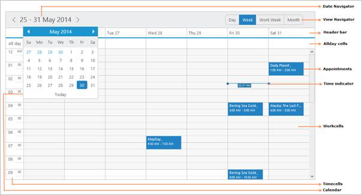

# Overview

* The Schedule control is an event calendar which is highly customizable and provide the look and feel of the Outlook-like Scheduler.The major advantage with Schedule is that it allows you to manage and list out various activities of a day for various resources. With the help of this control, the users can track their appointments, create a new one and can edit/delete the older ones. 
* The basic idea behind the usage of this control is to plan, create and manage the required appointments/events for the users and also to organize various other activities like meetings, important deadlines, tasks, etc. 
* The drag and drop functionality available within the Schedule control for the appointments will allow the end users to efficiently manage the events/appointments in the different available views (day, week, workweek, month).

{{ '' | markdownify }}
{:.image }

##Key Features

##Below are the key features of Schedule control:

* Timemode – Allows you to set either 12/24 hour format for the Schedule control.
* Timezone - Allows the Schedule control to make the appointments to be displayed in an appropriate time that belongs to the respective timezone set to it.
* Localization - Any culture can be easily applied to the Schedule control with the localization support.
* Appointment template – Allows you to customize the appointments based on their required scenarios.
* Start & end Hour – Allows you to customize the starthour and endhour of the Schedule.
* RTL - Displays the Schedule control in a Right to left view.
* Databinding – Allows the database field values to be bound with the Schedule fields. Also bind the Schedule control with an array of JSON objects or ej.DataManager.
* Keyboard navigation – Allows you to perform the Schedule actions through provided shortcut keys.
* View Customization – Provide the customization of the view options in the Schedule control.
* Highlight business hours – Allows the business hours to be highlighted in the Schedule control.
* Schedule resizing (responsive) – Makes the Schedule control to resize based on the window size or its parent container’s size.It also supports in mobile device.
* Current time indicator - Indicates the current time in a Schedule control with a line drawn across the current date.
* Drag & Drop – Allows the appointments within the Schedule control to be dragged and dropped in a required location.
* Resizing - Allows the appointments within the Schedule control to be resized.
* Recurrence - The recurrence support provides the Schedule control with various options, so that the appointments are easily handled on the basis of daily, weekly, monthly and so on.
* Calendar navigation – Allows you to navigate through the Schedule dates in a quicker and easier manner.
* Touch enabled – Allows the touch interactivity with the Schedule control.
* Angular & KO enabled – Allows both the one-way and two-way bindings for the KO databinding.
* Current Date & Current View – Allows you to set the current date for the Schedule control and also allows to set any one of the available views (day, week, workweek,month) as the current view to it.
* Grouping – Allows you to group the appointments based onthe unique name assigned to each resources in the resource collection.
* Multiple Resource – Provides support for rendering multiple resources appointments on the Schedule control.
* Searching – Allows you to search the list of apointments available in the Schedule control.

